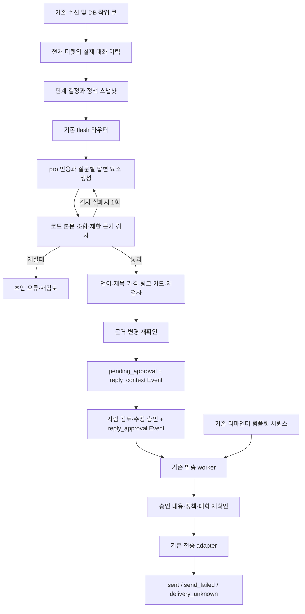

# 정책 기반 고객응답 구조 — 2026-09-21

상태: **PARTIAL**. 로컬 구현·회귀 검증 및 실제 Gemini 합성 개발셋 평가를 수행했다. 운영 정책 검증·배포 준비 완료를 뜻하지 않는다. [최신 실행 결과](../policy-response/runs/2026-09-21-live/results.md), [기계 판독 결과](../verification/policy-response-result.json), [기초 ADR](../adr/2026-09-21-policy-response-boundaries.md), [실측 후 생성 구조 ADR](../adr/2026-09-21-grounded-draft-composition.md)를 함께 읽는다.

## 선택한 구조와 이유

두 입력 지시 중 MASTER_TASK의 불변조건·보고 계약을 실행 기준으로, 00-CLI-PROMPT의 **코드 조사 → 초기 기록 → 참고자료 → 반박 → 구현** 순서를 결합했다. 입력 패키지의 특정 아키텍처를 선택하거나 두 구현의 성능을 순위화한 것이 아니다. 초기 판단은 [초기 분석](../policy-response/runs/2026-09-21-local/initial-assessment.md)에 먼저 남겼다. 00 문서의 동봉 01~03은 발견하지 못했고, 실제 발견한 MASTER 하위 specs와 acceptance를 사용했다.

현 저장소는 소수의 자연어 정책 원문, SQLAlchemy, DB 작업 큐, flash 문서 라우터, pro 초안 작성, 사람 승인으로 이미 연결되어 있다. 따라서 **기존 흐름 + 요청 단위 근거 스냅샷 + 공통 대화 기록 + 승인/발송 재확인**을 채택했다. 정책 컴파일러·벡터 DB·그래프·검증 모델을 추가하는 편이 좋은지는 측정되지 않았다.

## 실제 이전/이후 흐름

이전: HubSpot 웹훅/폴러 → durable inbound job → InboundAgent.handle → 문의 분류 → 문서 인덱스 선택 → 별도 시점에 회사 규칙 읽기 → 초안 → 언어/가격/링크 처리 → pending_approval → 사람 승인 → send worker → Conversations MESSAGE 또는 선택한 Gmail 사서함.

문제는 규칙 조회 실패가 빈 규칙으로 바뀌고, 긴 요약이 최신 원문을 밀어내며, 리마인더/test_sent가 실제 답변 판단을 흐리는 경로였다. 문서 선택과 생성 사이 정책 변경을 알아낼 기록도 없었다.

현재:

- `src/llm/policy_context.py`: model_access와 stage scope를 SQL에서 제한해 규칙·참고문서를 한 번에 읽고 frozen 객체로 복사한다. scope는 첫/후속 **대화 단계**이며 정책 시행일이 아니다.
- `src/llm/knowledge.py`: 기존 제목/usage_note 라우터를 유지한다. 라우터와 초안에 같은 최근 대화를 전달한다. 실패/빈 선택은 권한이 허용된 후보 전체로 돌아간다. 선택된 원문은 축약·정책 변환 없이 전달한다. 모델이 반환한 임의 문서 키로 DB를 다시 읽지 않는다.
- `src/llm/client.py`: 같은 snapshot의 규칙을 쓰고 JSON 재시도 전에도 변경을 검사한다. Pydantic 형식 검증은 의미 검증이 아니다. 파싱 실패 로그에서 원문 응답을 제거했다.
- `src/agents/inbound.py`: 실제 보낸 회신만 first/followup 판단에 쓴다. 리마인더는 그대로 이력에 남지만 “고객에게 이미 답했다”의 기준선은 아니다. 최초 회신 전 정정도 가장 최근 문의로 선택한다.
- `src/agents/draft_evidence.py`: 질문별 답변/확인 문장을 순서대로 조합해 중복 body 재서술을 없앤다. source_id/원문 인용, 숫자 기간, 일부 허위 진행 상태만 제한 검사한다. 검사 통과는 답변 의미 인증이 아니다. 재작성 후에도 실패하면 pending에 넣지 않는다.
- 최근 원문에 먼저 길이 예산을 배정하고 timestamp/source_ref 및 고객 주장·미검증 표시를 붙인다. 파생 요약/요청사항은 남은 공간에만 포함한다. 고객 메시지와 시스템 확인 사실을 하나의 boolean으로 합치지 않는다. 요청 추출도 같은 대화에서 고객 발화만 읽고 철회 결과의 빈 값으로 과거 요청을 지울 수 있다.
- 초안 저장과 함께 기존 Event에 정책 ID/version/hash, 선택된 ID, 대화 참조/hash, 입력 hash, body hash, 모델/API/prompt/schema hash, DRAFT_ONLY 및 semantic_validation=NOT_RUN을 기록한다. raw prompt/고객 본문/정책 본문은 새 Event에 복제하지 않는다.
- `reply_safety.py`는 승인 전, 발송 진입, 원격 주소 조회 후 실제 POST 직전에 근거를 재확인한다. 승인 Event는 검토한 본문·제목·수신/발신·CC·채널·서명 키·언어에 묶인다. 저장 행이 approved/sending인지도 확인한다.

## 도메인 경계와 구현의 한계

| 경계 | 실제 구현 | 남은 범위 |
|---|---|---|
| Authority | 허용된 원문을 그대로 사용, 사용 버전/hash 연결 | 승인된 정책 release/담당자 우선순위 체계는 없음. DB에 있는 행이 현재 원천이라는 기존 convention 유지 |
| Time | 대화 시간 UTC 정렬, first/followup 구분 | 시행일·계약 기준일·소급 적용·예외 우선순위 자동 판정 없음 |
| Facts | 최근 원문, source_ref, 고객 주장 표시, 파생 요약 구분 | 보강 CRM 속성별 검증 시점/충돌 resolver 없음. 요약·추출은 여전히 오류 가능 |
| State | 실제 발송만 답변 처리, 정정 우선, 오래된 입력 차단 | HubSpot에서 아직 동기화되지 않은 사실은 탐지 못함 |
| Decision | 형식/언어/기존 가격 가드와 승인 상태를 생성 결과에서 분리. 질문별 답변 요소는 생성 데이터로만 취급 | 신뢰 가능한 정책 결정기·조건/예외 의미 validator 없음 |
| Generation | 질문별 AnswerPoint를 코드에서 조합, 인용/숫자 기간/일부 실행 상태 검사, 실패 때 의미 재작성 1회, 그 뒤 남는 문제는 **표시**(FAIL + 코드) | 실제 개발셋에서 의미 오류/차단 관측. 운영 원문·독립 holdout·자연스러움 정량 평가는 NOT_RUN |
| Delivery | 새 승인 내용/근거 재검사, 기존 ambiguous-send 격리 유지 | 원격 송신과 DB 사이 원자성, 동적 서명/링크 설정, legacy 초안의 완전한 binding은 보장 못함 |

**근거 검사는 표시하고 막지 않는다** (2026-09-22 운영자 지시: 「미완성이라도 사람한테 뜨면 좋겠는데. 그래야 내용보고 후에 고도화를 하든 하지」). `check_draft` 가 재작성 1회 뒤에도 남긴 문제와 변환(언어·링크·가격 가드) 뒤 검사의 문제는 합쳐서 `limited_evidence_checks` 에 `status: FAIL` 과 `issues`(코드만, 고객 글 없음)로 적히고, 초안은 `pending_approval` 로 대기열에 선다. 티켓 화면(`ticket.evidence`, `_message_detail_context` 가 최신 `reply_context` Event 에서 읽는다)이 편집기 위에 경고 배너로 그 코드를 우리말로 적는다. 그전에는 그 초안이 `draft_failed` 로 죽고 dead 잡이 남아 운영자가 무엇이 틀렸는지 볼 길이 없었다. 이 검사는 문자열 검사라 과잉 차단이 있고(2026-09-21 실측), 그 판단은 본문을 읽는 사람이 한다. `draft_failed` 로 남는 것은 모델·스키마 실패, 정책 조회·스레드 조회 실패, 그리고 답변 요소가 전부 비어 본문이 없는 조합(`compose_answer` 의 `DraftEvidenceError`, durable job 에서 terminal)뿐이다.

정책 조회 장애는 **초안 실패/재검토**이지 환불 거절 등 고객의 사업 결과가 아니다. 문서를 정상 조회했지만 0개인 경우는 기존 DRAFT_ONLY 동작을 유지한다. 필수 정책의 목록이 없으므로 “누락 없음”을 증명하지 않는다. 담당자 승인 전 정책 판단 자동화 확대 금지.

생성 중에는 정책 원문 전체 해시를 비교하지만, 승인·발송 관문은 초안이 본 문서(규칙 전부 + 선택된 참고 문서)만 본다(`PolicySnapshot.evidence_changed`, 2026-09-22) — 전체 해시로 막으면 문서 하나 저장에 대기열 전체가 재생성 대상이 됐다. **대화 쪽은 해시가 아니다** (2026-09-22): 「대화가 변경되었다」는 초안이 못 본(`turn_refs` 에 없는) **고객** 메시지 중 시각이 `generated_at` 뒤인 것이 있을 때다(`inbound.customer_turns_since`). 대화 전체 해시로 재면 10분 폴러의 스레드 수집이 넣는 최초 문의의 사본(`hubspot:conv:` 줄 — 문의 `messages` 행에 스레드 id 가 없어 안 걸러진다), 운영자의 「수신」 기록, 개인함 수집이 붙이는 옛 메일이 전부 「변경」이 되어 New 티켓마다 승인이 막혔다. `thread_sha256` 은 기록용으로 남는다. 과거 원문이 삭제되면 Event의 hash만으로 원문을 재구성할 수 없다. 동일 모델 ID로 동일 문장을 재생성한다는 보장도 없다. 정밀한 릴리스/정책 의존성·삭제 보존 설계는 담당자 결정과 실제 문서량 측정 후 재검토한다.

## 화면과 리마인더

`src/db/history_view.py`가 고객 소유권을 확인한 티켓의 수신/발송 메시지(`DELIVERED_STATUSES` — 티켓 화면의 대화와 같은 집합), 소통 기록, 비정례 진행 기록을 묶는다. 같은 HubSpot 메시지는 중복 제거한다. 리마인더의 「N차 리마인더 완료」 줄은 거르지 않는다 — 운영자 지시로 소통 히스토리에 남기는 줄이고, 티켓 화면이 그리는 것을 고객 상세가 숨기면 두 화면이 같은 행을 두고 다른 말을 한다. `TicketHistoryBox.tsx`는 기존 InteractionItem을 재사용해 **티켓마다 테두리 박스**, 기록별 내용, 제목 링크만 제공한다. 리드 상세·티켓 이전 이력·수주 고객 이력이 같은 구조를 쓴다.

삭제한 것: 각 화면의 요약 전용 박스, 리드 상세의 중복 TicketBlock 렌더링, 중복 정책 읽기 쿼리/실패를 빈 값으로 바꾸는 경로, 불필요한 프런트 타입 필드. DB summary/revisions와 기존 API 호환 필드는 아직 다른 기능이 쓰므로 삭제하지 않았다.

리마인더 날짜/3·5·7일 템플릿/업무시간/중단 조건은 바꾸지 않았다. 이번 작업에서 운영 발송을 켜거나 끄지 않았으며 실제 리마인더 발송을 실행하지 않았다.
