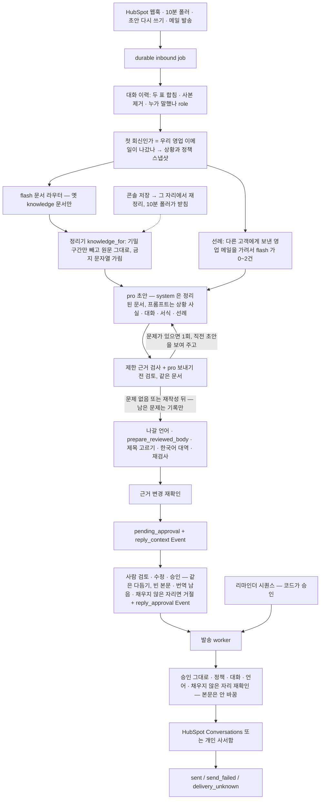

# 정책 기반 고객응답 구조 — 2026-09-21 (2026-10-06 갱신)

상태: **PARTIAL**. 로컬 구현·회귀 검증 및 실제 Gemini 합성 개발셋 평가를 수행했다. 운영 정책 검증·배포 준비 완료를 뜻하지 않는다. [최신 실행 결과](../policy-response/runs/2026-09-21-live/results.md), [기계 판독 결과](../verification/policy-response-result.json), [기초 ADR](../adr/2026-09-21-policy-response-boundaries.md), [실측 후 생성 구조 ADR](../adr/2026-09-21-grounded-draft-composition.md)를 함께 읽는다. 2026-10-06 에 무엇을 쓸지를 콘솔 문서로 넘겼다 — [콘솔 주도 초안 ADR](../adr/2026-10-06-console-driven-drafting.md). 그 변경은 운영 사례 재생 평가 2회차까지 채점했고(3·4회차는 평가 진행 중) 배포 전이다.

## 선택한 구조와 이유

두 입력 지시 중 MASTER_TASK의 불변조건·보고 계약을 실행 기준으로, 00-CLI-PROMPT의 **코드 조사 → 초기 기록 → 참고자료 → 반박 → 구현** 순서를 결합했다. 입력 패키지의 특정 아키텍처를 선택하거나 두 구현의 성능을 순위화한 것이 아니다. 초기 판단은 [초기 분석](../policy-response/runs/2026-09-21-local/initial-assessment.md)에 먼저 남겼다. 00 문서의 동봉 01~03은 발견하지 못했고, 실제 발견한 MASTER 하위 specs와 acceptance를 사용했다.

현 저장소는 소수의 자연어 정책 원문, SQLAlchemy, DB 작업 큐, flash 문서 라우터, pro 초안 작성, 사람 승인으로 이미 연결되어 있다. 따라서 **기존 흐름 + 요청 단위 근거 스냅샷 + 공통 대화 기록 + 승인/발송 재확인**을 채택했다. 정책 컴파일러·벡터 DB·그래프·검증 모델을 추가하는 편이 좋은지는 측정되지 않았다.

**2026-10-06 갱신.** 운영자 지시(「작성 규칙이나 이런건 우리쪽에 있는게 아니라 사이트에서 문서를 바꾸면(db에 수정이 되면) 우리 gemini가 참고하는 글(작성하면 자동 업데이트되게 좋은 형식으로)이 업데이트되어서 그에 맞춰서 변경되어야하는거야」)로 **코드에 있던 영업 지시를 지우고** 무엇을 어떻게 쓸지를 콘솔 문서(정책 문서 · 이메일 템플릿)에 맡겼다. 대신 코드가 하는 일이 넷 늘었다 — 문서를 구간으로 정리해 싣기(정리기), 지금이 어떤 회신인지 사실로 알리기(상황), 같은 문서로 초안을 한 번 더 읽히기(검토), 우리 팀이 실제로 보낸 메일 보여 주기(선례). 승인한 글자가 그대로 나가도록 발송의 다듬기도 승인 앞으로 옮겼다. 정책 컴파일러·벡터 DB·별도 검증 모델은 없다 — 정리기는 원문 오프셋 구간과 꼬리표이지 정책을 다시 쓰는 단계가 아니고, 보내기 전 검토(`_review_draft`)는 초안과 같은 pro 자리를 같은 문서로 한 번 더 부르는 것이다. 그 검토도 막지 않는다 — 찾은 것은 재작성 한 번에만 쓰인다.

## 실제 이전/이후 흐름

이전(~2026-09-21): HubSpot 웹훅/폴러 → durable inbound job → InboundAgent.handle → 문의 분류 → 문서 인덱스 선택 → 별도 시점에 회사 규칙 읽기 → 초안 → 언어/가격/링크 처리 → pending_approval → 사람 승인 → send worker → Conversations MESSAGE 또는 선택한 Gmail 사서함.

문제는 규칙 조회 실패가 빈 규칙으로 바뀌고, 긴 요약이 최신 원문을 밀어내며, 리마인더/test_sent가 실제 답변 판단을 흐리는 경로였다. 문서 선택과 생성 사이 정책 변경을 알아낼 기록도 없었다.

현재(2026-10-06):

```mermaid
flowchart TD
  A["HubSpot 웹훅 · 10분 폴러 · 초안 다시 쓰기 · 메일 발송"] --> Q["durable inbound job"]
  Q --> B["대화 이력: 두 표 합침 · 사본 제거 · 누가 말했나 role"]
  B --> C["첫 회신인가 = 우리 영업 이메일이 나갔나 → 상황과 정책 스냅샷"]
  C --> D["flash 문서 라우터 — 옛 knowledge 문서만"]
  D --> K["정리기 knowledge_for: 기밀 구간만 빼고 원문 그대로, 금지 문자열 가림"]
  C --> P["선례: 다른 고객에게 보낸 영업 메일을 가려서 flash 가 0~2건"]
  K --> E["pro 초안 — system 은 정리된 문서, 프롬프트는 상황 사실 · 대화 · 서식 · 선례"]
  P --> E
  E --> V["제한 근거 검사 + pro 보내기 전 검토, 같은 문서"]
  V -->|문제가 있으면 1회, 직전 초안을 보여 주고| E
  V -->|문제 없음 또는 재작성 뒤 — 남은 문제는 기록만| F["나갈 언어 · prepare_reviewed_body · 제목 고르기 · 한국어 대역 · 재검사"]
  F --> G["근거 변경 재확인"]
  G --> H["pending_approval + reply_context Event"]
  H --> I["사람 검토 · 수정 · 승인 — 같은 다듬기, 빈 본문 · 번역 남음 · 채우지 않은 자리면 거절 + reply_approval Event"]
  I --> J["발송 worker"]
  J --> L["승인 그대로 · 정책 · 대화 · 언어 · 채우지 않은 자리 재확인 — 본문은 안 바꿈"]
  L --> M["HubSpot Conversations 또는 개인 사서함"]
  M --> N["sent / send_failed / delivery_unknown"]
  R["리마인더 시퀀스 — 코드가 승인"] --> J
  S["콘솔 저장 → 그 자리에서 재정리, 10분 폴러가 받침"] -.-> K
```

- `src/llm/policy_context.py`: model_access와 stage scope를 SQL에서 제한해 규칙·참고문서를 한 번에 읽고 frozen 객체로 복사한다. scope는 첫/후속 **대화 단계**이며 정책 시행일이 아니다.
- `src/llm/knowledge.py`: 기존 제목/usage_note 라우터를 유지한다. 라우터와 초안에 같은 최근 대화를 전달한다. 실패/빈 선택은 권한이 허용된 후보 전체로 돌아간다. 모델이 반환한 임의 문서 키로 DB를 다시 읽지 않는다. 후보는 `mode='knowledge'` 행뿐인데 콘솔 고르개가 2026-09-10 부터 규칙 배치 셋(모든 회신 · 첫 회신에만 · 그 이후 회신에)이라 옛 행만 해당한다. 고른 문서도 규칙 문서와 같이 정리기를 지난다.
- `src/llm/organizer.py` (2026-10-06, 표 `policy_sections`, 이관 0130): 콘솔 문서를 코드가 구간(본문 오프셋, 원문 그대로)으로 나누고 flash 한 번이 꼬리표(종류 · 문서가 한정한 회신 · 기밀 · 금지 문자열)를 단다. `knowledge_for` 가 초안의 system 글을 만든다 — **기밀 구간만 빼고 상황으로는 거르지 않으며**, 종류별 머리말 아래 원문 그대로, 문서가 스스로 한정한 구간에만 「(…에만 적용)」. 문서가 표시한 금액 · 비율 · 공급사 이름과 모델이 적은 금지 문자열은 「[비공개]」가 된다(모델이 적은 숫자는 그 구간에서만). 지도는 본문 해시 · `ORGANIZER_VERSION` 에 묶이고 `PolicyDocument` 지문에 안 들어간다. 지도가 없거나 낡은 문서는 통째로(금지 문자열만 지운 채) 가고, 조회 실패는 빈 문맥이 아니라 `PolicyContextError` 다. 콘솔에서 저장하면 뒤에서 다시 정리하고(`policy_docs.schedule_reorganize`) 10분 폴러가 받친다(`organize_pending`).
- `src/llm/client.py`: 같은 snapshot의 규칙을 쓰고 JSON 재시도 전에도 변경을 검사한다. `knowledge=` 를 주면 snapshot 의 규칙 대신 그 정리된 글이 system 이 되고, snapshot 없이는 받지 않는다 — 회사 문서가 **system 으로** 실리는 호출은 초안과 그 검토뿐이다. 문서 본문을 프롬프트로 받는 호출은 그 밖에 둘이다 — 정리기 꼬리표(`policy/organize`)와 저장 때의 「언제 쓰는가」(`policy/usage_note`). 둘 다 「사람만 본다」 문서는 안 받는다. Pydantic 형식 검증은 의미 검증이 아니다. 파싱 실패 로그에서 원문 응답을 제거했다.
- `src/agents/inbound.py`: **우리 영업이 실제로 보낸 이메일**만 first/followup 판단에 쓴다(`history_view.is_sales_email` — 리마인더 · 챗봇 답 · CS 주소의 안내는 「고객에게 이미 답했다」의 기준선이 아니다). 상황 블록(`_situation_text`)은 사실만 적는다 — 상황 이름, 이번이 우리 영업의 몇 번째 이메일인지, 마지막 연락이 며칠 전인지, 챗봇 · CS 줄 유무, 지난 영업 메일 본문. 최초 회신 전 정정 — 채팅 · 폼이 아닌 가장 최근 고객 줄(메일, 손으로 적은 전화 · 미팅 「수신」 기록 포함, `_answered_turn`) — 은 가장 최근 문의로 고르고 채팅 줄 · 폼 제출은 맥락으로 둔다. 초안 뒤 같은 문서 · 대화로 검토를 한 번 하고(`_review_draft`), 근거 검사나 검토가 무엇이든 찾으면 직전 초안을 보여 주고 재작성 1회. 정리기가 실패하면 문서 통째(`render_rules`, 가리기 없음)로 쓴다.
- `src/llm/precedents.py` (2026-10-06): 다른 고객에게 영업이 최근 180일 안에 실제로 보낸 이메일 회신 최신 60건을 가려서 한 줄 인덱스로 만들고, flash 가 상황과 요청이 둘 다 맞는 0~2건을 고른다. 실패하면 선례 없이 쓰고, 매니페스트에는 id 만 남는다.
- `src/agents/draft_evidence.py`: 모델이 쓴 본문을 제한 검사한다 — source_id/원문 인용, 숫자 기간, 일부 허위 진행 상태, 답변 요소의 숫자가 본문에 있나(`answer_point_gaps`). 답변 요소를 이어 붙여 본문을 만들던 조합(`compose_answer`)은 2026-10-06 에 없앴다. 검사 통과는 답변 의미 인증이 아니다. 재작성 지시(`repair_instruction`)는 검사의 문제와 검토의 문제를 합치고 직전 초안을 같이 싣는다. 재작성 1회 뒤에도 실패하면 막지도 띄우지도 않고 기록만 한다(아래).
- 최근 원문에 먼저 길이 예산을 배정하고 timestamp/source_ref 및 고객 주장·미검증 표시를 붙인다. 말머리는 누가 말했나다(고객 · 우리(영업) · 우리(CS 안내) · 챗봇 · 폼 · 기록 · 우리(리마인더)). 파생 요약/요청사항은 남은 공간에만 포함한다. 고객 메시지와 시스템 확인 사실을 하나의 boolean으로 합치지 않는다. 요청 추출도 같은 대화에서 고객 발화만 읽고 철회 결과의 빈 값으로 과거 요청을 지울 수 있다.
- 초안 저장과 함께 기존 Event에 정책 ID/version/hash, 선택된 ID, 대화 참조/hash, 입력 hash, body hash, 모델/API/prompt/schema hash, DRAFT_ONLY 및 semantic_validation=NOT_RUN을 기록한다. 2026-10-06 부터 상황, 정리본(`knowledge` — mode · map_sha · 구간 id), 검토가 찾은 수, 제목 출처, 선례 id 도 적는다. raw prompt/고객 본문/정책 본문/선례 본문은 새 Event에 복제하지 않는다.
- `src/agents/approval.py`: `prepare_reviewed_body`(토큰 → 연락 링크 → `text_wash`)가 초안 · 저장 · 번역하기 · 미리보기 · 승인의 한 다듬기다 — 미리본 글 = 저장된 글 = 나가는 글(후속 리마인더는 이 다듬기를 안 지난다 — 아래). 승인은 다듬은 글이 비었거나, 번역하기가 남았거나(`translation_required`), 채우지 않은 자리(`reply_flags.unfilled_slots`)가 있으면 거절한다 — 빈칸은 그 줄을 짚는다.
- `reply_safety.py`는 승인 전, 발송 진입, 원격 주소 조회 후 실제 POST 직전에 근거를 재확인한다. 승인 Event는 검토한 본문·제목·수신/발신·CC·채널·서명 키·언어에 묶인다. 손에 든 행과 DB 행을 둘 다 언제나 대조한다(발송이 본문을 다듬던 동안 손에 든 행을 건너뛰던 `transformed` 는 2026-10-06 에 없앴다). 승인 기록(`reply_approval`)이 없는 행 — 후속 리마인더 · 옛 행 — 은 이 대조를 건너뛴다. 저장 행이 approved/sending인지도 확인한다.
- `src/integrations/senders/__init__.py`: 발송은 본문을 한 글자도 바꾸지 않는다 — 승인 그대로인가 · 나갈 언어인가 · 채우지 않은 자리가 남았나를 보고 막기만 한다.
- `src/common/subjects.py`: `choose_reply_subject` — 이어지는 이메일 스레드의 제목(`RE:` 하나) → 검사를 지난 모델 제안 → 고객이 폼에 쓴 제목 → 나갈 언어의 기본 제목. 허브스팟 티켓 이름은 후보가 아니다(CS 가 붙인 내부 이름 · 챗봇 꼬리표가 고객에게 나갔다).

## 도메인 경계와 구현의 한계

| 경계 | 실제 구현 | 남은 범위 |
|---|---|---|
| Authority | 허용된 원문을 구간 오프셋 그대로 사용(기밀 구간만 빼고, 금지 문자열은 「[비공개]」), 사용 버전/hash · 구간 id · 지도 hash 연결 | 승인된 정책 release/담당자 우선순위 체계는 없음. DB에 있는 행이 현재 원천이라는 기존 convention 유지. 문서가 표시하지 않은 내부 숫자는 모델의 꼬리표에 달림 |
| Time | 대화 시간 UTC 정렬, first/followup 구분, 몇 번째 영업 이메일 · 마지막 연락이 며칠 전인지를 사실로 제공 | 시행일·계약 기준일·소급 적용·예외 우선순위 자동 판정 없음. 「1차 회신에서는」 같은 문장 속 한정은 모델이 그 사실로 가린다 |
| Facts | 최근 원문, source_ref, 누가 말했나(role) 말머리, 고객 주장 표시, 파생 요약 구분. 다른 고객의 선례는 가린 참고 자료로만 | 보강 CRM 속성별 검증 시점/충돌 resolver 없음. 요약·추출은 여전히 오류 가능 |
| State | 우리 영업이 실제로 보낸 이메일만 답변 처리(챗봇 답 · CS 안내 · 리마인더 제외), 정정 우선, 오래된 입력 차단 | HubSpot에서 아직 동기화되지 않은 사실은 탐지 못함. 새 CS 주소는 설정(`NON_SALES_SENDER_ADDRESSES`)에 더하기 전까지 영업으로 센다 |
| Decision | 형식/언어 관문·채우지 않은 자리 관문과 승인 상태를 생성 결과에서 분리. 무엇을 쓸지는 콘솔 문서가 정하고 코드는 상황 사실만 준다. 질문별 답변 요소는 점검 기록으로만 취급 | 신뢰 가능한 정책 결정기·조건/예외 의미 validator 없음 |
| Generation | 모델이 본문을 쓰고 같은 문서로 검토 1회. 코드는 인용/숫자 기간/일부 실행 상태/답변 요소 숫자를 검사하고, 검사나 검토가 찾으면 직전 초안을 보여 주고 재작성 1회. 그 뒤 남는 문제는 매니페스트에만 **기록**(FAIL + 코드, 화면에 안 띄움) | 운영 사례 18건 재생 평가(적대적 채점, 사람 회신 = 100): 47.9 → 64.8, 3·4회차 평가 진행 중. holdout 아님(구현자가 사례를 봤다). 운영자 수정량·자연스러움 정량 평가는 NOT_RUN |
| Delivery | 본문 무변경. 새 승인 내용/근거·언어·채우지 않은 자리 재검사, 기존 ambiguous-send 격리 유지 | 원격 송신과 DB 사이 원자성, 발송 때 읽는 서명 HTML(`branded_signature_html` — 승인에는 서명 키만 묶인다. 연락 링크는 2026-10-06 부터 승인 전에 본문에 박혀 binding 안에 있다), legacy 초안의 완전한 binding은 보장 못함 |

**근거 검사는 막지도 띄우지도 않는다** (2026-10-06 운영자: 「답변 작성에 대한 경고문 이런건 필요없어」). `check_draft`·`answer_point_gaps` 가 재작성 1회 뒤에도 남긴 문제와 변환(언어·링크 정리) 뒤 검사의 문제는 합쳐서 `limited_evidence_checks` 에 `status: FAIL` 과 `issues`(코드만, 고객 글 없음)로 적히고, 초안은 `pending_approval` 로 대기열에 선다. 그 기록은 화면에도 운영 로그 탭에도 안 나온다 — 초안은 전부 사람이 읽고 고치고, 이 검사는 문자열 검사라 과잉 판정이 있다(2026-09-21 실측). 09-22 ~ 10-06 에는 티켓 화면이 편집기 위 경고 배너(`ticket.evidence`)로 그 코드를 적었고, 그 전(09-21)에는 그 초안이 `draft_failed` 로 죽고 dead 잡이 남아 운영자가 무엇이 틀렸는지 볼 길이 없었다. `draft_failed` 로 남는 것은 분류·초안 모델·스키마 실패, 정책 조회·스레드 조회 실패, 생성 중 정책이 바뀜(`PolicySnapshot.assert_current`), 생성 중 고객 메시지가 새로 옴(`_finalize_draft` 의 `customer_turns_since`), 그리고 본문이 빈 초안(`DraftEvidenceError`, durable job 에서 terminal)뿐이다 — 라우터 · 정리기 · 검토 · 선례의 실패는 초안을 안 죽인다(후보 전부 · 문서 통째 · 그것 없이). 초안 글에서 승인과 발송을 **막는** 것은 채우지 않은 자리(`reply_flags.unfilled_slots` — `[[…]]` · 치환 안 된 `{{TOKEN}}` · `[Name]`) · 나갈 언어(번역하기가 남음 — `approval.translation_required` · `senders.enforce_send_language`) · 빈 본문(승인)뿐이고, 문장이 무엇을 말하는지는 안 따진다. 빈칸을 발송도 한 번 더 보는 것은 후속 리마인더를 사람이 아니라 코드가 승인하기 때문이다. 보내기 전 검토(`_review_draft`)의 지적도 같은 대접이다 — 재작성 한 번에만 쓰이고, 남는 것은 매니페스트의 `review_problems` 수뿐이며, 검토 호출이 실패하면 검토 없이 간다.

정책 조회 장애는 **초안 실패/재검토**이지 환불 거절 등 고객의 사업 결과가 아니다. 문서를 정상 조회했지만 0개인 경우는 기존 DRAFT_ONLY 동작을 유지한다. 필수 정책의 목록이 없으므로 “누락 없음”을 증명하지 않는다. 담당자 승인 전 정책 판단 자동화 확대 금지.

생성 중에는 정책 원문 전체 해시를 비교하지만, 승인·발송 관문은 초안이 본 문서(규칙 전부 + 선택된 참고 문서)만 본다(`PolicySnapshot.evidence_changed`, 2026-09-22) — 전체 해시로 막으면 문서 하나 저장에 대기열 전체가 재생성 대상이 됐다. 같은 이유로 정리기의 지도(`policy_sections`)는 그 지문에 안 들어간다(2026-10-06) — 들어가면 정리가 끝날 때마다 대기 중인 초안이 전부 「정책이 변경되었습니다」로 막힌다. **대화 쪽은 해시가 아니다** (2026-09-22): 「대화가 변경되었다」는 초안이 못 본(`turn_refs` 에 없는) **고객** 메시지 중 시각이 `generated_at` 뒤인 것이 있을 때다(`inbound.customer_turns_since`). 대화 전체 해시로 재면 10분 폴러의 스레드 수집이 넣는 최초 문의의 사본(`hubspot:conv:` 줄 — 문의 `messages` 행에 스레드 id 가 없어 안 걸러진다), 운영자의 「수신」 기록, 개인함 수집이 붙이는 옛 메일이 전부 「변경」이 되어 New 티켓마다 승인이 막혔다. `thread_sha256` 은 기록용으로 남는다. 과거 원문이 삭제되면 Event의 hash만으로 원문을 재구성할 수 없다. 동일 모델 ID로 동일 문장을 재생성한다는 보장도 없다. 정밀한 릴리스/정책 의존성·삭제 보존 설계는 담당자 결정과 실제 문서량 측정 후 재검토한다.

## 화면과 리마인더

`src/db/history_view.py`가 고객 소유권을 확인한 티켓의 수신/발송 메시지(`DELIVERED_STATUSES` — 티켓 화면의 대화와 같은 집합), 소통 기록, 비정례 진행 기록을 묶는다. 같은 HubSpot 메시지는 중복 제거한다. 리마인더의 「Reminder Sent N」 줄(09-21 의 「N차 리마인더 완료」를 09-22 에 바꾼 글자, `followup_sequence.done_label`)은 거르지 않는다 — 운영자 지시로 소통 히스토리에 남기는 줄이고, 티켓 화면이 그리는 것을 고객 상세가 숨기면 두 화면이 같은 행을 두고 다른 말을 한다. `TicketHistoryBox.tsx`는 기존 InteractionItem을 재사용해 **티켓마다 테두리 박스**, 기록별 내용, 제목 링크만 제공한다. 리드 상세·티켓 이전 이력·수주 고객 이력이 같은 구조를 쓴다.

삭제한 것: 각 화면의 요약 전용 박스, 리드 상세의 중복 TicketBlock 렌더링, 중복 정책 읽기 쿼리/실패를 빈 값으로 바꾸는 경로, 불필요한 프런트 타입 필드. DB summary/revisions와 기존 API 호환 필드는 아직 다른 기능이 쓰므로 삭제하지 않았다.

리마인더 날짜/3·5·7일 템플릿/업무시간/중단 조건은 바꾸지 않았다. 이번 작업에서 운영 발송을 켜거나 끄지 않았으며 실제 리마인더 발송을 실행하지 않았다.

2026-10-06: 리마인더 시계의 기준도 우리 영업 이메일(`is_sales_email`)이다 — CS 주소의 안내는 시계를 시작하지 않는다. 리마인더 제목은 기준 회신 제목에 `RE:` 하나(`choose_reply_subject`)다. 리마인더 본문은 `prepare_reviewed_body` 를 안 지난다 — `followup_sequence._reminder_body` 가 토큰만 채우고(영어가 아니면 번역), 발송도 다듬지 않으므로 템플릿에 쓴 줄 · 링크 모양 그대로 나간다(그 전에는 발송이 링크 정리와 `text_wash` 를 해 줬다). 템플릿에 채우지 않은 자리가 있으면 그 리마인더는 `send_failed` 로 멈춘다.
