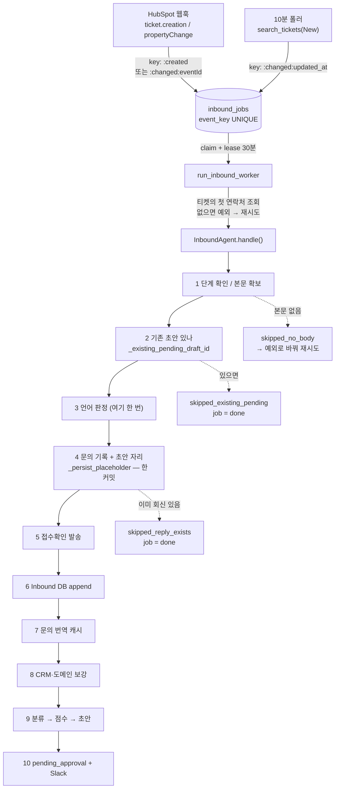

# 인바운드: 문의가 들어와 초안이 되기까지

> HubSpot 티켓 하나가 우리 DB 의 `Conversation` + 고객 메시지 한 줄 + 검토 대기 초안 한 통이
> 되기까지의 경로입니다. 들어오는 문은 둘 — HubSpot 웹훅(`src/api/webhook.py`)과 10분 폴러
> (`src/agents/inbound_poller.py`) — 이고, 둘 다 **일을 하지 않고** `inbound_jobs` 테이블에
> 행 하나를 넣고 끝냅니다. 실제 처리는 `run_inbound_worker` 가 그 행을 하나씩 집어
> `InboundAgent.handle()` 을 부르는 것뿐이고, `handle()` 은 이 서브시스템에서 유일하게 긴
> 함수입니다(`src/agents/inbound.py:148-345`). 티켓 본문 확보 → 언어 판정 → 문의·초안 자리
> 기록 → 접수확인 발송 → 시트 append → 문의 번역 → CRM 보강 → 분류 → 점수 → 초안 → 검토
> 대기, 이 순서이고 **순서 자체가 사양**입니다. 아래는 그 순서와, 그 순서를 뒤집었을 때 무슨
> 일이 나는지에 대한 문서입니다.

CLAUDE.md 에 이미 적힌 것(대전제·안전모드, 자동 회신은 대화당 한 번, 첫 회신 금액 금지,
유형↔문서 매핑을 코드에 두지 않는 이유, 서명·접수확인 푸터)은 여기서 다시 쓰지 않습니다.

## 한눈에

## 지켜야 하는 것들

### 초안이 하나인 것을 지키는 자물쇠는 세 개고, 큐의 event_key 는 그중 하나가 아니다

같은 티켓이 여러 번 밀려 들어오는데 초안은 하나여야 합니다. 그것을 실제로 지키는 것은
순서대로 이 셋입니다.

1. `_existing_pending_draft_id`(`src/agents/inbound.py:422-490`) — 티켓 키가 있으면 그 대화의
   outgoing 중 `draft_failed`·`rejected` 가 **아닌** 것이 하나라도 있으면 즉시 중단.
   `sent`·`superseded` 도 막습니다. 접수확인(`prompt_variant='auto_ack'`)은 세지 않습니다.
2. `_persist_placeholder` 안의 `prior_reply` 검사(`inbound.py:1125-1139`) — 티켓 없이 연락처로
   묶인 대화용. 여기서만 "문의는 기록하고 초안은 안 만든다"(`skipped_reply_exists`)가 나옵니다.
3. 접수확인 전용 부분 유니크 인덱스 `ux_messages_one_auto_ack_per_conversation`
   (`src/db/models.py:170-176`) — 웹훅과 폴러가 **같은 순간에** 첫 이벤트를 처리해도 접수확인은
   한 통. 애플리케이션 쪽 `with_for_update()` 는 그 앞의 직렬화이고, 최후의 방어는 인덱스입니다
   (`inbound.py:1312-1350` 의 `IntegrityError` 흡수).

`inbound_jobs.event_key` 는 이 목록에 없습니다. **웹훅과 폴러는 같은 티켓에 대해 서로 다른
키를 만듭니다** — 아래 함정 참고.

**어기면**: 한 티켓에 검토 대기 초안이 둘 생기고, 운영자가 둘 다 보냅니다. 고객은 같은 답을
두 번 받습니다.

### 언어 판정은 `handle()` 안에서 딱 한 번, `_persist_placeholder` 앞에서 일어난다

`inbound.py:206-209`. 이 값이 그 뒤 전부를 정합니다: 접수확인의 언어와 템플릿 선택, 회신 초안이
읽을 정책 문서의 언어, 본문 토큰의 한/영, 제목의 언어, 그리고 `Message.target_language`.
스크립트로 갈리는 언어(한/일/태/중)는 LLM 을 부르지 않습니다(`src/llm/language.py:47-71`).
라틴 문자만 flash 모델에 묻고, **실패하면 무조건 `en`** 입니다(`language.py:96-99`).

굳는 값과 쓰이는 값이 다릅니다:

- `Conversation.inquiry_language` 는 **처음 한 번만** 쓰이고 이후 덮이지 않습니다
  (`inbound.py:1039-1040`). 그런데 이 값을 읽는 곳은 화면 태그와 내보내기뿐입니다
  (`frontend/src/screens/MessageDetail.tsx:174`, `src/api/routes/exports.py:73`).
- 발송을 실제로 좌우하는 것은 `Message.target_language` 이고, 이것은 그때그때 판정한 값으로
  메시지마다 새로 박힙니다(`inbound.py:1151`, `1211`). 발송 직전의 마지막 문지기가 이 값만
  봅니다(`src/integrations/senders/__init__.py:16-66`).

**어기면**: 판정을 `_persist_placeholder` 뒤로 옮기면 접수확인이 언어 없이 나가고, 대화에
언어가 안 박혀 화면 태그가 영원히 빕니다. 반대로 초안 단계에서 다시 판정하게 만들면 —
라틴 문자는 모델 호출이라 결정적이지 않으므로 — 접수확인은 영어로, 상세 회신은 스페인어로
나가는 티켓이 생깁니다.

### durable job 이 이어받는 것은 "그 초안 하나"이고, 그 연결선은 문의 기록과 같은 커밋 안에 있다

`_persist_placeholder` 는 고객 문의 Message, 진행 기록, 초안 placeholder, 그리고
`InboundJob.payload["draft_message_id"]` 를 **한 번의 `session.commit()`** 으로 씁니다
(`inbound.py:1175-1182`). 워커가 다음 시도에서 그 payload 를 `_draft_message_id` 로 되돌려주고
(`src/agents/inbound_worker.py:238-243`), `resumable` 판정이 그 메시지가 같은 대화의
`drafting`/`draft_failed` outgoing 인지 확인한 뒤 **그 행을 다시 씁니다**(`inbound.py:1107-1114`).
`_existing_pending_draft_id` 도 이 한 건만 예외로 통과시킵니다(`inbound.py:482-488`).

재개일 때 `is_first_inbound` 를 다시 계산하는 것도 여기입니다: `prior_inbound == 1` (내가 지난번에
넣은 그 문의) **그리고** 접수확인이 아직 없을 때만 참(`inbound.py:1163-1173`). 접수확인을 만들기
직전에 죽은 프로세스만 접수확인을 다시 시도합니다.

**어기면**: 커밋을 나누면 — 문의를 먼저 쓰고 payload 를 나중에 — 그 사이에 죽은 프로세스의
초안은 주인 없는 `drafting` 으로 영영 남습니다. 화면에는 카드가 "작성중" 으로 계속 돌고,
다음 시도는 `_existing_pending_draft_id` 에 막혀 `skipped_existing_pending` 으로 job 을 `done`
처리합니다. 아무도 다시 오지 않습니다.

### `handle()` 이 조용히 return 하면 그 티켓은 끝난 것으로 간주된다 — 재시도는 예외로만 산다

워커는 `handle()` 이 예외를 던졌을 때만 재시도를 겁니다(`inbound_worker.py:247-256`). 그래서
"아직 본문이 안 왔다" 는 딕셔너리로 돌아온 뒤 **일부러 예외로 바뀝니다**
(`inbound_worker.py:245-246`). HubSpot 은 티켓을 만들고 본문·연락처를 조금 뒤에 붙이는 일이
있고, 그때 딱 한 번 조회한 결과로 문의를 버릴 수는 없습니다. 반대로 `skipped_not_new`,
`skipped_existing_pending`, `skipped_reply_exists` 는 상태 그대로 `done` 입니다 — 다시 해도
결과가 같은 종료입니다(`tests/test_inbound_worker.py:99-112` 가 고정).

**어기면**: 새 스킵 상태를 만들고 워커에 등록하지 않으면 그 티켓은 8번 재시도 후 `dead` 로
갑니다. 화면에는 아무것도 안 보이고, 로그에만 같은 예외가 여덟 줄 쌓입니다.

### 접수확인이 먼저, 시트가 나중. 이 순서는 테스트가 고정한다

`inbound.py:236-245`, `tests/test_inbound_auto_ack.py:163-177`. 이유는 사람이 기다리는 유일한
구간이 여기이기 때문입니다. 접수확인 앞에는 DB 왕복 두 뭉치(`_existing_pending_draft_id`,
`_persist_placeholder`)밖에 없습니다. 그 뒤로는 Google Sheets append(수 초), 문의 번역(모델),
CRM 보강(HubSpot 3회), 분류·점수·초안(pro 모델)이 줄줄이 붙지만 그때는 아무도 안 기다립니다.

**어기면**: 시트를 앞으로 옮기면 Sheets 가 느린 날 고객의 "접수했습니다" 메일이 몇 초씩
늦습니다. 시트가 죽은 날에는 — `_mirror_new_inbound_to_sheet` 가 전체를 `try` 로 감싸고 있으므로
(`inbound.py:419-420`) — 접수확인이 통째로 건너뛰어질 수 있습니다.

### 티켓 하나에 고객 메시지는 **한 줄만** 기록된다

`inbound.py:1061` 의 `if inbound_body and (not ticket_id or is_first_inbound)`. 티켓 키가 있으면
첫 inbound 일 때만 고객 본문을 씁니다. 재시도가 같은 문의를 두 번 붙이지 않게 하려는 조건인데,
결과적으로 **같은 티켓에 온 진짜 두 번째 고객 메시지도 저장되지 않습니다.** 실제로는 거기까지
가지도 않습니다: `_existing_pending_draft_id` 가 그 앞에서 `skipped_existing_pending` 으로
끊습니다(`inbound.py:185-199`).

확인 방법 — 같은 티켓 id 로 `handle()` 을 두 번 부르면(첫 회신을 `sent` 로 만들어 두어도)
두 번째는 `{'status': 'skipped_existing_pending'}` 이고 `messages` 는 inbound 1 + outgoing 1
그대로입니다.

> `docs/사용법.md:46-48` 의 "그 뒤에 같은 고객이 다시 메일을 보내면 화면에는 그대로
> 기록됩니다" 는 **티켓이 새로 열릴 때만** 맞습니다. HubSpot 이 답장을 기존 티켓에 붙이는
> 설정이면 그 메시지는 우리 화면 어디에도 없습니다. 고객 상세의 `기록 추가`로 사람이 옮겨
> 적는 것이 지금의 정답입니다.

**어기면**: 이 조건을 "재시도 방지" 로만 읽고 느슨하게 풀면 durable 재시도마다 같은 문의가
말풍선으로 쌓이고, 그 위에서 `_update_summary` 가 같은 말을 세 번 요약합니다.

### 초안의 제목·언어·가격은 모델이 아니라 코드가 정한다

`_draft_reply` 안의 CODE GUARD 네 개이고, 순서가 사양입니다.
`ensure_language` → `apply_editable_tokens` → 금액 제거 → 제목 → `korean_reading`.
토큰 치환이 언어 맞추기 **뒤**인 이유는
주석에 있습니다: 번역이 URL 을 기꺼이 고쳐 씁니다. 제목은 정책 문서가 제목을 들고 있으면 그것,
아니면 `RE: <고객 제목>` 입니다(`src/common/subjects.py`).

**어기면**: 토큰 치환을 앞으로 옮기면 120자짜리 예약 링크가 번역 과정에서 잘리거나 "정돈"
됩니다. 화면에서는 멀쩡해 보이고, 고객이 눌렀을 때 404 입니다.

한국어 대역(`korean_reading` → `messages.body_ko`)이 **맨 마지막**인 이유는 다릅니다:
링크와 금액이 확정된 뒤라야 두 벌이 같은 글이 되고, 그래야 운영자의 대조가 대조가 됩니다.

## 함정

### `HUBSPOT_TICKET_STAGE_NEW` 가 비면 문지기 셋이 동시에 열린다

기본값이 `""` 입니다(`src/common/config.py:57`). 비어 있을 때:

- 웹훅의 stage change → New 매핑이 통째로 꺼집니다(`webhook.py:103-106`, `not target` → None).
- 폴러가 `pipeline_stage=None` 으로 검색합니다(`inbound_poller.py:87`) — **모든 단계**의 티켓을
  긁어옵니다.
- `handle()` 의 단계 확인이 통째로 건너뜁니다(`inbound.py:152-157`, `expected_stage and ...`).

**보이는 모습**: 배포 직후 24시간(`INBOUND_INITIAL_LOOKBACK_HOURS`) 안에 손댄 모든 티켓 —
이미 답한 것, Won, Lost 포함 — 에 접수확인이 나가고 초안이 생깁니다.

### 웹훅과 폴러는 같은 티켓에 **서로 다른** 큐 키를 만든다

`inbound_event_key` 의 docstring 은 "One stable key shared by webhook and polling
discovery"(`inbound_worker.py:29-35`)이고, 이것은 `occurrence_key=None` 일 때만 참입니다.
실제로는:

| 출처 | key |
|---|---|
| 웹훅 `ticket.creation` | `hubspot:ticket:<id>:created` |
| 웹훅 stage→New | `hubspot:ticket:<id>:changed:<eventId>` (`webhook.py:252-254`) |
| 폴러 | `hubspot:ticket:<id>:changed:<updated_at ISO>` (`inbound_poller.py:98-104`) |

폴러는 `hs_lastmodifieddate` 를 언제나 받습니다(`src/integrations/hubspot.py:795-820`)므로
`occurrence_key` 는 항상 채워집니다. 즉 **새 티켓 하나는 보통 job 두 개**를 만듭니다(웹훅 1 +
폴러 1). 중복이 제거되는 것은 큐가 아니라 위의 자물쇠 셋에서입니다. 폴러의 15분 겹침
(`POLL_OVERLAP`, `inbound_poller.py:20`)이 10분 주기보다 긴 것은 의도이고, 그 겹침 안에서는
`updated_at` 이 같아 키가 같으므로 폴러끼리는 중복되지 않습니다.

**여기서 다치는 경우**: "job 이 하나니까 처리도 한 번" 이라고 믿고 `handle()` 안의 중복 방지를
지우는 것. 두 번 돕니다.

### `dead` 는 부활하지만 `done` 은 영원하다

`enqueue_inbound_ticket` 은 같은 키가 이미 있을 때, 그 job 이 `dead` 면 되살립니다
(`inbound_worker.py:69-82`). 그래서 8회 재시도로 죽은 티켓도 폴러가 다시 집어 올 수 있습니다 —
단 **같은 키로 다시 들어올 때만**, 즉 티켓의 `updated_at` 이 그대로일 때. `done`/`pending`/
`processing` 이면 그대로 무시(`return False`)입니다.

**보이는 모습**: 한 번 `done` 된 티켓은 다시 처리되지 않습니다. 그 티켓을 다시 태우려면
HubSpot 에서 티켓을 건드려 `hs_lastmodifieddate` 를 바꾸는 것이 유일한 방법입니다(그러면 폴러가
새 키를 만듭니다). `inbound_jobs` 행을 손으로 지우는 것도 같은 효과지만, 그러면 위의 자물쇠
1번에 막힙니다.

### 재시도 예산은 8회 ≈ 61분이다

`MAX_ATTEMPTS = 8`, 지연은 `min(30 * 2**(attempts-1), 1800)` (`inbound_worker.py:19`, `189`).
30·60·120·240·480·960·1800초, 합쳐서 약 61분. **연락처가 아직 안 붙은 티켓, 본문이 아직 안 온
티켓에 주어진 유예가 딱 이만큼입니다.** 넘으면 `dead` 이고, 그때부터는 폴러가 같은 키로
되살려 주기를 기다리는 수밖에 없습니다.

`LEASE_SECONDS = 30 * 60` 과 하트비트 `LEASE_SECONDS // 3 = 10분`(`inbound_worker.py:20-21`)은
별개 축입니다. 초안 작성이 30분을 넘고 하트비트 스레드까지 죽으면 다른 워커가 리스를
가져갑니다.

### 결과를 버리는 쪽을 택한 자리가 있다 — 리스를 빼앗기면 완료 기록이 사라진다

`_finish_job` 과 `_retry_job` 은 `locked_by=owner` 조건이 붙은 UPDATE 이고, 리스를 빼앗겼으면
0행을 고치고 **조용히 끝납니다**(`inbound_worker.py:167-205`). 즉 일은 다 했는데 job 은
`processing` 으로 남아 다시 claim 되고, 같은 티켓이 한 번 더 돕니다. 안전한 이유는 그때
자물쇠 1번이 막아 주기 때문입니다. 자물쇠를 약하게 만들면 이 설계가 같이 무너집니다.

### 기업 종류 분류는 도메인도 도메인 프로필도 못 본다 — 순서 때문에

`_company_type` 은 `_mirror_new_inbound_to_sheet` 안에서 불리고(`inbound.py:396-397`), 그것은
`_enrich_draft_context` **앞**입니다(`inbound.py:245` vs `258`). 그래서 그 시점에
`contact_info["domain_profile"]` 은 항상 `None` 이고, `contact_info["domain"]` 은 아예 어디서도
채워지지 않는 키입니다(`_fetch_contact` 의 dict 에 없습니다, `inbound.py:493-511`). 결국 모델은
`company` 와 문의 본문 1500자만 보고 「기업 종류」를 정합니다.

**보이는 모습**: 워크북 「기업 종류」 열의 정확도가 도메인 분석을 켜든 끄든 똑같습니다.
고치려면 `_company_type` 을 보강 뒤로 옮겨야 하는데, 그러면 시트 append 가 접수확인보다 더
뒤로 밀립니다 — 어느 쪽이 나은지는 운영자에게 물어야 합니다.

### 도메인 재분석 주기는 설정값을 읽는다

`domain_enrichment.py`의 캐시 만료 판단은 `settings.INBOUND_DOMAIN_REANALYZE_DAYS`를
읽습니다. `.env`에서 바꾼 일수가 다음 분석부터 적용됩니다.

### Client ID는 회사 키, Inquiry ID는 문의 행 키

`sheet_sync.reserve_inbound_client_id`는 `client_ids.find_existing_client_id`를 거쳐 같은 연락처,
같은 회사 도메인(개인 메일 제외)의 Client ID를 재사용합니다. 새 회사만 1000번대 번호를
발급하며 PostgreSQL에서는 advisory transaction lock으로 동시 발급을 직렬화합니다.

같은 Client ID로 문의 행이 여러 개 생길 수 있으므로 `Conversation.sheet_inquiry_key`와 시트의
`Inquiry ID` 열이 행의 고유키입니다. 실시간 append와 백필 모두 이 값을 쓰고, 단계 갱신·삭제도
Client ID와 Inquiry ID를 함께 넘깁니다. 0085가 기존 `sheet_client_id` UNIQUE 인덱스를 풀고
기존 대화에 문의 키를 채웁니다. 과거에 이미 갈라진 Client ID는 자동 병합하지 않습니다 —
계약·시트 행까지 함께 옮겨야 하므로 운영자가 확인한 뒤 별도 정리해야 합니다.

### 처리 완료 마커는 쓰기만 하고 아무도 읽지 않는다

`handle()` 은 성공할 때마다 `_mark_ticket_processed` 로 `events` 테이블에 행 하나를 넣습니다
(`inbound.py:320-330`). 그 값을 읽는 `_is_ticket_already_processed` / `_processed_ticket_ids`
(`inbound_poller.py:52-60`)를 부르는 프로덕션 코드는 없습니다 — 테스트만 부릅니다. 그리고
`_processed_ticket_ids` 는 **테이블 전체를 메모리로 올립니다.** 되살리는 순간 티켓 수만큼
커지는 SELECT 가 10분마다 돕니다.

같은 계보로 `inbound.py:100` 의 `_processed: set[str]` 도 죽어 있습니다(주석에 그렇게 적혀
있고, 테스트 픽스처만 비웁니다).

`events` 는 폴링 워터마크(`inbound_poller.py:46-49`)도 10분마다 한 행씩 append 하고, 어디에도
정리 코드가 없습니다.

### `_dispatch_auto_ack` 은 `asyncio.run` 이다 — 이벤트 루프 안에서 `handle()` 을 부르면 접수확인만 죽는다

`inbound.py:1360`. 지금 `handle()` 을 부르는 곳은 워커 하나뿐이고, 워커는
`asyncio.to_thread(process_one_inbound_job)` 으로 별도 스레드에서 돕니다
(`inbound_worker.py:271`) — 루프가 없으니 안전합니다. FastAPI 라우트에서 `handle()` 을 직접
`await` 없이 부르는 순간 `asyncio.run` 이 `RuntimeError` 를 내고, 그것은
`_maybe_send_auto_ack` 의 광범위한 `except` 에 먹힙니다(`inbound.py:1292-1293`).

**보이는 모습**: 초안은 정상적으로 만들어지고, 접수확인만 안 나갑니다. 처리 경과에
`자동 접수확인 메일 발송 재시도 대기 또는 수동 확인 필요.` 한 줄이 남습니다.

### 시트 미러 실패는 경고 한 줄이다 — 복구는 폴러가 한다

`_mirror_new_inbound_to_sheet` 전체가 하나의 `try`(`inbound.py:419-420`)이고, 실패하면
`Sheet mirror skipped/failed for msg N.` 만 남습니다. Client ID 예약도, `sheet_inbound_row`
기록도 안 됩니다. 복구는 폴러 틱마다 도는 `sync_pending_inbound_rows` 가
`sheet_inbound_row IS NULL AND last_incoming_at IS NOT NULL` 인 대화를 50건씩 다시 시도하는
것입니다(`sheet_sync.py:614-627`). **그래서 폴러를 끄면 시트 복구도 같이 꺼집니다.**

### 폴러 기본값은 꺼짐이다

`INBOUND_POLL_ENABLED: bool = False`(`config.py:153`). 배포 환경은 `render.yaml:159` 에서 켜고
있지만, 로컬이나 새 환경에서 `.env` 를 안 만들면 **웹훅 유실이 영영 복구되지 않습니다.**
같은 파일(`render.yaml:150-155`)에서 `INBOUND_AUTO_ACK_ENABLED=false` 로 못 박혀 있는 것도
같이 보세요 — 이 값이 false 면 접수확인 Message 행 자체가 생기지 않습니다. "메일이 안 나간다"
와 "화면에 접수확인이 없다" 는 원인이 다릅니다.

### 답장은 연락처 주소가 아니라 티켓의 주소로 간다

`_fetch_contact` 이 티켓의 `hs_all_associated_contact_emails` 첫 주소로 `info["email"]` 을
덮어씁니다(`inbound.py:546-555`). 그 값이 그대로 `Contact` 조회 키(`normalized_email`)와
`Message.to_address` 가 됩니다. `_TICKET_PROPERTIES` 에서 그 열 하나만 빠져도 답장이 조용히
연락처 주소로 돌아갑니다 — `tests/test_inbound_fetch_body.py:203-208` 이 그 열의 존재만
확인하는 이상한 테스트인 이유입니다.

### 접수확인 제목에는 `RE:` 가 없다 — 고객 메일함에서 별도 스레드로 뜬다

그 언어의 고정 제목 행이 있으면 그것을 쓰고, 없으면 `RE: <고객 제목>` 으로 떨어집니다
(`inbound.py:1280-1288`). 알고 치르는 대가라고 주석에 적혀 있습니다. 담당자의 상세 회신은
언제나 `RE:` 이므로 그쪽은 원래 스레드에 붙습니다.

### 문의 번역은 실패하면 비워 둔다 — 원문을 넣으면 안 된다

`cache_korean_inquiries`(`inbound.py:1454-1504`). `to_korean` 이 실패하면 예외 대신 빈 문자열을
돌려주므로, 그 자리에 원문을 채우면 영어가 「한국어 번역」이라는 이름으로 굳고 폴러가 그 행을
다시 집지 않습니다. `NULL` 은 "아직 안 옮겼다" 하나만 뜻해야 합니다. **화면을 여는 길에서는
절대 부르지 마세요** — 예전에 티켓을 열 때 번역해서, 처음 여는 사람이 말풍선마다 모델을
기다렸습니다.

## 왜 이렇게 되어 있는가

### 웹훅이 아무 일도 하지 않고 200 을 돌려주는 이유

HubSpot 은 200 을 못 받으면 **배치 전체**를 재전송합니다. 그래서 서명 검증 → 파싱 → DB insert
까지만 하고 끝냅니다(`webhook.py:184-266`). 같은 이유로 `_handle_deletion` 과
`_sync_stage_change` 는 절대 예외를 밖으로 내보내지 않습니다(`webhook.py:114-156`). 본문 크기
1MB·이벤트 100개 상한도 파싱 전에 걸립니다.

### `ticket.deletion` 이 `_HUBSPOT_SUBSCRIPTION_MAP` 에 없는 이유

거기 등록된 타입은 곧 "인바운드 작업으로 큐에 넣을 것" 이고, 없어진 티켓을 조회하는 것은
작업이 아닙니다(`webhook.py:109-111`). 삭제는 매핑 밖에서 따로 처리합니다.

### 폴러 워터마크는 실패하면 전진하지 않는다

`_save_ticket_poll_marker(now)` 는 루프가 정상 종료했을 때만 호출됩니다
(`inbound_poller.py:123`). 검색 실패·enqueue 실패는 전부 `return queued` 로 빠져 워터마크를
그대로 둡니다(`tests/test_inbound_poller.py:194-205` 가 고정). `now` 를 폴 **시작** 시각으로
잡는 것도 같은 이유 — 도는 동안 바뀐 티켓을 다음 회차가 다시 봅니다.

한 페이지가 꽉 찼는데 최종 변경 시각이 전진하지 않으면 커서를 옮기지 않고 그냥 나갑니다
(`inbound_poller.py:116-120`). 여기서 커서를 밀면 티켓이 조용히 사라집니다.

### 라우터가 문서를 하나도 못 고르면 유형 매칭으로 떨어진다

`select_relevant_docs`(`src/llm/knowledge.py:244-251`). 그래서 사본의 `categories` 가
`["all"]` 이어야 한다는 CLAUDE.md 의 규칙이 있습니다 — 폴백까지 0건이면 **문서 없이** 답을
씁니다. 그 상태는 화면에 아무 표시도 남기지 않고, 로그의
`Doc router selected nothing` 한 줄이 전부입니다.

### 접수확인만 영어 전용 행을 갖는 이유

사람이 앞에 없는 유일한 메일이라, 매번 번역하면 고객이 기다리는 Gemini 호출이 되고 문장이
매번 조금씩 달라집니다 — 늘 똑같아야 하는 그 한 통에 대해서. 그래서 `auto_ack_en` 행이 있고
(0053), 다른 언어는 여전히 번역합니다(`inbound.py:1259-1278`).

### 초안이 완성된 뒤에 한 번 더 단계를 확인하는 이유

`handle()` 의 단계 확인은 접수 시점 한 번인데 초안 작성은 몇 분 걸립니다. 그 사이 티켓이
움직였으면(미팅 링크 발송, HubSpot 에서의 답장, 콘솔 보드 이동) 완성된 초안은 늦은 답입니다.
`_finalize_draft` 가 `session.flush()` **후에** `_retire_superseded_drafts` 를 부르고
(`inbound.py:1231-1237`), 여기서 안 닫으면 그 대화에는 다시 아무 이벤트도 오지 않으므로 아무도
안 닫습니다. `flush()` 가 먼저인 것도 사양입니다 — `SessionLocal` 이 `autoflush=False` 라
방금 준 `pending_approval` 이 DB 에 없으면 아래 조회가 그 행을 못 봅니다.

### 왕복이 200ms 인데 접수 경로가 세션을 스무 번 여는 이유

`handle()` 한 번에 `SessionLocal()` 이 열리는 곳: `_existing_pending_draft_id`,
`_persist_placeholder`, `_persist_auto_ack`, 발송 워커 내부, `_mirror_new_inbound_to_sheet`(3),
`cache_korean_inquiries`, `_is_first_reply`, `_build_conversation_context`, `_finalize_draft`,
`_update_summary`(2), `_mark_ticket_processed`. 도쿄까지 왕복 200ms 면 순수 네트워크만 수 초
입니다. 그래도 되는 이유는 이 전부가 백그라운드 워커 스레드에서 돌고 응답을 기다리는 사람이
없기 때문입니다. **단 하나의 예외가 접수확인까지의 시간**이고, 그래서 그 앞에는 위의 두 개만
있습니다. 최적화가 필요해지면 뒤쪽(보강·요약)을 묶으세요. 앞쪽 두 개를 합치려 들면 durable
재개의 "한 커밋" 불변식이 깨집니다.

## 손대려면 같이 봐야 하는 것

| 고치는 곳 | 같이 고쳐야 하는 곳 | 왜 |
|---|---|---|
| `src/agents/inbound.py` 의 스킵 상태(`skipped_*`) | `src/agents/inbound_worker.py:245-246`, `tests/test_inbound_worker.py:99-112` | 재시도할 상태인지 종료할 상태인지가 워커에만 적혀 있습니다 |
| `_persist_placeholder` 의 커밋 경계 | `inbound_worker.py:238-243` (`_draft_message_id` 왕복) | 재개가 그 한 커밋에 걸려 있습니다 |
| `webhook.py` 의 `occurrence_key` | `inbound_poller.py:98-104`, `inbound_worker.py:29-35` | 세 곳이 같은 키 규칙을 각자 만듭니다 |
| `Message.prompt_variant == 'auto_ack'` 조건 | `inbound.py:476-477,752,1074-1075,1131-1132,1168`, `stage_sync.py:158`, `senders/__init__.py:80,98` | "접수확인은 회신이 아니다" 가 여덟 군데에 손으로 반복돼 있습니다 |
| `ux_messages_one_auto_ack_per_conversation` | `src/db/models.py:170-176`, 대응 마이그레이션, `tests/test_inbound_auto_ack.py:119-147` | 애플리케이션 잠금이 아니라 이 인덱스가 최후 방어입니다 |
| 언어 판정 위치 | `inbound.py:206-209`, `1039-1040`, `1151`, `1211`, `senders/__init__.py:16-66`, `frontend/src/screens/MessageDetail.tsx:174` | 굳는 값(대화)과 쓰는 값(메시지)이 다릅니다 |
| `_TICKET_PROPERTIES` | `src/integrations/hubspot.py:788-791`, `tests/test_inbound_fetch_body.py:203-208` | 열 하나가 빠지면 답장 주소가 조용히 바뀝니다 |
| `reserve_inbound_client_id` | `src/agents/client_ids.py`, `src/agents/sheet_sync.py:483-517`, `src/integrations/google_sheets.py:265-295` | 지금 두 갈래이고, 한쪽만 고치면 어긋납니다 |
| `_company_type` 호출 위치 | `inbound.py:245` vs `258` | 옮기면 시트 append 가 접수확인보다 뒤로 밀립니다 |
| `INBOUND_POLL_ENABLED` | `sheet_sync.sync_pending_inbound_rows`, `inbound.cache_korean_inquiries`, `hubspot_backfill` | 폴러 틱이 이 셋의 유일한 재시도 자리입니다(`inbound_poller.py:199-217`) |
> 2026-08-24 변경: 즉시 자동 접수확인은 제거되었습니다. 이 문서의 `auto_ack` 설명은 과거 데이터와 제거 전 설계를 이해하기 위한 기록이며, 현재 인바운드는 검토용 초안만 만듭니다.
