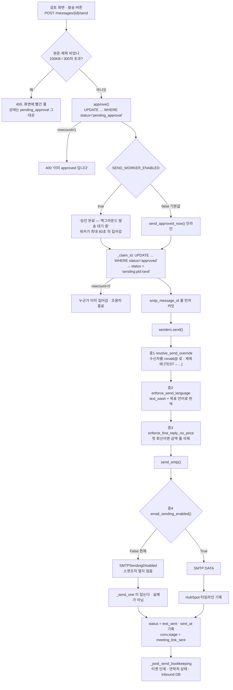

# 검토에서 발송까지, 그리고 안 나가게 막는 장치들

> 운영자가 초안을 읽고 `발송` 을 누르는 순간부터, 메일이 SMTP 를 떠나고, HubSpot 티켓과
> 워크북이 따라 움직이는 데까지가 이 서브시스템이다. 가운데에 `Message.status` 하나가
> 있고 — 화면·집계·발송·복구가 전부 그 한 칸만 본다 — 그 칸을 옮기는 것은 승인
> (`approval.approve`), 발송 워커(`send_worker`), 그리고 단계 동기화
> (`stage_sync._retire_superseded_drafts`) 셋뿐이다. 발송 경로에는 메일을 못 나가게 하는
> 층이 네 겹 쌓여 있고, 그중 가장 아래 한 겹(`EMAIL_SENDING_ENABLED`)이 지금 켜져 있어서
> **오늘 이 시스템에서 나가는 메일은 한 통도 없다**. 그런데도 단계 이동·HubSpot·워크북은
> 전부 진짜로 일어난다 — 그 비대칭이 이 문서의 절반이다.

전제로 읽을 것: CLAUDE.md 의 「Pre-launch safety」 · 「Email is a separate axis」 ·
「서명은 사람이 고르는 것」 항목. 여기 적는 것은 거기 **없는 것**이다.

## 한눈에

## 지켜야 하는 것들

### 메일을 막는 층은 네 겹이고, 가장 아래 한 겹만이 진짜 차단이다

위에서부터: ① `senders.send()` 의 수신자 재작성(`src/integrations/senders/__init__.py:179-196`),
② `send_smtp()` 안의 같은 재작성(`src/integrations/senders/smtp.py:146-149`) — `send()` 를
거치지 않은 호출자를 위한 그물, ③ SMTP 자격증명 미설정
(`src/integrations/senders/smtp.py:151-152`), ④ `email_sending_enabled()`
(`src/integrations/senders/smtp.py:140-144`). ①②③은 **어디로 갈지**를 바꿀 뿐 메일은
나간다. 아무 데도 안 나가게 하는 것은 ④뿐이고, 그래서 ④는 함수의 맨 첫 줄이다 —
`_build_message` 보다도, 자격증명 검사보다도 앞이다.

**어기면**: ④를 `_build_message` 뒤로 옮기면, 서명·제목 인코딩이 잘못된 메일에서는
`SMTPHeaderInjectionError` 가 먼저 나서 `send_failed` 가 되고, 운영자는 "발송 실패" 를 보고
원인을 SMTP 에서 찾는다. 실제로는 애초에 보낼 생각이 없던 건이다.

### 한 행은 정확히 한 번만 발송된다 — 그것을 지키는 것은 상태 문자열 하나다

클레임은 `UPDATE messages SET status='sending:<pid>:<rand>' WHERE id=? AND status='approved'`
(`src/agents/send_worker.py:320-333`). `rowcount == 1` 인 프로세스만 이긴다. `_send_one` 은
자기가 이긴 행인지 다시 확인하고(`send_worker.py:188`), 아니면 아무것도 안 하고 돌아온다.
`SELECT FOR UPDATE` 를 안 쓰는 이유는 SQLite 와 Postgres 양쪽에서 같은 코드가 돌아야 하기
때문이다(`send_worker.py:339-341`).

**어기면**: `_WORKER_ID` 의 `sending:` 접두사를 바꾸면 `_reclaim_stuck_sending` 의
`status LIKE 'sending:%'`(`send_worker.py:400`)와 검토 목록의 "중간 상태는 숨긴다" 규칙
(`src/api/routes/messages.py:461-463`)이 동시에 끊긴다. 그 문자열 포맷은 주석이 아니라
**계약**이다. 끊기면 발송 도중에 죽은 행이 영원히 `sending:...` 로 남고, 어느 목록에도
안 나오고, 아무도 다시 집어 가지 않는다.

### 승인 라우트는 워커가 켜져 있으면 절대 직접 보내지 않는다

`src/api/routes/messages.py:728-739` 과 `src/api/main.py:515-523` 이 같은 분기를 갖는다.
워커가 켜져 있으면 라우트는 승인만 하고 끝낸다.

**어기면**: 둘 다 보내면 워커의 클레임과 인라인 클레임이 경쟁하고, 하나는 지지만
`send_approved_now` 는 진 것을 `False` 로 돌려주므로 화면에는 **"승인됐지만 발송에
실패했습니다"** 빨간 줄이 뜬다. 메일은 정상적으로 나갔는데. 이 분기가 그것을 막는다.

### 발송 뒤 처리는 어떤 경우에도 발송을 되돌리지 않는다

`_post_send_bookkeeping` 은 예외를 안 던지도록 쓰였고(`send_worker.py:101-103`), 그래도
새는 예외는 `_send_one` 이 잡아 로그만 남긴다(`send_worker.py:251-257`). 상태 커밋은
bookkeeping **앞**에서 이미 끝나 있다(`send_worker.py:238`).

**어기면**: 시트가 5분 죽은 것 때문에 이미 고객에게 간 메일이 `send_failed` 로 남고,
복구 화면의 「발송·작성 실패」 목록에 뜬다. 운영자가 `재시도` 를 누르면 같은 메일이 한 번
더 간다. `tests/test_send_worker.py:251` 이 이것만 본다.

### `sent` 는 고객에게 정말 간 것뿐이다

`test_mode = bool(resolve_send_override()) or not delivered`
(`send_worker.py:226-227`). 테스트 주소로 돌렸거나 아예 안 보냈으면 `test_sent`.

**어기면**: 발송률·리포트(`src/agents/report.py:51` 이 `status == "sent"` 로 센다)가
나가지도 않은 메일을 세고, 나중에 진짜 발송을 시작했을 때 어느 달부터가 진짜인지 알 수
없다.

### 발송 경로에서 본문을 고치는 것은 두 가드뿐이고, 순서가 정해져 있다

`enforce_send_language` → `enforce_first_reply_no_price`
(`src/integrations/senders/__init__.py:199-201`). 번역이 먼저다.

**어기면**: 뒤집으면 한국어 본문에서 금액을 지운 뒤 번역하는 게 아니라, 금액을 지우고
**번역이 다시 금액을 만들어 낸다**. `enforce_first_reply_no_price` 의 docstring 이 "Runs
AFTER translation so a translated-in price is caught too" 라고 적어 둔 이유가 이것이다
(`senders/__init__.py:76`).

## 함정

### 「서명 없음」 을 고르고 `발송` 을 누르면 서명이 그대로 붙었다 — 고침

> **고쳐졌습니다.** `approve()` 가 「안 넘겼다」와 「없음으로 정했다」를 `_UNSET` 센티널로
> 가릅니다. `tests/test_translate.py::test_choosing_no_signature_and_sending_straight_away_removes_it`
> 이 양쪽(고르면 지워지고, 안 넘기면 그대로)을 고정합니다. 아래는 그 기록입니다 —
> **None 이 「값 없음」과 「없음이라는 값」을 겸하면 반드시 나는 사고**의 표본입니다.

`approve()` 는 `signature_key is not None` 일 때만 값을 쓴다
(`src/agents/approval.py:70-71`). 그런데 `_clean_signature_key("")` 는 「서명 없음」에 대해
**`None`** 을 돌려준다(`src/api/routes/messages.py:79`). 즉 "서명을 지워라" 와 "건드리지
마라" 가 같은 값으로 도착한다. 초안은 `_default_signature()` 로 목록 첫 서명을 이미 달고
있으므로(`src/agents/inbound.py:1150`), 결과는 **운영자가 뗀 서명이 그대로 붙어 나가는
것**이다.

같은 폼의 다른 두 버튼은 안 그렇다. `저장`(`messages.py:808`)과
`번역하기`(`messages.py:637`)는 `msg.signature_key` 에 직접 대입하므로 `None` 이 저장된다.
그래서 **`저장` 이나 `번역하기` 를 거쳐 발송하면 지워지고, 곧장 `발송` 을 누르면 안
지워진다** — 화면에는 어느 쪽도 티가 안 난다. 미리보기(`messages.py:744-755`)는 폼 값을
그대로 렌더하므로 미리보기에는 서명이 없다. 미리보기와 실제 메일이 다른 유일한 자리다.

### 지금 이 순간 발송 후 동기화 재시도 기계는 통째로 죽어 있다

`_retry_post_send_syncs` 는 `status == "sent"` 만 고른다(`send_worker.py:429`). 복구 화면의
「동기화 실패」 목록도 마찬가지고(`src/api/routes/recovery.py:66`), 운영자용 강제 재동기화
라우트도 마찬가지다(`recovery.py:215-232`). 그런데 `FORCE_TEST_RECIPIENT = True` 인 동안 모든
발송은 `test_sent` 다.

**결과**: HubSpot 티켓 이동이나 Inbound DB 갱신이 실패하면 `post_send_sync_error` 에 사유가
적히기는 하는데, 아무도 그 행을 다시 보지 않고 화면 어디에도 안 나온다. 조용한 실패의
표준형이다. 발송을 진짜로 켜는 날 이 세 곳의 조건을 같이 봐라 —
`status.in_(("sent", "test_sent"))` 로 바꿔야 할지, 아니면 그때는 `sent` 만 남으므로 저절로
풀리는지.

### 첫 회신 금액 가드는 언어가 안 정해지면 통째로 안 돈다

`enforce_first_reply_no_price` 의 첫 두 줄이 `target_language` 가 비면 그냥 `return` 이다
(`src/integrations/senders/__init__.py:78-79`). 금액 규칙은 언어와 아무 상관이 없는데도
그렇다. `target_language` 는 초안을 만들 때 `inquiry_lang` 을 그대로 넣은 값이라
(`src/agents/inbound.py:1151`) 언어 판정이 비면 NULL 로 남는다.

**결과**: 언어를 못 잡은 문의일수록 — 즉 본문이 짧거나 이상한 문의일수록 — 첫 회신 금액
가드가 없다. 초안 단계의 가드(`inbound.py:891-906`)는 돌았으므로 운영자가 검토 화면에서
직접 적어 넣은 금액만 새는데, 그게 정확히 이 하드 가드가 존재하는 이유다.

### 발송 한도는 안 나간 메일도 센다. 그리고 하루가 바뀌는 시각은 오전 9시다

`_record_send()` 는 실제로 SMTP 를 쓴 것만 센다(`send_worker.py:239-242`, 주석도 그렇게
적혀 있다). 하지만 한도 판정은 프로세스 카운터와 **DB 카운터의 최댓값**이고
(`send_worker.py:48`), DB 카운터는 `sent_at` 이 오늘인 `Message` 행을 전부 센다
(`send_worker.py:83-88`) — 상태도 `prompt_variant` 도 안 본다. `_send_one` 은 안 나간
건에도 `sent_at` 을 찍는다(`send_worker.py:229`).

**결과**: 접수확인도 세고, 한 통도 안 나간 `test_sent` 도 센다. 하루 400건
(`DAILY_SEND_LIMIT`, `src/common/config.py:172` — 무료 Gmail 500/일에 대한 여유값)을 채우면
워커가 "Daily send limit reached" 를 찍고 멈춘다. 메일은 애초에 한 통도 안 나갔는데.
그리고 `_reset_daily_if_needed` 는 **UTC** 자정 기준이라(`send_worker.py:37`) 실제로는
한국시간 오전 9시에 리셋된다. `TIMEZONE=Asia/Seoul` 설정과 무관하다.

### `approved` 로 남은 행은 어느 화면에도 없다

검토 목록의 두 바구니는 `approved` 를 일부러 뺐고(`src/api/routes/messages.py:464-470`),
복구 화면도 `send_failed`/`delivery_unknown`/`draft_failed`/`drafting` 만 본다
(`recovery.py:51-61`). 이유는 "큐에 들어갔으니 사람이 결정할 게 없다" 이고, 워커가 돌고
있는 한 맞다.

그런데 `approved` 로 **멈춰 있게 되는** 길이 셋 있다:

1. `SEND_WORKER_ENABLED=true` 인데 워커가 실제로는 안 도는 경우(기동 실패, 웹 프로세스가
   여러 개라 기동 가드에 걸림 — `src/api/main.py:119-123`).
2. 쿼터에 걸린 인라인 발송. `send_approved_now` 가 `scheduled_at` 을 60초 뒤로 밀고 `False`
   를 돌려주는데(`send_worker.py:367-376`), 워커가 꺼져 있으면 그 60초 뒤에 아무도 안 온다.
   화면에는 **"승인됐지만 발송에 실패했습니다"** 가 뜨고 행은 `approved` 로 남는다.
3. 클레임 경쟁에서 진 경우(`send_worker.py:377-378`) — 같은 화면, 같은 결말.

**결과**: 승인은 됐고 메일은 안 나갔고 어느 목록에도 안 보인다. 찾는 방법은 DB 를 직접
보는 것뿐이다.

### 승인과 발송 사이에 단계 동기화가 끼면 그 회신은 조용히 종료된다

`_SUPERSEDABLE` 에 `approved` 가 들어 있다(`src/agents/stage_sync.py:122`). 주석이 이유를
적어 뒀다 — "발송 워커는 상태만 보고 집어 가므로, 티켓이 이미 지나간 뒤에도 고객에게
메일을 보낼 수 있는 유일한 미발송 상태였다". 옳은 설계지만 뒷면이 있다: 운영자가 `발송` 을
눌러 `approved` 가 된 직후, 워커가 집어 가기 전 최대 60초 안에 10분 폴러나 웹훅이 그
티켓의 단계를 New 밖으로 옮기면 **그 행은 `superseded` 가 되고 메일은 나가지 않는다.**
화면에는 「발송 완료」 바구니에 종료로 나타난다. `sending:*` 는 목록에 없으므로 이미
클레임된 행은 안전하다 — 창은 승인과 클레임 사이뿐이다.

### 테스트 모드에서는 번역과 금액 제거가 행에 저장되지 않는다

`senders.send()` 는 재라우팅할 때 `copy.copy(message)` 로 사본을 만들고 그 뒤의 모든
본문 가공을 사본에 한다(`src/integrations/senders/__init__.py:186`, `199-201`). ORM 행은
안 건드린다 — 검토 화면이 보여 주는 수신자와 제목을 테스트 발송이 덮어쓰면 안 되기
때문이다.

**결과**: 진짜 발송에서는 번역·금액 제거 결과가 `_send_one` 의 커밋과 함께 행에 남고,
테스트 발송에서는 안 남는다. 같은 티켓의 본문이 모드에 따라 다르게 보인다. 발송된 메일의
실제 본문을 알고 싶으면 행이 아니라 HubSpot 타임라인을 봐야 한다(제목의 `[TEST→…]` 표식이
어느 쪽인지 알려 준다).

### `move_ticket_stage_after_send` 는 설정이 비어 있으면 "성공" 이다

`HUBSPOT_TICKET_STAGE_AFTER_SEND` 가 빈 문자열이면 `True` 를 돌려준다
(`src/integrations/hubspot.py`, `move_ticket_stage_after_send` 의 `if not ticket_id or not
target: return True`). 그러면 `_post_send_bookkeeping` 의 `errors` 가 비고
`post_send_synced_at` 이 찍힌다.

**결과**: 화면상 동기화는 완료인데 HubSpot 티켓은 영원히 New 다. 티켓이 안 움직인다는
신고를 받으면 코드가 아니라 그 설정값을 먼저 봐라.

### `approval.mark_sent` 는 아무도 부르지 않는다

`src/agents/approval.py:139-156`. 호출자가 없다(코드·테스트 전부). 클레임 없이 상태를
`sent` 로 만들고 티켓 단계를 옮기는, 발송 경로를 통째로 우회하는 함수다.

**결과**: 이걸 "간단한 유틸" 로 알고 새 코드에서 부르면 중복 발송 방지가 없는 두 번째 발송
경로가 생긴다. 되살릴 이유가 있으면 `_send_one` 의 성공 분기와 같은 일을 하는지부터 맞춰
봐라.

### 리포트 메일러는 chokepoint 밖에 있다

`src/agents/report.py:145-187` 은 `smtplib` 를 직접 연다. 그래서 no-send 스위치와 수신자
고정을 **자기가** 검사한다(`report.py:150-170`). `tests/test_safe_mode.py:432` 가 이것만
따로 고정한다.

**결과**: 새 발송 경로를 만들 때 `senders.send()` 를 안 쓰기로 했다면 그 경로도 같은 두 줄을
직접 넣어야 한다. 그리고 `tests/test_safe_mode.py` 에 줄을 하나 추가해야 한다 — CLAUDE.md
의 대전제 항목이 요구하는 그것이다.

## 왜 이렇게 되어 있는가

### no-send 스위치는 "실패" 가 아니라 "이번 건은 안 보냄" 이다

`SMTPSendingDisabled` 는 `SMTPPermanentError` 의 하위 클래스라
(`src/integrations/senders/smtp.py:114`) 원래대로면 재시도 없이 `send_failed` 로 떨어진다.
예전에 실제로 그랬고, 운영자가 `발송` 을 눌렀는데 아무 일도 안 일어난 것처럼 보였다. 지금은
`_send_one` 이 그 예외만 따로 잡아(`send_worker.py:214-220`) 나머지 — 단계 이동, HubSpot
티켓, 워크북 — 를 전부 그대로 진행한다. 코드에 한국어 주석으로 사고 경위가 그대로 남아
있다(`send_worker.py:202-210`).

같은 자리에 적힌 두 번째 결정: **고객 타임라인에는 "답장했다" 기록이 안 남는다.**
`senders.send()` 가 타임라인을 SMTP **뒤에** 쓰기 때문에(`senders/__init__.py:204-211`)
거기까지 도달하지 못한다. 순서가 곧 보증이다 — 타임라인 기록을 SMTP 앞으로 옮기면 나가지도
않은 메일이 고객 이력에 답장으로 남는다.

### 발송 후 처리를 `not test_mode` 로 막던 시절이 있었다

`FORCE_TEST_RECIPIENT` 가 켜져 있는 한 `test_mode` 는 **항상** 참이라, HubSpot 티켓도
워크북도 영영 안 움직였다. 지금은 test_mode 와 무관하게 돈다(`send_worker.py:244-250`) —
목적지별 차단은 `guard_external_write` 가 각자 하므로 여기서 두 번 막을 일이 아니다.
`tests/test_safe_mode.py:520` 이 이 회귀만 본다.

### 테스트 발송도 HubSpot 타임라인에 남긴다

예전에는 재라우팅된 발송의 타임라인 기록을 건너뛰었고, 그러면 테스트 발송마다 고객 이력에
구멍이 생겼다 — `FORCE_TEST_RECIPIENT` 가 켜져 있는 한 그게 **모든** 발송이다. 지금은
남기되, 남기는 것은 실제로 나간 사본(제목의 `[TEST→…]` 포함)이라 테스트 사본이 진짜 답장으로
읽힐 수 없다(`senders/__init__.py:207-211`). 그래서 `_log_hubspot_email` 이 `message`(나간
사본)와 `row`(ORM 행) 둘을 받는다 — 관계는 행에서 읽고 engagement id 도 행에 찍어야 하는데,
사본은 둘 다 못 한다(`senders/__init__.py:121-127`).

### `smtp_message_id` 를 SMTP 전에 커밋하는 이유

`_send_one` 이 SMTP 를 건드리기 전에 결정론적 Message-ID 를 만들어 커밋한다
(`send_worker.py:192-197`). UUID5 라 같은 행 id 면 항상 같은 값이다
(`smtp.py:30-40`). 프로세스가 DATA 도중에 죽으면 그 행은 `delivery_unknown` 이 되는데, 그때
메일함에서 그 메일을 찾을 유일한 열쇠가 이 값이다. 나중에 찍으면 죽은 뒤엔 없다.
`tests/test_send_worker.py:207` 이 "unknown 이어도 smtp_message_id 는 있다" 를 고정한다.

### 세 가지 실패를 다르게 처리하는 이유

- **transient**(421/450/451/452/471, 연결 끊김) — 같은 호출 안에서 1초·2초 백오프로 최대
  3회(`send_worker.py:95`, `273-284`). 그래도 안 되면 `send_failed`.
- **permanent**(인증 실패, 전 수신자 거부, 그 밖의 응답 코드) — 즉시 중단
  (`send_worker.py:269-272`). 재시도해도 같은 답이 온다.
- **unknown**(`send_message` 도중 연결이 끊김) — `delivery_unknown` 으로 격리하고 **절대
  자동 재시도하지 않는다**(`send_worker.py:260-268`). SMTP 가 DATA 를 받아들인 직후일 수
  있어서, 다시 보내면 고객에게 같은 메일이 두 통 간다. 사람이 메일함을 확인하고 복구 화면
  에서 「보냄 확인」/「안 보냄 확인」 을 눌러 푼다(`src/api/routes/recovery.py:181-212`).
- **분류를 못 한 예외** — permanent 취급(`send_worker.py:285-289`). 무한 재시도보다 낫다.

리스 만료도 같은 판단이다. 15분(`SEND_LEASE_SECONDS`, `send_worker.py:96`) 넘게 `sending:*`
로 남아 있던 행은 `approved` 로 되돌리는 게 아니라 `delivery_unknown` 으로 격리한다
(`send_worker.py:388-409`). 워커가 죽기 직전에 SMTP 가 받았을 수 있다. 15분이 그 값인 이유:
정상 경로의 최악은 SMTP 타임아웃 30초 × 3회 + 백오프 3초 + jitter 15초 ≈ 100초라, 살아 있는
발송을 잘못 뺏을 여지가 없다.

### 접수확인만 큐에서 다시 시도된다

transient 실패 뒤 `approved` 로 되돌려 재예약하는 것은 `prompt_variant == "auto_ack"` 인
경우뿐이고, 최대 5회 · 지수 백오프 상한 15분이다(`send_worker.py:95-98`, `295-313`). 답변
회신은 그렇게 하지 않는다 — 사람이 검토해서 보낸 것이므로, 실패는 사람에게 보여야지 조용히
다시 시도할 일이 아니다. 접수확인은 반대로 사람이 관여하지 않는 자동 메일이라 큐가
책임진다. 접수확인은 대화당 정확히 하나라는 것을 DB 부분 유니크 인덱스가 보장한다
(`src/db/models.py:167-175`).

### `EmailMessage` 를 쓰는 이유, `Address` 를 쓰는 이유

`MIMEText` 를 쓰던 시절이 있었고, 한국어 제목·발신자 이름이 RFC 2047 인코딩 없이 나갔다
(`smtp.py:44-45`, `68-74`). CR/LF 헤더 인젝션 검사는 **연결하기 전에** 한다
(`smtp.py:46-49`) — 소켓을 열고 나서 거부하면 세션 하나를 버리게 된다.

### 서명이 `---` 위로 들어가는 이유

`to_html_email` 은 서명을 본문 맨 끝이 아니라 `---` 로 시작하는 문단 **앞**에 넣는다
(`src/integrations/email_html.py:273-281`). 운영자가 본문 끝에 구분선과 추신을 적는
습관이 있어서, 맨 끝에 붙이면 서명이 추신 아래로 내려간다. 그리고 서명도 본문과 똑같이
처리한다 — HTML 이면 sanitizer 를 통과하고 글이면 줄바꿈이 살아난다. 예전에는 안 그래서
`새로 만들기` 에서 세 줄로 적은 서명이 메일에서 한 줄로 이어져 나왔고, 화면에는 그 이유가
아무 데도 안 적혀 있었다(`email_html.py:279-281`).

### 금액 탐지가 "숫자 옆에 통화 신호" 를 요구하는 이유

`src/common/pricing_guard.py:10-12`. 통화 기호나 기간 단위가 붙지 않은 숫자는 절대 금액으로
안 본다 — "200 mins", "60-minute videos", "Tier 2", 연도 "2026" 이 전부 지워지던 시절이
있었기 때문이다. 삭제 단위가 문장이 아니라 **줄**인 것도 같은 이유다: 회신 서식 규칙이 한
줄에 한 사실이라 줄이 안전한 단위다(`pricing_guard.py:45-49`).

### 목록에서 `sending:*` 를 숨기는 이유

중간 상태를 그대로 렌더하면 화면에 `sending:31415:2718281` 이라는 알약이 몇 초간 뜬다.
그래서 두 바구니 어디에도 안 넣었고, 그 몇 초 동안 행이 목록에서 사라지는 쪽을 택했다
(`src/api/routes/messages.py:461-463`).

## 손대려면 같이 봐야 하는 것

| 고치는 곳 | 같이 고쳐야 하는 곳 | 왜 |
|---|---|---|
| `src/common/safe_mode.py` 의 두 상수 | `tests/test_safe_mode.py:383-401` | 소스 파일을 AST 로 읽어 **출하되는 값**을 검사한다. monkeypatch 로는 못 속인다. |
| 새 외부 쓰기/발송 경로 | `tests/test_safe_mode.py` 에 줄 추가 | CLAUDE.md 대전제 항목의 명시적 요구. |
| `send_worker._WORKER_ID` 포맷 | `send_worker.py:400` (`LIKE 'sending:%'`), `src/api/routes/messages.py:464-470` | 상태 문자열이 세 곳의 계약이다. |
| `Message.status` 값 하나 추가/변경 | `messages.py:LIST_STATUS_BUCKETS`, `recovery.py:recovery_context`, `stage_sync._SUPERSEDABLE`, `send_worker._retry_post_send_syncs`, `report.py:51` | 다섯 곳이 각자 상태 목록을 들고 있다. 어느 하나가 빠지면 그 상태의 행은 화면에서 사라지거나 영영 재시도된다. |
| `test_sent` 를 없애거나 `sent` 로 합침 | `send_worker.py:429`, `recovery.py:66`, `recovery.py:215-232` | 지금 죽어 있는 동기화 재시도 경로가 그날 되살아난다. 되살아난다는 것을 알고 해야 한다. |
| `_clean_signature_key` 또는 `approve()` 의 시그니처 처리 | `messages.py:712-718`(발송), `:637`(번역), `:808`(저장), `:754`(미리보기) | 네 곳이 같은 값을 서로 다르게 다룬다(위 함정 참고). |
| `senders.send()` 의 가공 순서 | `messages.py:message_translate`(같은 `text_wash`·번역 로직의 사전 버전), `src/agents/inbound.py:891`(초안 단계 금액 가드) | 같은 규칙을 세 지점에서 건다. 하나만 고치면 어긋난다. |
| `email_html.to_html_email` / `branded_signature_html` | `smtp._build_message`(실제 발송), `messages.message_preview`(미리보기) | 두 호출자가 같은 결과를 내야 미리보기가 거짓말을 안 한다. |
| `DAILY_SEND_LIMIT` / `SEND_RATE_PER_MINUTE` | `send_worker._database_send_counts` | 설정을 올려도 DB 카운터가 `test_sent`·접수확인을 함께 세는 사실은 그대로다. |
| `HUBSPOT_TICKET_STAGE_AFTER_SEND` | `_post_send_bookkeeping` 의 `errors` 판정 | 비어 있으면 "성공" 으로 집계된다. |
> 2026-08-24 변경: 즉시 자동 접수확인은 제거되었습니다. 아래 `auto_ack` 재시도 설명은 과거 발송 기록과 제거 전 설계에만 해당합니다.
