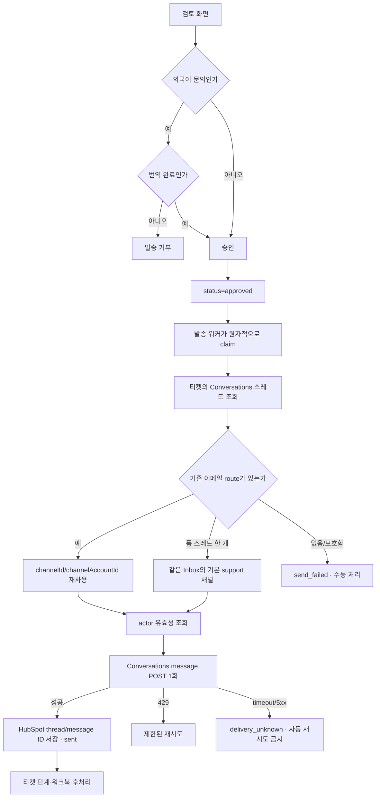

# 검토에서 발송까지

> 현재 실발송 수단은 HubSpot Conversations다. 자동 접수확인은 없으며, 사람이 검토하고
> 승인한 초안만 기존 티켓 스레드에 답장으로 나간다.

## 흐름

## 발송 조건

- `EMAIL_SENDING_ENABLED`와 `LIVE_EXTERNAL_WRITES`가 모두 켜져야 한다.
- `LIVE_HUBSPOT_WRITES`도 켜져야 실제 Conversations POST가 허용된다.
- 수신자는 메시지에 저장된 실제 고객 주소 하나여야 한다. 내부 테스트 주소 치환은 없다.
- 외국어 문의는 검토 화면의 번역 절차를 완료해 `message.language == target_language`가 되기
  전에는 승인과 발송이 모두 거부된다. 발송 단계에서 몰래 번역하지 않는다.
- 자동 접수확인용 `auto_ack`는 과거 데이터 호환 표시일 뿐 새로 생성하거나 claim하지 않는다.

## 스레드와 발신자 선택

`find_conversation_reply_context`는 티켓에 연결된 활성 스레드를 읽고, 고객 주소가 포함된
가장 최신 이메일 메시지의 `channelId=1002`와 `channelAccountId`를 복사한다. 이것이 사람이
기존 스레드에서 답장한 경로와 가장 가깝다.

폼으로 막 생성된 스레드는 복사할 이메일 메시지가 없다. 이 경우에만 다음 조건을 모두 만족할
때 `HUBSPOT_DEFAULT_EMAIL_CHANNEL_ACCOUNT_ID`를 사용한다.

- 후보 스레드가 정확히 하나다.
- 기본 채널 계정이 email(`1002`)이고 active·authorized 상태다.
- 채널 계정과 스레드의 Inbox ID가 같다.

하나라도 어긋나면 다른 고객이나 다른 제품 Inbox로 보낼 위험이 있으므로 실패 처리한다.

`HUBSPOT_SENDER_ACTOR_ID`는 HubSpot 안의 발송 주체와 감사 추적을 정한다. 실제 From 주소는
`channelAccountId`가 정한다. 현재 운영 기본값은 팀 공용 actor `A-82843387`; 폼 스레드용
기본 이메일 계정은 `support@perso.ai`의 `2039804092`다.

## 중복 발송 방지

워커는 `approved` 행을 `sending:<pid>:<random>`으로 원자적으로 바꾼 프로세스만 발송한다.
성공한 뒤 `hubspot_thread_id`와 `hubspot_message_id`를 저장한다.

Conversations 발송 POST에는 애플리케이션이 지정할 수 있는 idempotency key가 없다. 따라서:

- 429처럼 HubSpot이 명확히 거절한 경우만 안전하게 재시도한다.
- 요청 timeout, 연결 단절, 5xx는 HubSpot이 이미 받아들였을 가능성이 있어
  `delivery_unknown`으로 격리하고 자동 재시도하지 않는다.
- `delivery_unknown`은 HubSpot 스레드에서 실제 발송 여부를 사람이 확인한 뒤 복구한다.

## 발송 후 처리

실발송 성공을 DB에 먼저 커밋한 뒤 티켓 단계 이동, 연락처 상태, Google Sheets, 요약 갱신을
best effort로 처리한다. 후처리 실패가 이미 발송된 메일을 `send_failed`로 되돌리면 재시도 때
중복 메일이 나가므로, 후처리 오류는 별도 필드에 남기고 발송 없이 다시 동기화한다.

코드 수준 no-send 스위치로 발송을 억제한 개발 모드는 `test_sent`로 구분한다. 운영 배포에서는
헬스체크의 `hubspot_conversations`가 actor와 기본 channel account를 실제 읽기로 검증한다.

## 본문·서명 가드

발송 직전 순서는 `enforce_send_language` → `enforce_first_reply_no_price` → HTML 변환이다.
서명은 운영자가 고른 `message.signature_key`를 `branded_signature_html`로 렌더링해 본문 아래에
붙인다. 검토 미리보기와 실제 발송은 같은 HTML 함수를 사용해야 한다.

제목과 수신자에 CR/LF가 있거나, 파싱 결과 수신자가 정확히 한 명이 아니면 발송하지 않는다.

## 같이 봐야 하는 파일

| 변경 | 같이 확인할 곳 |
|---|---|
| 승인·번역 조건 | `src/api/routes/messages.py`, `src/integrations/senders/__init__.py` |
| 스레드·채널 선택 | `src/integrations/hubspot.py`, `tests/test_hubspot_conversations.py` |
| 오류·재시도 정책 | `src/integrations/delivery.py`, `src/agents/send_worker.py` |
| 외부 쓰기 안전장치 | `src/common/safe_mode.py`, `tests/test_safe_mode.py` |
| 서명·HTML | `src/integrations/email_html.py`, 발송 미리보기 테스트 |
| 배포 설정 | `.env.example`, `render.yaml`, `src/common/healthcheck.py` |
