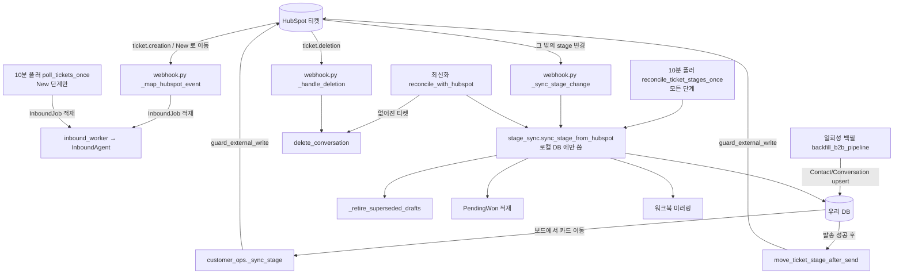

# HubSpot 과 우리 DB 가 어긋나지 않게 하는 규칙

> HubSpot 티켓 파이프라인이 원본이고, 우리 DB(`Conversation.stage` · `CustomerProfile.pipeline_stage`)는
> 그 사본입니다. 사본이 원본과 어긋나는 길은 네 갈래입니다 — 웹훅이 실시간으로 밀어 주고, 10분 폴러가
> 웹훅이 놓친 것을 훑고, 운영자가 누르는 `최신화`(`hubspot_reconcile`)가 지워진 티켓까지 확인하고,
> 일회성 백필이 옛 티켓을 한 번에 끌어옵니다. 반대 방향(콘솔 → HubSpot)은 딱 두 곳뿐입니다:
> 보드 카드 이동(`customer_ops._sync_stage`)과 발송 후 단계 이동(`move_ticket_stage_after_send`).
> 이 문서는 그 다섯 경로가 서로를 밟지 않게 하는 규칙과, 그 그물에 뚫린 구멍을 적습니다.
> 단계 이름·환경변수 표는 `docs/설정.md` 「문의 파이프라인 단계」에, 안전 스위치는 CLAUDE.md
> 「Pre-launch safety」·「per-destination switches」에 이미 있습니다 — 여기서는 반복하지 않습니다.

## 한눈에

## 지켜야 하는 것들

### HubSpot → 우리 방향의 코드는 HubSpot 에 아무것도 쓰지 않는다

`stage_sync.py` 전체가 로컬 DB 만 씁니다(모듈 docstring `src/agents/stage_sync.py:10-16`).
`hubspot_reconcile.py` 도 마찬가지고, 유일한 HubSpot 접촉은 읽기(`get_ticket_sync`,
`existing_ticket_ids_sync`)입니다. `hubspot_backfill.py` 도 읽기 전용입니다
(`src/agents/hubspot_backfill.py:15`).

**어기면**: 무한 루프. 웹훅이 단계 변경을 알려 오고 → 우리가 HubSpot 에 단계를 쓰고 → HubSpot 이
propertyChange 를 다시 보내고 → 반복. `guard_external_write` 는 이걸 못 막습니다(HubSpot 쓰기는
지금 LIVE 입니다). 화면에는 `처리 경과`에 "HubSpot에서 단계 변경 감지" 가 초 단위로 쌓이고,
HubSpot API 는 429 로 죽습니다.

### 두 번째 방어선: 같은 단계면 조기 반환

`sync_stage_from_hubspot` 은 `conv.stage == local_stage` 일 때 초안 정리만 하고 `None` 을 돌려줍니다
(`src/agents/stage_sync.py:208-214`). 이것이 콘솔 → HubSpot → 웹훅 메아리를 흡수하는 자리입니다.

**그래서 쓰기 순서가 제약입니다.** 보드 드롭은 로컬을 **먼저** 커밋하고
(`customer_ops._set_conversation_stage`, `src/api/routes/customer_ops.py:472-492`) **그 다음**
HubSpot 에 밉니다(`customer_ops.py:1197-1198`). 뒤집으면 메아리가 로컬 커밋보다 먼저 도착해
`previous → local_stage` 진짜 이동으로 기록되고, 처리 경과에 운영자가 하지 않은 "HubSpot에서 단계
변경 감지" 가 남습니다.

### 초안을 종료하는 곳은 `_retire_superseded_drafts` 하나뿐

`src/agents/stage_sync.py:130-176`. 단계를 옮기는 네 경로(웹훅/폴러, 보드 드롭
`customer_ops.py:184`·`:473`, 백필 `hubspot_backfill.py:222`, 최신화 `hubspot_reconcile.py:143-148`)와
초안을 완성하는 `_finalize_draft` 가 전부 여기로 옵니다.

**어기면**: 이미 답이 나간 문의의 초안이 `발송 대기` 에 남아, 운영자가 고객에게 같은 답을 두 번
보냅니다. `approved` 도 종료 대상인 이유가 이것입니다 — 발송 워커는 `status` 만 보고 집어 갑니다
(`stage_sync.py:122` 의 `_SUPERSEDABLE`).

### 접수확인(`prompt_variant == "auto_ack"`)은 초안이 아니다

`_retire_superseded_drafts` 의 필터에 `prompt_variant != "auto_ack"` 이 박혀 있습니다
(`src/agents/stage_sync.py:158`).

**어기면**: 단계를 한 번 옮기는 것이 아직 발송 큐에 앉아 있는 고객 접수확인을 취소합니다. 고객은
문의를 보내고 **아무 답도 못 받습니다** — 상세 초안도 같이 종료됐으니까요. 화면상 증상이 없습니다:
그 대화는 그냥 "답변 완료" 로 보입니다.

### "New 를 벗어났다" 는 매핑된 단계일 때만

`_PAST_NEW = frozenset(LOCAL_STAGE_TO_SETTING) - {"new"}` (`src/agents/stage_sync.py:127`).
`!= "new"` 가 아닙니다.

**어기면**: `Conversation.stage` 의 모델 기본값 `"initial"` 과 `None`, 뜻 모르는 값이 전부 "단계가
옮겨졌다" 로 세어져, 아직 아무도 손대지 않은 티켓의 초안까지 `superseded` 가 됩니다.
`tests/test_stage_sync.py:453` 이 고정합니다.

### 티켓 없음은 절대 "지워졌다" 로 읽지 않는다

`existing_ticket_ids_sync` 는 배치가 실패하면 짧은 집합이 아니라 **예외**를 던집니다
(`src/integrations/hubspot.py:507-510`, docstring `:488-490`). `reconcile_with_hubspot` 은 그 예외를
잡아 삭제 패스를 통째로 건너뜁니다(`src/agents/hubspot_reconcile.py:196-199`). 단건 조회 쪽도
404/410 만 삭제 후보로 세고 401/403 은 로그만 남깁니다(`hubspot_reconcile.py:223-232`).

**어기면**: 토큰이 만료된 아침에 `최신화` 를 누르면 "확인 N건, 삭제 대상 N건" 이 뜨고, 확인을
누르는 순간 보드 전체가 사라집니다. `tests/test_hubspot_reconcile.py:196` 이 이 시나리오를 고정합니다.

### `최신화` 의 첫 클릭은 세기만 한다

`reconcile_with_hubspot(apply=False)` 가 기본값입니다(`src/agents/hubspot_reconcile.py:151`,
라우트 `src/api/routes/recovery.py:104`). 단계 정렬은 양쪽 패스에서 다 적용되지만, **삭제와 초안
종료는 확인을 누른 뒤에만** 일어납니다.

**어기면**: 404 는 지워진 티켓의 모습이기도 하지만 다른 포털의 티켓 ID, 백필된 행, 잘못 적힌 ID 의
모습이기도 합니다. 첫 버전이 이걸 즉시 적용해서, 지어낸 티켓 ID 로 채운 DB 에 한 번 눌렀다가
세 스레드를 날렸습니다(`hubspot_reconcile.py:160-166`).

### 티켓이 지워져도 사람과 돈은 남는다

`delete_conversation` 은 Conversation·Message·ConversationProgress 만 지우고, `ContractRecord` 와
`CustomerInteraction` 은 `conversation_id` 를 NULL 로 떼어 놓습니다
(`src/agents/hubspot_reconcile.py:99-111`). Contact 는 손대지 않습니다.

자식 행은 FK 캐스케이드에 맡기지 않고 **명시적으로** 지웁니다: 캐스케이드가 `ON DELETE` 로
선언돼 있는데 SQLite 는 `foreign_keys=ON` 일 때만 지키고, ORM 은 NOT NULL 컬럼을 NULL 로 만들려
듭니다(`hubspot_reconcile.py:83-86`). `tests/test_hubspot_reconcile.py:132` 가 폭발 반경을 고정합니다.

### 웹훅은 절대 5xx 를 돌려주지 않는다

`_handle_deletion` 과 `_sync_stage_change` 둘 다 모든 예외를 삼킵니다
(`src/api/webhook.py:131-133`, `:154-156`).

**어기면**: HubSpot 이 **배치 전체**를 재전송합니다. Sheets 한 번 죽은 것 때문에 같은 이벤트가
계속 다시 오고, 그때마다 초안 종료·PendingWon 적재가 다시 돕니다.
`tests/test_stage_sync.py:192` 가 Sheets 장애 케이스를 고정합니다.

### 워크북 미러링은 커밋 **뒤**, 세션 **밖**에서

`_mirror_stage_to_sheet` 은 `session.commit()` 다음 줄에서 불립니다
(`src/agents/stage_sync.py:245-252`). `sheet_client_id` 는 세션이 열려 있는 동안 미리 원시값으로
빼 둡니다(`:218-223`).

**어기면**: ① Sheets 실패가 로컬 단계 이동을 롤백합니다 — HubSpot 에는 Won 인데 우리 보드는 New.
② 커밋 후 인스턴스가 detach 되어 `DetachedInstanceError` 가 납니다(운영은 `expire_on_commit=True`).

## 함정

### 티켓 단계 ID 설정이 비면, 폴러가 **모든** 티켓을 문의로 빨아들인다

`HUBSPOT_TICKET_STAGE_NEW` 의 기본값은 빈 문자열입니다(`src/common/config.py:57`). 비었을 때
각 지점의 행동이 서로 다릅니다:

| 지점 | 빈 값일 때 |
| --- | --- |
| `stage_id_to_local()` (`stage_sync.py:65-78`) | 빈 ID 를 건너뜀 → 매핑이 `{}` → **모든 단계 동기화가 조용히 멈춤** |
| `_map_hubspot_event` (`webhook.py:103-106`) | stage 변경 이벤트를 전부 무시 |
| `InboundAgent.handle` (`inbound.py:152-157`) | 단계 검사를 **건너뜀** — 어떤 단계의 티켓이든 접수 |
| `poll_tickets_once` (`inbound_poller.py:87`) | `pipeline_stage=None` → **모든 단계·모든 파이프라인** 검색 |
| `move_ticket_stage_after_send` (`hubspot.py:919-921`) | 아무것도 안 하고 `True`(성공) 반환 |

셋을 합치면: 설정이 비어 있는 채로 폴러가 돌면 10분마다 최근 변경된 **모든** 티켓(Won·Lost·다른
파이프라인 포함)이 InboundJob 에 실리고, 단계 게이트가 꺼져 있으니 전부 초안이 만들어지고 첫
문의로 취급되어 접수확인이 나갑니다. 화면에는 그냥 문의가 폭증한 것으로 보입니다.
`stage_id_to_local()` 이 `{}` 라 처리 경과에는 단계 이동 기록이 하나도 없어서, 원인을 가리키는
단서가 없습니다.

`tests/test_stage_sync.py:135` 는 "빈 ID 가 `""` 하나로 충돌하지 않는다" 만 고정합니다 — 위의
연쇄는 테스트가 없습니다.

### 콘솔에서 Won 으로 옮기면 「수주 전환 대기」에 뜨지 않는다

`_enqueue_pending_won` 의 호출자는 딱 하나이고(`src/agents/stage_sync.py:243-244`), 그 자리는
**단계가 실제로 바뀐** 분기 안입니다. 보드에서 카드를 Won 으로 끌면 순서가 이렇습니다:

1. `_set_conversation_stage` 가 `conv.stage = "won"` 을 커밋 (`customer_ops.py:472`)
2. `_sync_stage` 가 HubSpot 티켓을 Won 단계로 이동 (`customer_ops.py:230`)
3. HubSpot 이 propertyChange 를 되쏘고 → `sync_stage_from_hubspot` → `conv.stage` 는 이미 `"won"`
   → `:208` 에서 조기 반환 → **`_enqueue_pending_won` 까지 가지 못함**

CLAUDE.md 의 "Won 감지는 `sync_stage_from_hubspot` 한 곳" 은 HubSpot 쪽에서 옮겼을 때의 이야기입니다.
콘솔 보드는 그 한 곳을 우회합니다. 증상: HubSpot 파이프라인에는 Won 인데 「수주 전환 대기」가
비어 있고, 계약을 등록할 입구가 없습니다.

### HubSpot 쓰기가 실패한 로컬 단계 이동은 언젠가 되돌아온다

`_sync_stage` 는 세 값을 돌려줍니다 — `True` 성공, `False` 시도했으나 실패, `None` 시도 안 함
(`src/api/routes/customer_ops.py:198-241`). `None` 은 `ExternalWriteBlocked`(안전 모드), 티켓 ID
없음, 워크북 행 없음을 모두 포함하고 배너는 `local` 로 뜹니다(`_sync_state`, `:244-255`).

`local`/`partial` 은 **"이 이동은 여기에만 존재한다"** 는 뜻입니다. HubSpot 은 여전히 옛 단계이므로,
누군가 그 티켓을 HubSpot 에서 건드리는 순간(또는 그 스레드에 미발송 초안이 있어 `최신화` 가 단건
조회를 하는 순간) `sync_stage_from_hubspot` 이 옛 단계로 되돌립니다. 운영자에게는 "아까 옮긴
카드가 원래 자리로 돌아갔다" 로 보입니다. `LIVE_HUBSPOT_WRITES` 를 꺼 두면 **모든** 보드 이동이
이 상태입니다.

### 재시도가 걸린 호출은 일부뿐이다

`_request_with_retries`(async, `src/integrations/hubspot.py:52-102`)와
`_sync_request_with_retries`(sync, `:110-154`)가 429/5xx 를 지수 백오프로 재시도합니다. 그런데
**이 둘을 지나는 호출은 다섯 개뿐**입니다: `get_contact`, `update_contact`(=`_retry`, `:211-214`),
`list_tickets_with_contacts_sync`, `get_contacts_batch_sync`, `existing_ticket_ids_sync`.

재시도가 **없는** 쪽에 정작 중요한 것들이 있습니다:

- `update_ticket_stage_sync` (`:848-857`) — 보드 이동의 실제 쓰기. 429 하나에 `False` → 배너 `partial`
- `search_tickets_sync` (`:902`) — 10분 폴러와 sweep 의 유일한 조회. 429 면 그 틱이 통째로 날아감
- `get_ticket_sync` (`:823-831`), `create_email_engagement` (`:301`), `create_interaction_note` (`:541`)

`create_email_engagement` 가 `self._retry` 가 아니라 `http.post` 를 직접 쓰는 것은
`:301` 에서 확인됩니다 — 눈에 잘 안 띄니 고치기 전에 이 줄을 보세요.

### 고객 상세의 `HubSpot 동기화` 버튼 한 번 = 왕복 약 95번

`_sync_hubspot` (`src/api/routes/customer_ops.py:1045-1062`)이 순서대로 부릅니다:
연락처 1 + 이메일 목록 1 + 이메일 상세 20 + 로그된 활동 목록 3 + 그 상세 최대 60 + Deal 1+10 + 메모 2.
전부 페이싱 없이, 재시도 없이, 동기 호출입니다. HubSpot Private App 한도는 100req/10s 이고
`_BULK_PACE_SECONDS = 0.12`(`hubspot.py:107`)가 그 한도에 맞춘 값인데 **이 경로는 그걸 안 씁니다**.
증상: 두 사람이 거의 동시에 누르면 뒤쪽 호출이 429 로 조용히 건너뛰어지고
(`get_logged_engagements_sync` 는 200 이 아니면 `continue`, `:651`·`:663`) 리드 히스토리에
일부만 들어옵니다 — 오류 표시 없이.

### 10분 sweep 은 1000건에서 잘리고, 그래도 워터마크를 전진시킨다

`reconcile_ticket_stages_once` 는 `search_tickets_sync(limit=POLL_BATCH_SIZE)` 를 **한 번만**
부릅니다(`src/agents/inbound_poller.py:162-166`). 페이지 커서를 따라가는 루프가 없습니다 —
`poll_tickets_once` 에는 있습니다(`:83-121`). 그리고 개별 티켓 실패는 삼키고(`:172-178`),
워터마크는 어쨌든 저장합니다(`:180-182`).

즉 **웹훅이 놓친 것을 메우는 그물의 구멍이 둘**입니다:

1. 10분 창에 1001건 이상 변경되면 초과분은 영원히 안 봅니다(워터마크가 이미 지나감).
   대량 편집·임포트·파이프라인 정리 직후가 정확히 그 상황입니다.
2. `sync_stage_from_hubspot` 이 한 티켓에서 예외를 내면 그 티켓만 조용히 빠집니다.

`poll_tickets_once` 는 정반대로 설계돼 있습니다 — 실패하면 워터마크를 **저장하지 않고** 반환해
다음 틱이 같은 창을 다시 훑습니다(`:106-108`, `:116-120`). 두 함수가 같은 파일에 있어서 같은
성질일 것처럼 보이지만 다릅니다.

메우는 것은 `POLL_OVERLAP = 15분`(`:20`)뿐이고, 이건 폴 간격 10분보다 크게 잡은 겹침이지
누락 복구가 아닙니다.

### 웹훅 서명은 프록시 앞의 공개 URL 로 계산된다

`_public_request_uri` (`src/api/webhook.py:159-176`)가 `x-forwarded-host` / `x-forwarded-proto` 로
공개 URL 을 재구성합니다. 프록시가 그 헤더를 안 붙이면 내부 호스트로 서명을 검증해 **모든 배달이
401** 이 됩니다.

그리고 이 실패는 **화면에 아무 흔적도 남기지 않습니다**: 10분 폴러가 같은 일을 하므로 문의는 계속
들어오고, 다만 실시간성이 사라지고 `ticket.deletion` 만 영영 못 받습니다(폴러는 HubSpot 이 **가진**
티켓만 훑습니다). 로그의 `webhook reject` 줄이 유일한 단서입니다. `WEBHOOK_DEBUG_DUMP=true` 를
켜면 `data/last_rejected_webhook.json` 에 헤더 이름과 URI 가 떨어집니다(`webhook.py:66-88`, 본문과
자격증명은 일부러 뺐습니다).

`HUBSPOT_SIGNATURE_MAX_AGE_SECONDS = 300`(`config.py:238`)도 같은 증상을 냅니다 — 서버 시계가
5분 이상 틀어지면 전부 401.

### 경로가 두 개인 이유

`/webhooks/hubspot` 과 `/webhook/hubspot/inbound` 이 같은 핸들러에 붙어 있습니다
(`src/api/webhook.py:182-183`). 서명이 **실제 요청 경로**를 포함해 계산되므로 둘 다 검증됩니다.
전환 중 날아가던 배달을 잃지 않으려고 남긴 별칭이니, 지우려면 HubSpot Private App 의 Target URL 을
먼저 확인하세요.

### 백필은 단계가 **바뀔 때만** 초안을 정리한다

`backfill_b2b_pipeline` 은 `elif conv.stage != stage:` 안에서만 `_retire_superseded_drafts` 를
부릅니다(`src/agents/hubspot_backfill.py:217-222`). `sync_stage_from_hubspot` 은 단계가 같아도 한 번
더 훑는데(`stage_sync.py:208-214`) 여기는 안 합니다.

백필로 들어온 행은 `last_incoming_at` 이 NULL 이라 워크북 동기화에도, sweep 의 최근 변경 창에도
안 걸립니다. 즉 이미 올바른 단계로 백필된 스레드에 초안이 붙어 있으면 아무것도 그것을 치우지
않습니다 — `최신화` 만이 유일한 출구입니다.

### 티켓 ID 는 어디서나 문자열, 웹훅에서만 정수

`Conversation.hubspot_ticket_id` 는 `String(64) UNIQUE`(`src/db/models.py:78-80`)인데
`HubSpotWebhookEvent.objectId` 는 `int` 입니다(`src/api/schemas.py:14`). 웹훅 핸들러가
`str(event.objectId)` 로 감싸는 것(`webhook.py:130`, `:152`)이 그 경계입니다.

**어기면**: `filter(Conversation.hubspot_ticket_id == 4200001)` 은 SQLite 에서 조용히 0건입니다.
증상은 "웹훅은 200 인데 아무 일도 안 일어남". `tests/test_stage_sync.py:22-23` 이 이 함정을 적어
두려고 일부러 숫자 문자열을 씁니다.

### `hubspot_contact_id` 는 UNIQUE 다

`src/db/models.py:34`. 백필이 `contact.hubspot_contact_id = contact.hubspot_contact_id or dto.id`
로 채우는데(`hubspot_backfill.py:200`), 서로 다른 이메일의 로컬 Contact 둘이 같은 HubSpot 연락처를
가리키게 되면 `session.commit()` 한 방에 **백필 전체**가 IntegrityError 로 죽습니다 — 백필은
재개 불가라 처음부터 다시입니다. 같은 이유로 죽었던 사례가 CustomerProfile 쪽에 남아 있습니다
(`hubspot_backfill.py:225-234`: autoflush 가 꺼져 있어 같은 연락처의 두 번째 티켓이 같은 PK 로
프로필을 또 넣었습니다. 재현하려면 두 티켓이 **인접**해야 합니다 —
`tests/test_hubspot_backfill.py:122-134`).

## 왜 이렇게 되어 있는가

### 타임라인 이메일 객체는 발송 수단이 아니라 **기록 그 자체**다

HubSpot 에는 이 답장을 **보내는** API 가 없습니다(transactional single-send 는 유료 애드온과
디자인된 템플릿을 요구). SMTP 가 배달하고, `create_email_engagement` 가 만든 CRM 이메일 객체가
고객 히스토리의 전부입니다(`src/integrations/hubspot.py:275-283`, `senders/__init__.py:164-169`).

- **연관을 두 번 겁니다**: contact(타입 `198`)와 ticket(타입 `224`). 티켓 연관이 없으면 운영자가
  읽는 그 문의 화면에 활동이 **하나도** 안 보입니다(`hubspot.py:306`, `:316`).
- **티켓 연관 실패는 삼킵니다**(`hubspot.py:314-325`). 메일은 이미 나갔고 engagement 도 이미
  만들어졌는데 여기서 raise 하면 호출자가 "기록 실패" 경로로 가면서 `hubspot_engagement_id` 를
  잃습니다.
- **전달 성공 뒤에만 기록합니다.** 안전 스위치로 억제되거나 SMTP가 실패한 메일을 고객
  타임라인에 답장으로 남기지 않습니다.
- **조용한 실패 하나**: `contact.hubspot_contact_id` 가 없으면 로그도 없이 그냥 돌아갑니다
  (`senders/__init__.py:137-138`). 워크북에서 들어온 고객이 여기 해당합니다.

### 소통 히스토리는 note 한 종류로만 쓴다

`create_interaction_note` (`hubspot.py:514-570`). 콘솔의 열 개 채널을 전부 note 로 씁니다 —
`hs_call`/`hs_meeting`/`hs_communication` 을 안 쓰는 이유는 운영자가 남기는 것이 통화의
duration·direction·status 가 아니라 대화 전체의 한 줄 요약이기 때문입니다. 채널은 note 본문
첫 줄에 들어갑니다.

연관은 v4 default 엔드포인트를 씁니다(`:551`, `:560`) — 그래서 여기엔 연관 타입 ID 가 **없고**,
틀리게 적을 수도 없습니다. 이메일 쪽(198/224)은 v3 라 숫자가 박혀 있습니다. 새 객체를 붙일 때는
v4 쪽을 베끼세요.

### 백필이 LIST 를 쓰고 SEARCH 를 안 쓰는 이유

`list_tickets_with_contacts_sync` (`hubspot.py:384-433`). SEARCH 는 `associations` 를 인라인으로
못 돌려줍니다. LIST 는 돌려주므로 티켓당 연관 GET 한 번 대신 페이지당 호출 한 번이 됩니다.
대가로 모든 파이프라인을 훑고(이 포털 기준 ~29페이지) `pipeline` 은 클라이언트 쪽에서 거릅니다.

같이 버린 것: `get_ticket_primary_contact_sync` 는 `limit=1` 이라 담당자가 둘인 티켓에서 둘째를
떨어뜨리고, 429 를 "연락처 없음" 으로 보고합니다(`hubspot.py:392-395`, `:833-846`). 아직 코드에
남아 있으니 새로 쓰지 마세요.

### `_BULK_PACE_SECONDS = 0.12` 인 이유

Private App 한도가 100req/10s 입니다. 0.12초 간격 = 초당 8.3건 = 10초에 83건 — 한도 아래로
여유를 둔 값입니다(`hubspot.py:105-107`). 백필은 재개 불가라 중간에 죽으면 1페이지부터 다시라서,
재시도만으로는 부족하고 페이싱까지 필요했습니다(`:116-121`).

### `search_tickets_sync` 의 필터 순서는 테스트가 고정한다

`hs_lastmodifieddate` 필터가 반드시 `filters[0]` 이어야 합니다 — `tests/test_hubspot.py:189` 가
인덱스로 확인합니다(docstring `hubspot.py:870-872`). `createdate` 가 아니라 최종 변경 시각으로
검색하는 이유는 다른 단계에서 만들어진 뒤 New 로 옮겨진 티켓을 잡기 위해서입니다.

### `ticket.deletion` 을 `_HUBSPOT_SUBSCRIPTION_MAP` 에 안 넣은 이유

매핑에 있는 타입은 InboundJob 으로 적재됩니다. 없어진 티켓을 fetch 하는 것은 일이 아닙니다
(`src/api/webhook.py:109-111`). 그래서 삭제는 "inbound work 가 아닌" 분기에서 따로 처리합니다
(`webhook.py:241-243`). `tests/test_hubspot_reconcile.py:188` 이 이걸 고정합니다.

### 백필이 메일을 못 보내는 근거는 "안 부른다" 가 아니다

Message 행도 InboundJob 행도 **만들지 않는다** 는 것이 근거입니다(`hubspot_backfill.py:11-14`,
`tests/test_hubspot_backfill.py:160`). 인바운드 워커는 `inbound_jobs` 에서만, 발송 워커는
`messages.status='approved'` 에서만 일을 집어 가므로 두 큐 어디에도 안 나타납니다.
`last_incoming_at` 을 NULL 로 두는 것도 같은 종류의 근거입니다 — 워크북 append 쿼리가
`last_incoming_at IS NOT NULL` 을 조건으로 쓰기 때문입니다(`hubspot_backfill.py:17-21`).

**고칠 때**: 이 세 가지 중 하나라도 채우면 안전 논증이 무너집니다. 특히 `last_incoming_at` 은
"있으면 편한 값" 처럼 보이는데, 채우는 순간 300여 행이 공용 영업 워크북에 append 됩니다.

### 「소통 히스토리」에 `contract_seq` 만 붙인 것과 같은 결

`reconcile_with_hubspot` 이 존재 확인은 **모든** 티켓에, 단계·초안 확인은 **미발송 초안이 있는**
스레드에만 하는 것은 비용 대칭이 아니라 피해 대칭입니다(`hubspot_reconcile.py:151-166`).
이미 답한 스레드가 단계를 틀리게 알고 있어도 아무도 잘못된 일을 하지 않지만, 지워진 티켓의
카드는 초안이 없어서 **어떤 것으로도 찾을 수 없습니다**(`_all_ticket_ids` docstring, `:50-59`).

## 손대려면 같이 봐야 하는 것

| 고치는 곳 | 같이 고쳐야 하는 곳 |
| --- | --- |
| `src/agents/stage_sync.py` `LOCAL_STAGE_TO_SETTING` | `src/api/routes/customer_ops.py` `PIPELINE_STAGES` / `VALID_PIPELINE_STAGES`, `src/common/config.py` 의 `HUBSPOT_TICKET_STAGE_*`, `src/integrations/google_sheets.py` `_STAGE_VALUES`, `src/agents/sheet_sync.py` `_local_stage` — `tests/test_stage_sync.py:99`·`:106` 이 네 집합의 일치를 고정 |
| `stage_sync.local_stage_for` (HubSpot ID → 로컬 키) | `customer_ops._stage_id` (`customer_ops.py:114-119`) — 명시적 역함수. 한쪽만 고치면 왕복이 깨짐 |
| `_retire_superseded_drafts` 의 `_SUPERSEDABLE` | `src/api/routes/messages.py` `LIST_STATUS_BUCKETS` — `superseded` 가 `awaiting` 이 아니라 `sent` 에 있어야 함(`tests/test_stage_sync.py:392`) |
| `HubSpotClient._TICKET_PROPERTIES` (`hubspot.py:788-791`) | `_ticket_from_api` (`:793-821`), `TicketDTO` (`hubspot_models.py:45-73`), `search_tickets_sync` 가 이 문자열을 `,` 로 split 함(`:897`) |
| `create_email_engagement` / `create_interaction_note` 에 새 쓰기 추가 | `guard_external_write("hubspot:…")` 접두사 필수 — 접두사가 없으면 채널 게이트가 아니라 마스터로 폴백(`src/common/safe_mode.py:147-171`), 그리고 `tests/test_safe_mode.py` 에 한 줄 |
| `sync_stage_from_hubspot` 의 분기 구조 | `_enqueue_pending_won`(같은 파일 `:243`)과 `_retire_superseded_drafts` 가 서로 다른 분기에 있음 — 조기 반환 위치를 옮기면 둘 중 하나가 조용히 빠짐 |
| `webhook._map_hubspot_event` | `inbound_worker.inbound_event_key` (`:29-35`) — `occurrence_key` 유무가 `…:created` / `…:changed:<key>` 를 가르고, 그게 중복 제거의 전부 |
| `_public_request_uri` | HubSpot Private App 의 Webhook Target URL, 그리고 `tests/test_inbound_webhook_route.py:48` 의 `_sign_request` |
| `hubspot_backfill.B2B_PIPELINE_ID = "798618015"` | 설정이 아니라 상수(`hubspot_backfill.py:54-55`). 파이프라인을 바꾸면 여기와 모든 `HUBSPOT_TICKET_STAGE_*` 를 같이 |
| `reconcile_with_hubspot` 의 리포트 키 | `src/api/routes/recovery.py:104-108` 이 `report["retired"]` 를 감사 로그에 씀, 프런트가 `checked/moved/deleted/retired/stale/swept` 를 그대로 표시 |
> 2026-08-24 변경: 즉시 자동 접수확인은 제거되었습니다. 아래 `auto_ack` 예외 설명은 과거 데이터 호환을 위한 기록입니다.
