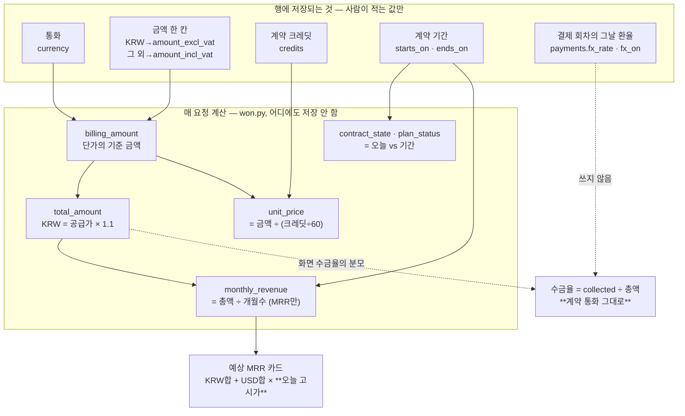

# 수주 고객: 계약·크레딧·결제와 돈 계산

> 수주로 넘어온 고객 하나(`clients`) 아래에 계약이 차수로 쌓이고(`client_contracts`), 그 아래에 크레딧 지급 회차·분납 회차가 달립니다. **이 서브시스템에서 돈에 관한 값은 거의 전부 저장하지 않고 매 요청마다 다시 계산합니다.** 행에 실제로 들어 있는 것은 통화·금액 한 칸·계약 크레딧·계약 기간 넷뿐이고, 총액·공급가·분당 단가·월간 매출·수금율·계약 상태·플랜 상태·고객 종류는 전부 `src/common/won.py` 가 그 넷에서 만들어 냅니다. 예외가 딱 하나 있는데, **결제 회차의 환율만은 행에 박습니다** — 그날의 값이라 다시 계산하면 안 되기 때문입니다. 쓰기는 `src/api/routes/won_customers.py`, 읽기는 `src/api/routes/ui_api.py` 의 `_won_contract`/`_won_client`, 화면은 `frontend/src/screens/won/`.
>
> CLAUDE.md 의 「수주 고객은 Client ID 로 묶인다」 항목이 전제입니다. 여기서는 거기 없는 것만 적습니다.

## 한눈에



시계가 둘입니다. **과거(입금 한 건)는 행에 박힌 그날 환율**, **미래 추정(예상 MRR)은 오늘 고시가**. 둘을 섞으면 지난달 매출이 이번 달에 바뀝니다.

## 지켜야 하는 것들

### 통화가 금액 칸을 정한다 — 한 계약에 채워지는 금액 칸은 언제나 하나

원화 계약은 `amount_excl_vat`(공급가)만, 그 밖의 통화는 `amount_incl_vat`(총액)만 값을 가집니다. 국내 계약서는 공급가로 적히고 부가세가 따로 붙지만 해외 계약에는 그 부가세가 없어 총액이 곧 대금이기 때문입니다. 지키는 코드는 `won_customers.py:79-89`(`_one_amount_per_currency`)이고, `_fill_contract` 의 **맨 마지막**에서 무조건 불립니다(`won_customers.py:208`). 읽는 쪽은 `won.billing_amount`(`won.py:202-221`)가 통화를 보고 어느 칸이 기준인지 정합니다.

**어기면**: 둘 다 값이 있는 계약이 생기고, 그 순간 분당 단가가 어느 금액 기준인지 계약마다 달라집니다. 화면에는 아무 표시도 없습니다 — 숫자가 하나 다를 뿐입니다. 실제로 시트에서 가져오는 경로(`sheet_to_db.py:158-159`)는 L열과 M열을 **둘 다** 읽어 넣으므로 임포트 직후에는 이 불변식이 깨져 있습니다. `billing_amount` 가 공급가를 우선하고, 다음 시트 동기화 때 `won_sheets.py:148` 이 L열을 계산값으로 덮어써서 조용히 수습됩니다.

### 분당 단가는 계산값이다 — 받지도, 저장하지도 않는다

`won.unit_price`(`won.py:236-253`) = 기준 금액 ÷ (계약 크레딧 ÷ 60). `ClientContract` 에 `unit_price` 열은 없고(`models.py:647-729`), 폼에도 입력 칸이 없습니다(`WonContractForm.tsx:325-331` — 읽기 전용 표시). 시트로 나갈 때도 계산값이 나갑니다(`won_sheets.py:150`), 시트에서 거꾸로 읽지도 않습니다(`sheet_to_db.py:160-161`).

**방향이 뒤집힌 계산이 이것입니다.** 예전에는 단가를 받아 크레딧을 계산했습니다(크레딧 = 공급가 ÷ 단가 × 60). 계약서에 적히는 것은 금액과 크레딧이고 단가는 그 둘에서 나오는 값인데, 단가를 입력으로 두면 **반올림한 단가로 계산한 크레딧이 계약서의 크레딧과 어긋납니다.** 그래서 소수점도 남깁니다: 20,000,000 ÷ (456,120÷60) = 2,630.89… 처럼 딱 떨어지지 않는 계약이 흔하고, 반올림한 단가는 되짚어 곱했을 때 금액이 안 맞습니다. 검산은 `tests/test_won_customers.py:38-69`(운영자 시트의 실제 계약 두 건).

**어기면**: 단가를 다시 입력 칸으로 만들면 계약서와 장부의 크레딧이 갈라지고, 그 차이는 크레딧 지급 진행률이 100%를 안 채우는 것으로만 뒤늦게 보입니다.

### 플랜 상태·계약 상태·고객 종류는 열이 아니다

`won.plan_status`(`won.py:113-140`)는 계약 기간에서, `won.contract_state`(`won.py:102-110`)는 오늘과 그 계약의 기간에서, `won.client_type`(`won.py:70-77`)은 Client ID 번호대에서 나옵니다. 화면의 고르개도 없앴습니다(`WonCustomerDetail.tsx:438-450`, `WonContractForm.tsx:424-431` — 저장하면 무엇이 될지 미리 알려주는 문구만 남았습니다). 시트 J열도 같은 함수에서 나가고(`won_sheets.py:132`), 시트에서 거꾸로 읽지 않습니다(`sheet_to_db.py:131-133`). 고정: `tests/test_won_customers.py:483-536`.

`plan_status` 가 `contract_state` 를 그대로 쓰지 않는 이유는 **날짜가 덜 적힌 계약의 해석이 반대**라서입니다. 계약 하나를 보는 화면에서 날짜가 없으면 「진행 중」이고, 고객 전체를 보는 자리에서 날짜가 덜 적힌 계약은 아직 작성 중이라는 뜻이므로 「세팅중」입니다.

**어기면**: 계약이 끝나도 누가 손으로 바꿔 주기 전까지 「사용중」이 남습니다 — 저장했던 시절의 실제 증상이고, 시트에도 그 값이 그대로 실려 나갔습니다.

### 회차 나눗셈의 나머지는 마지막 회차에 붙인다 — 단, 크레딧만

`_seed_schedules`(`won_customers.py:238-282`)에서 크레딧은 `per = credits // rounds` 로 깔고 **마지막 회차에 `credits - per*(rounds-1)`** 을 넣습니다(`won_customers.py:273`). 240,817을 3회로 나누면 80,272 / 80,272 / **80,273** 이고 합이 정확히 계약 크레딧입니다(`tests/test_won_customers.py:229-255`).

**분납은 이 규칙이 없습니다.** `won_customers.py:255-261` 은 `per = total / count` 를 모든 회차에 같은 값으로 넣습니다. 11,000,000을 3회로 나누면 회차당 3,666,666.666…이고 `Numeric(18,2)` 에 들어가면서 3,666,666.67 × 3 = **11,000,000.01** 이 됩니다. 테스트가 통과하는 것은 4회(딱 떨어짐)로만 검증하기 때문입니다.

**어기면**(=나머지를 회차마다 반올림하면): 합계가 계약 금액/크레딧과 어긋나고, 그 차이는 화면 어디에도 안 나옵니다. 수금율이 100.0% 를 살짝 넘거나 잔여 금액이 −0.01 로 남는 식으로만 보입니다.

### 크레딧 지급 회차의 합은 계약 크레딧과 같지 않아도 된다

`granted_credits`(`won.py:284-288`)는 계약 크레딧을 넘을 수 있습니다 — 테스트·보상 지급이 계약분 밖에 있습니다. 그래서 진행률은 100%를 넘겨 계산하되 막대만 100%에서 자르고(`WonCustomerDetail.tsx:620-623, 689`), 남은 값이 음수면 라벨이 「잔여 크레딧」에서 **「계약 외 추가 지급」**으로 바뀝니다(`WonCustomerDetail.tsx:696-697`).

**어기면**: 넘는 것을 오류로 보고 잘라 버리면, 보상으로 얼마를 더 줬는지가 장부에서 사라집니다.

### 환율은 두 개의 시계다 — 섞지 않는다

- **입금 한 건**: 완료로 바꾸는 순간 그 `paid_on` 날짜의 환율을 행에 박습니다(`won_customers.py:423-424`, `_fill_fx` `429-438`, 열은 `models.py:767-770`). 이후 어떤 계산도 이 값을 다시 구하지 않습니다.
- **예상 MRR 카드**: 오늘 고시가를 **가져와서** 씁니다(`fx.usd_krw_today` `fx.py:142-153` → `ui_api.py:803-806, 890-892`). 손으로 적는 칸이었는데, 그러면 두 사람이 다른 환율로 다른 MRR 을 보고 그 값이 언제 것인지 아무도 모릅니다.
- **수금율은 환산하지 않습니다.** 언제나 계약 통화 기준입니다(`won.py:276-278`, 화면은 `WonCustomerDetail.tsx:853-855`).

조회 실패는 저장을 막지 않습니다(`won_customers.py:429-438` 이 예외를 삼키고 로그만 남깁니다). 값이 비면 화면이 입력칸을 열어 두고 운영자가 직접 넣습니다 — 환율 API 가 죽었다고 입금 처리가 막히면, 그 사실은 수금율이 틀린 채로 며칠 지나서야 드러납니다.

**어기면**: 오늘 환율로 과거 입금을 다시 환산하는 순간 지난달 매출이 이번 달에 바뀝니다. 마감한 숫자가 흔들리고, 왜 흔들렸는지 설명할 단서가 없습니다.

### 쓰기 라우트는 전부 POST다

`won_customers.py` 의 모든 쓰기가 POST 하나뿐입니다(파일 머리말 `:14-17`). 콘솔의 `postForm` 이 POST 만 보내므로 라우트가 PUT 이면 405 가 나고, **화면에는 "저장이 안 된다" 로만 보입니다** — 크레딧 지급 완료가 실제로 그렇게 막혀 있었습니다. `tests/test_won_customers.py:258-271` 이 라우터를 훑어 GET/HEAD 아닌 것은 전부 `{"POST"}` 인지 확인합니다.

같은 부류로, `/won-customers` 접두사는 `src/api/security.py` 의 웹 UI 경로 목록에 있어야 세션 쿠키로 열립니다. 빠지면 로그인한 운영자가 "invalid or missing token" 을 받고 화면에는 저장 실패로만 보입니다(`tests/test_won_customers.py:217-226`).

## 함정

### 비고 한 줄 저장하면 옛 원화 계약의 금액이 사라졌다 — 고침

> **고쳐졌습니다.** 이 문서를 쓰면서 발견해 그 자리에서 고쳤습니다 —
> `_one_amount_per_currency` 는 이제 **쓰는 쪽에 값이 있을 때만** 반대쪽을 비웁니다.
> `tests/test_won_customers.py::test_saving_only_the_notes_never_erases_the_money` 가 고정합니다.
> 아래는 그 사고가 어떻게 가능했는지의 기록입니다 — 같은 모양의 함정이 남아 있습니다:
> **이 라우트에는 계약 전체 폼만 오는 것이 아닙니다.** 부분 폼을 받는 라우트에서 폼에
> 없는 칸을 만지는 코드는 전부 같은 위험을 갖습니다.

**확인함(실행 검증, 고치기 전).** 공급가를 받기로 하기 전의 원화 계약은 `amount_incl_vat` 에만 값이 있습니다. `won.billing_amount`(`won.py:214-221`)가 총액에서 공급가를 되짚어 화면은 멀쩡히 보입니다. 그런데 `_fill_contract`(`won_customers.py:187-208`)는 **폼에 온 칸만** 반영한 뒤 마지막에 `_one_amount_per_currency` 를 무조건 부릅니다. 상세 화면의 「갱신 계획 · 비고」 저장은 `renewal_plan / stop_reason / memo` 세 칸만 보냈으므로, 금액 칸은 손대지 않은 채 `amount_incl_vat = None` 만 실행됩니다. 결과:

```
before: 1,566,000 / 1,722,600 / 1,450   (공급가 / 총액 / 분당 단가)
after : None      / None      / None
```

**증상**: 총 계약금액·공급가·분당 단가가 `₩0`, 월간 매출 0, 수금율 0%, 예상 MRR 이 그만큼 줄어듭니다. 되돌릴 값이 어디에도 없습니다(시트 동기화가 L·M열도 함께 비웁니다). 계약 폼으로 저장한 경우에만 안전한데, 그건 폼이 되짚은 공급가를 실어 보내기 때문입니다(`WonContractForm.tsx:469-485` ← API 의 `amount_excl_vat` = `billing_amount`, `ui_api.py:693`).

### 계약을 수정해도 회차는 따라오지 않는다

`_seed_schedules` 는 **생성 시에만** 돕니다(`won_customers.py:227`). `update_contract`(`:299-306`)는 `_fill_contract` 만 부릅니다. 그래서 계약 크레딧을 64,800 → 100,000 으로 고치면 지급 회차 합은 64,800 그대로이고 진행률이 영영 65% 에서 멈춥니다. 분납 횟수나 총액을 고쳐도 결제 행의 금액은 옛 값입니다. 폼은 편집 중일 때 「총 지급 회차 · 첫 지급 예정일」을 비활성화하고 "회차는 크레딧 지급 섹션에서 고칩니다" 라고만 적습니다(`WonContractForm.tsx:358-373`) — 금액에 대해서는 아무 말도 안 합니다.

### 계약이 끝나면 미수금이 보드에서 사라진다

액션 보드는 `plan_status == "사용 중단"` 인 고객을 통째로 건너뛰고(`ui_api.py:857`), 남은 고객도 **활성 계약 하나**만 봅니다(`ui_api.py:855-878`, `won.active_contract` `won.py:143-150`). 1차 계약이 끝났는데 마지막 분납이 미입금이면, 그 건은 결제 예정 보드에도 목록의 「다음 결제」 칸에도 나오지 않습니다. 상세 화면에서 그 차수를 직접 골라야 보입니다.

클레임은 이 서브시스템에 더 이상 없습니다. 콘솔 밖에서 관리하기로 해서 표·라우트·`won.open_claims`·액션 보드·`contract_claims` 테이블까지 전부 지웠습니다(마이그레이션 0072, 2026-08-13). 워크북의 「클레임 · 히스토리」 탭은 시트에 남아 있지만 콘솔이 읽지도 쓰지도 않습니다 — 손으로 적는 자리입니다.

「갱신 · 비고」도 같은 길을 갔습니다(마이그레이션 0073, 2026-08-14). 상세 6번 섹션 전체와 `client_contracts.renewal_plan` · `stop_reason` · `memo` 세 열, `won.RENEWAL_PLANS`, CSV 의 「갱신 계획」 열, 시트 W·X·Y 동기화가 함께 없어졌습니다. 뒤 섹션 번호는 당겼습니다 — 매출 관리가 6, 소통 히스토리가 7 입니다(앵커로 들어오는 링크는 4·5번뿐이라 어긋나는 자리가 없습니다). 워크북의 그 세 열과 「갱신 계획」 드롭다운은 시트에 그대로 남고, 이제 시트가 원본입니다. `owned` 에서도 뺐습니다: 남겨 두면 콘솔이 지운 고객의 행에서 손으로 적은 세 칸까지 같이 비웁니다.

### 통화를 바꾸면 총액 칸에 원화 총액이 남아 있다

편집 폼은 `amount_incl_vat` 를 API 값(원화 계약이면 **계산된 총액**)으로 채웁니다(`WonContractForm.tsx:473`). KRW → USD 로 통화를 바꾸면 총액 입력칸에 `11000000` 이 그대로 남고, 그 상태로 저장하면 11,000,000 USD 계약이 됩니다. 입력칸에 보이기는 하지만 "원래 있던 값" 처럼 보입니다.

### 원화 입금에도 USD/KRW 환율이 박힌다

`update_payment`(`won_customers.py:397-426`)는 계약 통화를 **보지 않습니다**(확인함: 함수 소스에 `currency` 가 없습니다). 원화 계약의 분납을 입금 완료로 바꾸면 그 행의 「적용 환율」에 1,38x 가 찍힙니다(`WonCustomerDetail.tsx:986-988`). 계산에 쓰이는 곳이 없어 금액은 안 틀리지만, 나중에 이 열을 근거로 무언가를 계산하려 들면 KRW 행의 값이 먼저 걸립니다.

### USD 계약의 「공급가」 칸은 `$0` 으로 보인다

API 는 원화가 아니면 `amount_excl_vat` 를 `null` 로 내려보내는데(`ui_api.py:693`), 화면의 `money()` 는 `null` 을 0으로 찍습니다(`shared.ts:81-86`). 그래서 상세의 「공급가 (VAT 제외)」(`WonCustomerDetail.tsx:563-566`), 결제 현황의 부연(`:885`), 매출 관리의 「월간 매출 (공급가 기준)」(`:1282-1285`)이 USD 계약에서는 `$0` 입니다. 옆에 「VAT 해당 없음」이라 적혀 있는 것이 유일한 단서입니다.

### 신규 고객 등록 화면의 「GTM Inbound」 카드가 깨져 있다

`options.customer_types` 는 `won.ALLOCATABLE_BANDS` 의 키(`GTM Inbound`, `GTM Outbound`, `Interactive`, `AX`)인데, 화면의 번호대 표는 키를 `Inbound` 로 적어 두었습니다(`WonNew.tsx:26-28`). `TYPE_BASE["GTM Inbound"]` 가 `undefined` 라 그 카드만 「번대 · 다음 ID NaN」으로 그려집니다(`WonNew.tsx:180`). 고르는 것과 저장은 됩니다 — 실제 발급은 서버가 하므로(`won_customers.py:120`) 번호는 정상입니다.

같은 문자열 불일치가 `client_ids.py:105` 에도 있습니다: `next_client_id(session, "Inbound")` 는 `ALLOCATABLE_BANDS` 에 없는 키라 `ValueError` 를 던집니다(`client_ids.py:68-70`). 지금은 그 함수(`client_id_for_inquiry`)를 부르는 곳이 없어서 드러나지 않습니다 — 인바운드 번호는 `sheet_sync.reserve_inbound_client_id` 가 발급합니다. **되살리기 전에 키부터 고치세요.**

### 수주 전환 대기는 스스로 사라지지 않는다

`PendingWon.status` 에 `done` 을 쓰는 코드가 **한 줄도 없습니다**(전 저장소 확인). `stage_sync._enqueue_pending_won` 의 주석은 "이미 처리해서 `done` 이 된 티켓은 되살리지 않습니다" 라고 적고 있지만(`stage_sync.py:266-268`), 실제로 상태를 바꾸는 것은 `dismiss_pending`(`won_customers.py:509-517`)의 `dismissed` 뿐입니다. 계약을 다 등록해도 카드는 「수주 전환 대기」에 남아 있고, 운영자가 **「보류」를 눌러야** 없어집니다 — 그 버튼은 화면상 "Won → Negotiating 롤백" 용으로 보입니다.

### 상세의 분당 단가는 반올림해서 보여 준다

`money()` 가 `Math.round` 를 합니다(`shared.ts:85-86`). 계약 폼은 소수 넷째 자리까지 보여 주는데(`WonContractForm.tsx:130-136`) 상세 화면의 「분당 단가」는 `₩2,631` 로 나옵니다(`WonCustomerDetail.tsx:569-571`). 같은 계약의 단가가 두 화면에서 다르게 읽힙니다.

### `_number` 는 0을 살리고 쓰레기를 지운다

`won_customers.py:56-64`. 빈 칸은 `None`, `"0"` 은 값입니다(무료 계약을 저장할 수 있어야 합니다). 하지만 숫자가 아닌 글자는 예외 없이 `None` 이 됩니다 — 금액 칸에 `"협의"` 라고 적으면 400 이 아니라 **조용히 빈 값으로 저장**됩니다.

### 계약 차수는 동시 저장에 안전하지 않다

`create_contract` 가 `max(seq)+1` 을 읽고 씁니다(`won_customers.py:219`). 두 번 눌리면 `ux_client_contract_seq`(`models.py:728`) 유니크 제약에 걸려 500 이 납니다. 잠금이 없습니다 — 지금 규모(고객 수십)에서는 사고가 안 나지만, 재시도 로직을 넣기 전에 이 사실을 알고 있어야 합니다.

## 왜 이렇게 되어 있는가

- **계약 크레딧이 입력이 된 것은 최근입니다.** 방향이 반대였습니다(단가 입력 → 크레딧 계산). `WonContractForm.tsx` 의 **모듈 docstring(`:16-22`)은 아직 옛 방향을 설명합니다** — "계약 크레딧을 입력받지 않습니다", "통화가 다르면 환율을 받습니다". 둘 다 지금 코드에는 없습니다(크레딧은 `:269-272` 의 입력 칸, 환율 칸은 폼 어디에도 없습니다). 코드를 믿으세요.
- **총액 입력 칸을 없앤 이유**: 원화 계약의 총액은 공급가 + 10% 의 정확한 함수라 받을 이유가 없습니다(`won.py:224-233`). 대신 총액만 있는 옛 행을 위해 역함수를 남겼습니다 — 그렇게 하지 않으면 공급가가 필수 칸이라 **그 계약은 플랜 하나 고치는 것조차 저장이 막혔습니다**(`tests/test_won_customers.py:539-558`).
- **계약 삭제 라우트가 없습니다**(`won_customers.py:19-20`). 지워야 할 계약은 실수로 만든 것뿐인데 그건 값을 고치면 되고, 지우면 딸린 결제·크레딧 기록이 CASCADE 로 같이 사라집니다.
- **`dateutil` 을 안 씁니다.** `_add_months`(`won_customers.py:285-296`)는 `calendar.monthrange` 로 8줄입니다. 31일에 시작한 계약의 2월 회차가 28일이면 충분하고, 이 한 줄 때문에 배포마다 설치되는 의존성이 하나 늘 이유가 없습니다. **프런트에도 같은 규칙의 복제본이 있습니다**(`shared.ts:146-152`) — 매출 막대와 폼의 기본 종료일이 씁니다.
- **목록과 상세를 한 번에 보냅니다**(`ui_api.py:659-667`). 상세가 8개 섹션인데 섹션마다 요청이면 여는 데 왕복 여덟 번이고, 서울에서 이 서비스까지 왕복이 200~370ms 입니다. 계약 하나가 1KB 남짓이라 통째로 싣는 편이 쌉니다.
- **`selectinload` 세 줄이 성능의 전부입니다**(`ui_api.py:811-821`). 계약만 미리 읽고 그 아래를 안 읽었더니 고객 40·계약 80 짜리 장부 하나에 쿼리가 **163번** 나갔습니다(실측). 왕복 200ms 면 30초입니다. 163 → 6 으로 줄었고 결과는 한 글자도 다르지 않습니다. **`_won_client` 이 만지는 관계(credit_grants·payments·claims)를 하나라도 늘리면 여기도 같이 늘려야 합니다.**
- **오늘 환율은 날짜별로 한 번만 부릅니다**(`fx.py:139-153`, 프로세스 메모리). 목록 한 번에 외부 호출 한 번이면 목록이 그 응답만큼 느려집니다.
- **환율 조회는 공휴일을 모릅니다**(`won.previous_business_day`, `won.py:291-299`). 주말만 물러납니다 — 공휴일 달력을 들고 있느니, 그날 값이 비면 운영자가 넣는 편이 낫다는 판단입니다. 수출입은행 쪽은 응답이 비면 하루씩 최대 5일 물러납니다(`fx.py:46, 71-93`).
- **한국에서 낮에 보면 거의 항상 전일자 고시가입니다. 정상입니다** — ECB 는 유럽 오후에 하루 한 번 냅니다(KST 밤). 그래서 화면이 "오늘" 이라 쓰지 않고 실제 고시일을 적습니다(`WonCustomers.tsx:197-208`).
- **HubSpot 의 Won type 을 읽지 않습니다.** Renewal 인지 Contract 인지는 우리 장부가 압니다 — 그 Client ID 아래 계약이 이미 있으면 재계약입니다(`ui_api.py:832-847`). 파이프라인에서 담당자가 고른 값은 틀릴 수 있고, 계약 수는 틀릴 수가 없습니다. `won.WON_TYPE_HINT`(`won.py:65-67`)는 그래서 자동 반영이 아니라 기본값 제안용으로만 남아 있습니다 — Contract 와 Renewal 이 둘 다 MRR 이라, 되묻지 않으면 PoC 였던 건이 조용히 MRR 로 굳습니다.
- **시트 → DB 라우트가 `/internal/` 아래 있는 이유**(`won_customers.py:520-534`): 값이 시트에만 있는 상태에서 DB 를 처음 채워야 하는데 사내망이 Postgres 포트를 막고 Render 무료 플랜은 셸도 일회성 작업도 없습니다. 배포본에서 코드를 돌릴 통로가 HTTP 뿐이었습니다. `/won-customers` 접두사 밖에 둔 것은 브라우저 세션이 아니라 `X-Internal-Token` 을 지나게 하려는 것입니다.

## 마법 값

| 값 | 어디 | 왜 그 값인가 |
|---|---|---|
| `60` | `won.py:17` `CREDITS_PER_MINUTE` | 1분 = 60크레딧. 제품 정의라 고정입니다. 화면의 `크레딧 ÷ 60 = 분` 표시도 전부 여기서 나옵니다. |
| `30.4375` | `won.py:99` | 365.25 ÷ 12. **docstring 은 30.44 라고 적혀 있지만 코드는 30.4375 입니다.** 달력 개월이 아니라 일수 기준인 이유는 3/1~2/28 이 11개월로 나오면 월간 매출이 한 달치 부풀어 운영자 시트와 어긋나기 때문입니다. |
| `0.1` | `won.py:195` `VAT_RATE` | 원화 계약의 부가세. 총액 = 공급가 × 1.1 이고, 그래서 원화 계약은 총액을 받지 않습니다. |
| `14` | `shared.ts:100-107` `dueClass` | 임박 강조 기준. 7일로 좁히면 다음 주 할 일이 회색으로 묻혀 월요일에 한 번 훑는 화면이 못 됩니다. |
| `60` (일) | `WonCustomers.tsx:96, 138` | 갱신 임박 기준. KPI 카드와 필터가 같은 값을 씁니다 — 한쪽만 고치면 "임박 3곳" 을 눌렀는데 5곳이 나옵니다. |
| `1380` | `config.py:141` `MRR_FX_RATE`, `WonCustomers.tsx:85` | 환율 조회가 실패했을 때의 **바닥값**. 화면은 이때 고시일 대신 「설정값」이라고 적습니다(`ui_api.py:892`). |
| `32` | `won_customers.py:594` | CSV 에서 계약 없는 고객 행을 채우는 빈 칸 수 = 머리글 43 − 고객 11. **머리글에 열을 하나 더하면 여기도 고쳐야 합니다.** 안 고치면 계약 있는 행과 없는 행의 열이 어긋난 CSV 가 나갑니다. |
| `1000` | `won_sheets.py:47` `MAX_ROW` | 시트에 수식이 깔려 있는 물리적 행 수(`scripts/build_won_sheets.py` 의 `GRID_ROWS`). 넘치면 조용히 버리지 않고 경고 로그를 남깁니다(`won_sheets.py:386-393`). |
| `5` | `fx.py:46` | 수출입은행 조회가 물러나는 최대 일수. 연휴가 5일을 넘으면 포기하고 운영자가 넣습니다. |

## 손대려면 같이 봐야 하는 것

| 고치면 | 같이 고쳐야 하는 곳 | 왜 |
|---|---|---|
| `src/common/won.py` 의 금액 계산 (`billing_amount`/`total_amount`/`unit_price`) | `frontend/src/screens/won/WonContractForm.tsx:120-136` | 폼이 입력 중에 같은 식으로 미리 보여 줍니다. 서버 식만 바꾸면 저장 전후 숫자가 달라집니다. |
| 같은 것 | `src/agents/won_sheets.py:148-150` (L·M·O열) | 시트로 나가는 것도 계산값입니다. |
| 같은 것 | `src/api/routes/won_customers.py:540-628` (CSV) | CSV 는 계산값도 같이 내보냅니다 — 시트에서 다시 수식을 짜면 두 곳의 숫자가 갈라집니다. |
| `won.ALLOCATABLE_BANDS` / `CLIENT_ID_BANDS` 의 **키 문자열** | `won.DEPARTMENT_BY_TYPE`(`won.py:35-41`), `client_ids.next_client_id`(`:68`), `client_ids.py:105`, `WonNew.tsx:20-28` | 같은 문자열이 네 곳에 손으로 적혀 있습니다. 지금도 두 곳이 어긋나 있습니다(위 함정 참고). |
| `_won_client` / `_won_contract` 가 만지는 관계 | `ui_api.py:818-820` 과 `:925-927` 의 `selectinload` 3줄, `won_sheets.py:243-245` | 안 늘리면 N+1 이 조용히 돌아옵니다 — 화면은 똑같고 느려질 뿐입니다. |
| `ClientContract` 에 열 추가 | `_CONTRACT_FIELDS`/`_CONTRACT_INTS`/`_CONTRACT_DECIMALS`(`won_customers.py:173-184`) · `_won_contract`(`ui_api.py:676-756`) · `shared.ts:21-43` 의 `Contract` 타입 · `won_sheets._contract_row` · `sheet_to_db` 의 열 문자 | 폼 필드 목록에 이름을 안 넣으면 폼에는 칸이 있는데 저장이 안 됩니다. 조용합니다. |
| 시트의 **열 위치** (A·C·L·M·O…) | `won_sheets.py:74-93`(탭별 `owned`/`natural_cols`) · `sheet_to_db.py:151-181` · `scripts/build_won_sheets.py` | 양쪽이 열 문자를 각자 적습니다. 한쪽만 고치면 남의 열을 덮어씁니다 — `plan_tab` 은 순수 함수라 테스트가 붙는 곳도 거기입니다(`won_sheets.py:289-342`). |
| 쓰기 라우트 추가 | `tests/test_won_customers.py:258-271`(POST 여부) · `src/api/security.py`(웹 UI 경로) · `main.py:369-375`(시트 동기화 트리거) | 시트 동기화를 부르는 곳은 미들웨어 **한 곳**입니다. 경로가 `/won-customers` 나 `/customers/` 로 시작하지 않으면 시트가 안 따라옵니다. |
| 크레딧/분납 회차 생성 규칙 | `won_customers.py:238-282` · `WonContractForm.tsx:358-373`(회차 수·첫 지급일 입력) · `tests/test_won_customers.py:229-255, 296-326` | 폼이 보내는 `credit_rounds`/`first_credit_on` 은 계약 열이 아니라 시딩 전용 파라미터입니다. |
| 화면 표기 규칙 (`money`/`dday`/`dueClass`) | `tests/test_won_customers.py:388-418` | 목업에서 온 임계값·문구를 문자열로 고정해 둔 테스트가 있습니다. 눈에 안 보이는 숫자라 조용히 어긋나기 때문입니다. |
