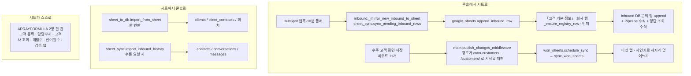

# 워크북: 콘솔이 시트를 쓰는 법과, 절대 건드리면 안 되는 칸

> 영업 워크북(구글 스프레드시트) 하나에 탭이 일곱 개 있고, 콘솔은 그중 여섯 개를 기계로 쓴다.
> 문의가 들어오면 `Inbound DB` 에 한 줄이 붙고(+회사가 처음이면 「고객 기본 정보」에 회사 줄이
> 먼저 붙는다), 수주 고객 화면에서 뭔가 저장되면 「고객 기본 정보 · 계약 및 결제 정보 · 크레딧
> 지급 현황 · 결제 현황」 네 탭이 DB 와 맞춰진다(「클레임 · 히스토리」 탭은 콘솔이 그 기능을
> 버린 뒤로 손으로 적는 자리다 — 0072). 반대 방향(시트 →
> DB)은 `sheet_to_db.import_from_sheet` 하나뿐이고 그건 이관용으로 한 번 돌리는 것이다. 시트에는
> 사람이 손으로 쓰는 행과 콘솔이 쓰는 행이 섞여 있고, 열 중 상당수는 값이 아니라 시트 안의
> 수식이다 — 이 문서는 **어느 칸이 누구 것인지**와, 그 경계를 넘었을 때 무엇이 조용히 깨지는지에
> 대한 것이다.
>
> 워크북의 큰 규칙(화살표는 「고객 기본 정보」 → 나머지 한 방향, 파생 열은 ARRAYFORMULA 한 칸,
> 행은 자연키로 찾는다, RAW/USER_ENTERED 를 나눠 보낸다)은 CLAUDE.md 의 **수주 고객** 항목에 이미
> 적혀 있다. 여기서는 거기 없는 것만 적는다.

## 한눈에

## 지켜야 하는 것들

### 회사 행이 문의 행보다 **먼저** 만들어진다

`_append_existing_tab` 은 registry → dedup → append 순서로 돈다
(`src/integrations/google_sheets.py:519-551`). 「고객 기본 정보」에 그 Client ID 가 없으면
`_ensure_registry_row` 가 먼저 회사 줄을 만들고(`google_sheets.py:336-380`), 그 다음에 Inbound DB
문의 행이 붙고, 그 행의 고객사·기업 종류·국가 칸에는 값이 아니라 그 회사 줄을 가리키는 VLOOKUP 이
들어간다(`_write_registry_formulas`, `google_sheets.py:383-406`).

**어기면**: 조회는 대상이 있어야 값을 준다. 순서가 뒤집히면 그 회사만 이름·국가·기업 종류가
영원히 빈칸이다 — 수식은 정상이고 `#REF!` 도 안 뜨므로 화면상 오류가 아니라 **그냥 이름 없는
문의**로 보인다. `tests/test_google_sheets.py:411-441` 이 이 순서를 고정한다.

### 콘솔이 쓰는 열 = `_Tab.owned` 하나뿐, 그 밖은 손대지 않는다

탭마다 `natural_cols`(행을 찾는 키)와 `owned`(콘솔이 쓰는 열 전부)가 선언되어 있다
(`src/agents/won_sheets.py:57-93`). 값을 쓸 때도, 지워진 항목의 행을 비울 때도 `owned` 만
다룬다(`won_sheets.py:336-341`). 「고객 기본 정보」의 `owned` 가 `ACEFIJ` 인 것은 B(고객
종류)·G(담당부서)가 시트 안의 ARRAYFORMULA 이고, D(Website URL)·H(최초 연락일)는 콘솔에 칸이 없어
시트가 원본이기 때문이다.

**어기면**: ARRAYFORMULA 열에 값을 한 칸 쓰면 그 행만 멈추는 게 아니라 **열 전체가 `#REF!`** 가
된다 — 2행 한 칸이 열 전체를 계산하기 때문이다. 시트에 그렇게 적혀 있다
(`scripts/build_won_sheets.py:155-158`, 열 제목의 셀 메모로 붙는다).

### 이 규칙은 한 곳에서 깨져 있었다 — `_ensure_registry_row` 의 G열 (고침)

> **고쳐졌습니다.** 이 문서를 쓰면서 발견해 그 자리에서 고쳤습니다 — 이제 G 도 B 와 같이
> `""` 를 씁니다. `tests/test_won_customers.py::test_the_registry_append_never_writes_into_a_formula_column`
> 이 「고객 기본 정보」의 수식 열 목록과 이 append 를 같이 묶어 고정합니다.
> 아래는 어쩌다 그렇게 됐는지의 기록입니다 — **커밋 순서로 생기는 어긋남**의 표본입니다.

`_ensure_registry_row` 는 「고객 기본 정보」에 A~H 여덟 칸을 append 하는데, 일곱 번째 값이
`DEPARTMENT_BY_TYPE...` 즉 **G(담당부서)** 다(`google_sheets.py:374`). 그런데 G 는
`scripts/build_won_sheets.py:180-182` 에서 ARRAYFORMULA 열로 다시 지어졌다. B(고객 종류)는 같은
append 에서 `""` 로 비워 두고 「고객 종류는 수식이다」라고 주석까지 달려 있는데
(`google_sheets.py:369`), G 는 그대로 값이 실린다. 커밋 순서가 이유다: 회사 행을 만드는 코드가
2026-08-10 `13879bd`, G 를 수식으로 바꾼 워크북 빌드 스크립트가 같은 날 그 **뒤**인 `d781c8d` 이고,
후자는 `google_sheets.py` 를 건드리지 않았다.

**어기면**(이미 어겨져 있으므로 — 다음 신규 회사 문의가 들어오는 순간): 「고객 기본 정보」 G열
전체가 `#REF!` 가 되고, G 를 먹는 그 탭의 다른 것들이 같이 죽는다. Inbound DB 쪽 조회는
`$A:$J` 범위라 G 가 깨져도 이름은 살아 있어서, **워크북을 직접 열어 보기 전에는 안 보인다.**
고치려면 `google_sheets.py:374` 를 `""` 로 바꾸면 된다(수식이 어차피 같은 값을 계산한다) — 이
문서는 코드를 고치지 않으므로 여기 적어 둔다.

### 「고객 기본 정보」에 1000행을 넘는 행이 생기면 안 된다

`plan_tab` 은 2행부터 `MAX_ROW`(1000) 까지만 훑고 그 밖에서 빈 행을 찾는다
(`won_sheets.py:314`, `won_sheets.py:323`). 같은 1000 이 세 군데에 따로 박혀 있다 —
`won_sheets.MAX_ROW`(47), `build_won_sheets.GRID_ROWS`(50), `sheet_to_db.read()` 의 `A2:{last}1000`
(`src/agents/sheet_to_db.py:76`).

**어기면**: 1000행 밖의 행은 콘솔에게 **존재하지 않는다.** 그 고객의 행을 못 찾았으니 자연키
매칭이 실패하고, 1000행 안의 빈 자리에 **같은 Client ID 로 한 줄을 더** 만든다. 그러면 계약 탭의
`VLOOKUP` 은 위쪽 줄만 보므로 아래 줄은 아무도 안 읽는 유령이 된다. 넘치는 쪽은 로그로만 알려준다
(`won_sheets.py:387-393`). `_ensure_registry_row` 의 append 는 이 한계를 모른다 —
`values().append()` 에 그냥 맡긴다(`google_sheets.py:360-379`).

### 읽을 때는 자연키 열만 **한 열씩** 읽는다 — 단, Inbound DB 는 예외

`sync_won_sheets` 는 `batchGet` 으로 자연키 열만 열 단위로 읽는다(`won_sheets.py:356-369`). 이유는
`plan_tab` docstring(`won_sheets.py:294-297`)과 CLAUDE.md 에 있다. 반면 Inbound DB 쪽
`_existing_row_for_keys` 는 `A{first}:{last}` 로 **행 단위**로 읽는다
(`google_sheets.py:454-464`).

**모순이 아니다**: Inbound DB 에는 ARRAYFORMULA 를 못 쓰고(앱이 append 하는 탭이라 — CLAUDE.md),
행마다 한 칸씩 조회 수식이 들어간다. 그래서 빈 문자열이 시트 끝까지 차 있지 않다. **Inbound DB 에
ARRAYFORMULA 를 하나라도 깔면 이 읽기가 즉시 망가진다** — 마지막 행이 시트 끝이 되어 매 문의마다
`_existing_row_for_keys` 가 전체를 훑고도 자리를 못 찾는다.

### 자연키가 겹치는 행은 두 번째부터 **비워진다**

`by_natural.setdefault` 라 같은 자연키의 첫 행만 기억하고(`won_sheets.py:320`), 나머지는 `stale`
에 남아 `owned` 열이 전부 비워진다(`won_sheets.py:338-341`). `owned` 에 A(Client ID)가 들어 있으므로
비워진 행은 다음 동기화 때 **빈 행**으로 재활용된다.

이건 버그가 아니라 중복 청소 장치다. 다만 **손으로 복사해 둔 행이 콘솔이 아는 고객의 것이면 다음
저장 때 말없이 지워진다**. 손으로 남길 행은 콘솔에 없는 Client ID 여야 한다.

### 글자는 RAW, 숫자·날짜는 USER_ENTERED — 그런데 Inbound DB 는 **전부 RAW** 다

수주 고객 탭들은 두 벌로 나눠 보낸다(`won_sheets.py:395-404`, 이유는 그 파일
docstring `won_sheets.py:21-23`). 그런데 Inbound DB 경로는 append 도(`google_sheets.py:541`),
수정도(`google_sheets.py:495`), 단계 갱신도(`google_sheets.py:706`) 전부 RAW 다. 즉 **Inbound DB 의
문의 날짜는 진짜 날짜가 아니라 `2026-07-18` 이라는 글자다.**

그게 우연이 아니라 전제가 된 곳이 있다: `--import-inbound` 가 최초 연락일을 고를 때
`len(value) == 10 and value[4] == "-"` 로 문자열을 비교하고 그중 가장 이른 것을 고른다
(`scripts/build_won_sheets.py:490-494`). 게다가 그 읽기는 `valueRenderOption="FORMULA"` 다
(`build_won_sheets.py:469`) — 진짜 날짜 셀이면 `46234` 같은 일련번호가 돌아와 저 검사에 전부
탈락한다.

**어기면**(Inbound DB append 를 USER_ENTERED 로 바꾸면): 날짜 정렬·필터는 좋아지지만 다음 번
`--import-inbound` 에서 **최초 연락일이 통째로 빈다.** 그리고 전화번호 `+82 10-…` 가 수식으로
해석되어 `#ERROR!` 가 된다.

### 수식으로 내보내는 칸은 값으로 쓰지 않는다 — Pipeline 과 명단 조회

`Pipeline` 은 값이 아니라 옆 칸(구독 플랜)을 읽는 수식이고(`google_sheets.py:299-322`), Inbound DB
의 고객사·기업 종류·국가도 명단 조회 수식이다(`google_sheets.py:383-406`). 둘 다 append 와 **분리된
두 번째 쓰기**인 이유는 행 번호를 append 응답에서만 알 수 있기 때문이고, 둘 다
`valueInputOption="USER_ENTERED"` 여야 한다 — RAW 로 보내면 시트에 수식의 **글자**가 박힌다.

**단, `update_inbound_stage` 는 `pipeline` 을 값으로 덮어쓴다**(`google_sheets.py:693-701`). 콘솔에서
단계를 옮기며 자격을 같이 넘기면 그 행의 Pipeline 수식은 그때 사라지고 이후 플랜을 고쳐도 안
따라온다. 의도된 것으로 보이지만(사람이 고른 값이 이긴다) 어디에도 적혀 있지 않다.

## 함정

### `수주 DB` 탭은 워크북에서 지워졌는데 코드는 아직 그 탭에 쓴다

`build_won_sheets._JUNK` 가 `수주 DB` 를 **삭제**한다(`scripts/build_won_sheets.py:548-557`, 내용은
계약·회차 탭으로 옮겼다). 그런데 `append_order_row` 는 여전히
`GOOGLE_SHEETS_ORDERS_TAB`(기본값 `"수주 DB"`, `src/common/config.py:216`) 을 부르고
(`google_sheets.py:612-617`), 계약 저장 화면은 아직 `ContractRecord` 를 만들며
(`src/api/routes/customer_ops.py:942`), 폴러는 10분마다 `sync_pending_order_rows` 를 돌린다
(`src/agents/inbound_poller.py:216`).

**증상**: 없는 탭을 읽으니 API 가 400 을 주고, `record_order` 가 그걸 삼킨다
(`google_sheets.py:729-736`). `ContractRecord.sheet_synced_at` 은 영원히 NULL 이라 **10분마다 같은
실패를 되풀이한다.** 화면에는 아무것도 안 뜨고 로그에 `Google Sheets order append failed
(continuing).` 만 쌓인다.

### 검증 탭의 「산정 크레딧」은 콘솔이 관리하는 계약에서 **항상 빈다**

검증 탭 E열은 `공급가 ÷ 분당 단가 × 60` 을 다시 계산하는데, 계약 통화와 단가 통화가 다르면 계약
행의 N(단가 통화)·P(적용 환율)를 쓴다(`build_won_sheets.py:386-395`). 그런데 `won_sheets` 는 N 과 P
를 **빈칸으로 밀어 버린다**(`won_sheets.py:151-153`, `won_sheets.py:168` — 「없어진 칸입니다」).
N 이 비면 `N=K` 도 `N="USD"` 도 거짓이라 `O/P` 로 가고, P 가 비어 `#DIV/0!` → `IFERROR` → `""`.

**증상**: 검증 탭 M열(확인)은 `E=""` 를 OK 로 친다(`build_won_sheets.py:410-414`). 그래서 **크레딧
산정 불일치는 손으로 적은 행에서만 뜬다** — 콘솔이 관리하는 계약은 검산 없이 항상 초록이다.
빨간 칸이 없는 것이 「맞다」가 아니라 「안 봤다」인 상태.

### 별표 붙은 헤더는 별칭 표에 안 걸린다

정규화는 공백만 지우고 별표는 남긴다(`google_sheets.py:149-150`). 수주 고객 탭들의 헤더는
`"Client ID *"` 라 `"clientid*"` 가 되고, `_ALIASES` 에도 `_key_for_header` 의 `endswith("clientid")`
예외에도(`google_sheets.py:163-169`) 안 걸린다.

**그래서 그 다섯 탭은 헤더가 아니라 열 문자로 다룬다** — `won_sheets` 의 `owned`/`natural_cols`,
`sheet_to_db` 의 `cell(r, "AB")`. 이 탭들을 `_append_existing_tab` 류의 별칭 경로에 태우면
`'…' tab has no header row` 로 죽는다.

### `_header_lookup` 은 시트가 아니라 **넘긴 record 의 키**로 만들어진다

`for key in record` 로 별칭 사전을 짓는다(`google_sheets.py:153-160`). `"Billing Email"` 은 인바운드
record 에서는 `email` 로, 수주 record 에서는 `billing_email` 로 매핑된다 — 같은 헤더가 record 에 따라
다른 필드가 된다는 뜻이다(`_ALIASES` 의 `email` / `billing_email`, `google_sheets.py:39`,
`google_sheets.py:66`).

**어기면**: 한 record 에 `email` 과 `billing_email` 을 **둘 다** 담는 순간 `"billingemail"` 키가 dict
순서로 결정된다 — 두 칸 중 하나가 조용히 다른 값으로 채워진다. 필드를 추가할 때는 그 record 안에
별칭이 겹치는 키가 없는지부터 본다.

### 단계 갱신은 실패해도 `False` 만 돌려준다, 그리고 두 단계는 시트에 말이 없다

`update_inbound_stage` 는 전부 try 로 감싸 실패를 로그로만 남긴다(`google_sheets.py:709-716`).
그리고 보드의 일곱 단계 중 `reminder_sent`·`closed` 는 `_STAGE_VALUES` 에 없어
(`google_sheets.py:626-632`) 시트가 **이전 단계를 그대로 들고 있는다** — 이것도 경고 로그뿐이다
(`google_sheets.py:674-681`).

**증상**: 콘솔과 HubSpot 은 옮겨졌는데 워크북만 안 옮겨진 상태. 콘솔 어디에도 표시가 없다.
`_STAGE_VALUES` 에 새 단어를 넣을 때는 반대 방향인 `sheet_sync._local_stage`
(`src/agents/sheet_sync.py:208-221`)도 같이 넣어야 한다 — 한쪽만 알면, 다음 `import_inbound_history`
가 방금 옮긴 단계를 시트의 옛 값으로 되돌린다.

### 「시트 읽기·동기화」 결과를 보여주는 화면이 없다

`full_sheet_sync_status()` 는 요청·시작·완료·실패를 Event 로 남기지만(`sheet_sync.py:85-121`),
저장소 어디에서도 호출되지 않는다 — 그 값을 그리던 `/pipeline` 패널이 없어졌다
(`google_sheets.py:739-741`). 버튼은 `?google=queued` 로 리다이렉트할 뿐이다
(`customer_ops.py:1340-1343`).

**증상**: 눌렀는데 30분이 지나도 아무것도 안 변했을 때, 실패했는지 아직 도는 중인지 알 방법이
DB 의 `events` 테이블뿐이다. 수주 탭 동기화(`schedule_sync`)는 더해서 아예 기록도 안 남기고 경고
로그만 남긴다(`won_sheets.py:447`).

### 수주 탭 동기화는 **URL 접두사**로 걸린다

미들웨어가 `/won-customers` 또는 `/customers/` 로 시작하는 경로에서만
`schedule_sync()` 를 부른다(`src/api/main.py:369-375`).

**어기면**: 수주 데이터를 고치는 라우트를 다른 접두사(예: `/internal/…`)에 달면 저장은 되는데
시트는 영원히 옛 값이다. 화면과 시트가 다른데 어느 쪽도 오류를 내지 않는다.

### `--replace` 로 살아남는 것은 A 열에 Client ID 가 있는 행뿐이다

`existing_rows` 는 파생 열을 빼고 값만 읽은 뒤 `if row.get("A")` 인 행만 보관한다
(`build_won_sheets.py:597-617`). 그리고 읽기는 `valueRenderOption` 을 안 주므로 **화면에 보이는
문자열**을 가져온다 — 금액 열은 `#,##0` 서식이라(`build_won_sheets.py:913`) 소수점이 있던 금액은
반올림된 채 되돌아온다.

**어기면**: Client ID 없이 메모처럼 적어 둔 행은 `--replace` 한 번에 사라진다. 되돌릴 방법은 없다
(스크립트가 백업을 남기지 않는다).

### 명단 탭을 다시 지으면 Inbound DB 의 조회 수식이 끊긴다

탭을 지웠다 만들면 그 탭을 이름으로 가리키던 수식이 끊기는데, **끊긴 것을 눈으로 확인할 방법이
없다 — 그냥 이름이 빈 채로 있을 뿐이다.** 그래서 `build()` 는 마지막에 항상
`point_inbound_at_registry` 로 Inbound DB 의 조회 수식을 새로 쓴다(`build_won_sheets.py:501-508`,
호출은 `build_won_sheets.py:959`).

**어기면**(그 호출을 빼거나 순서를 앞으로 옮기면): Inbound DB 의 고객사·국가·기업 종류가 전부
빈칸이 된다. 오류 표시는 없다.

### `sheet_to_db` 는 열 문자를 통째로 박아 두고 있다

`cell(r, "AB")` 식으로 계약 탭 A~AM 을 위치로 읽는다(`sheet_to_db.py:151-181`). 헤더를 보지
않는다.

**어기면**: `build_won_sheets` 의 `headers` 중간에 열을 하나 끼우는 순간 그 뒤 서른 개 필드가 한 칸씩
밀려 들어온다 — 플랜명 칸에 이메일이, 초대 한도에 space 개수가 들어가고 **아무 예외도 안 난다.**

### 콘솔이 계산해서 내보내는 열은 `sheet_to_db` 가 **읽지 않는다**

플랜 상태(J), 분당 단가와 그 통화·환율(N·O·P)은 일부러 뺐다(`sheet_to_db.py:131-133`,
`sheet_to_db.py:160-161`).

**어기면**: 계약 기간에서 나오는 값을 시트에서 도로 읽어 오면, 시트에 손으로 적힌 옛 「사용중」이
계약 날짜를 이긴다. 저장하지 않기로 한 값을 저장하는 것과 같은 결과다(`src/common/won.py:113-127`).
`won_sheets` 에 계산해서 내보내는 열을 추가하면, `sheet_to_db` 에는 **추가하지 않는 것이** 맞다.

### 담당(AM)은 계약별인데 DB 는 고객당 하나다

`CONTRACTS.owned` 에 AM 이 없다 — 시트가 원본이다(`won_sheets.py:82`). `sheet_to_db` 는 그걸 읽되
**마지막 차수의 사람**을 그 고객의 담당으로 접는다(`sheet_to_db.py:99-105`).

**어기면**: AM 을 `owned` 에 넣어 콘솔이 쓰기 시작하면, 1차와 2차의 담당이 다른 고객에서 1차 담당이
2차 담당으로 덮인다. 그런 고객이 실제로 있다고 시트 메모에 적혀 있다(`build_won_sheets.py:282`).

## 왜 이렇게 되어 있는가

- **Pipeline 이 값이 아니라 수식인 이유.** 영업팀이 딜이 움직이는 동안 구독 플랜을 손으로
  고친다. 한 번 써 넣은 `MQL` 은 그 옆 칸과 곧 모순되지만, 수식은 그 칸을 영원히 다시 읽는다.
  플랜 열을 N 으로 박지 않고 헤더로 찾는 것도 같은 이유 — 열을 하나 끼워도 엉뚱한 칸을 가리키지
  않는다(`google_sheets.py:299-322`).
- **회사 명단을 매번 다시 만들지 않는 이유.** `companies_from_history` 는 `--import-inbound` 전용
  이다. Inbound DB 의 고객사 칸이 이제 명단을 조회하므로, 매번 명단을 Inbound DB 에서 다시 만들면
  값의 출처가 자기 자신이 되어 **한 번 비는 순간 영영 빈다**. 그래서 읽을 때도
  `valueRenderOption="FORMULA"` 로 원시 수식을 읽고 `=` 로 시작하는 칸은 출처에서 뺀다
  (`build_won_sheets.py:449-473`).
- **드롭다운 목록이 시트가 아니라 파이썬에 있는 이유.** 값을 규칙 안에 직접 넣으면 참조할 탭이
  없으니 지워질 일도 없다(`build_won_sheets.py:918-934`). 대가는 **살아 있는 시트가 파이썬 표를
  안 따라온다**는 것 — 고객 종류를 `Inbound` 에서 `GTM Inbound` 로 바꿨을 때 실제로 그랬고, 그래서
  `refresh_derived()`(수식·드롭다운만 다시 쓰기, `build_won_sheets.py:964-1012`)와 그 둘이 같은 말을
  하는지 보는 테스트(`tests/test_won_sheets.py:124-140`)가 생겼다.
- **「동기화 키」 표식 열을 지운 이유.** 자연키(Client ID·차수·회차)가 이미 사람이 안 고치는
  값이라 그 열이 하는 일이 없었다(`won_sheets.py:7-9`).
- **`_APPEND_LOCK` 이 프로세스 안에서만 유효한데 그대로 두는 이유.** 최대 ID 조회와 append 사이가
  원자적이지 않아도, DB 쪽 `sheet_client_id` 유니크 제약과 재시도 루프가 두 번째 방어선이다
  (`sheet_sync.reserve_inbound_client_id`, `sheet_sync.py:483-517`; 마이그레이션 0035). 그래서
  **Sheets 를 쓰는 워커는 하나로 유지한다.**
- **검증 탭이 정보 없는 행을 0 이 아니라 빈칸으로 두는 이유.** 0 으로 두면 「산정 0 ≠ 계약 크레딧」이
  되어 정보가 없을 뿐인 행이 전부 붉게 뜨고, 진짜 어긋난 행이 그 사이에 묻힌다. 금액도 ±1 은
  봐준다 — 회차 금액 반올림 때문이다(`build_won_sheets.py:385-414`).
- **재계약이 새 Client ID 가 아닌 이유, 고객 종류를 저장하지 않는 이유**는 CLAUDE.md 의 수주 고객
  항목에 있다.

## 손대려면 같이 봐야 하는 것

| 고치면 | 같이 고쳐야 하는 것 | 안 고치면 |
| --- | --- | --- |
| `scripts/build_won_sheets.py` 의 `headers` (열 추가·삭제·순서) | `src/agents/won_sheets.py` 의 `owned`/`natural_cols`/`_*_row`, `src/agents/sheet_to_db.py` 의 모든 `cell(r, "…")`, `src/integrations/google_sheets.py:333` `_REGISTRY_COLUMNS`, `build_won_sheets.py:522` 의 `("F",3),("H",6),("I",5)` | 전 필드가 한 칸씩 밀려 들어가고 예외는 안 난다 |
| `scripts/build_won_sheets.py` 의 `array` 수식 | 살아 있는 워크북 — `--refresh-derived` 를 돌려야 반영된다 | 코드와 시트가 다른 계산을 한다 |
| `scripts/build_won_sheets.py` 의 `CHOICES` | `src/common/won.py` 의 같은 목록(`CLIENT_ID_BANDS`, `INDUSTRIES`, `RENEWAL_PLANS` …), 그리고 `--refresh-derived` | 드롭다운에 없는 값을 콘솔이 쓴다. `tests/test_won_sheets.py:124` 가 고객 종류만 잡아 준다 |
| `google_sheets._STAGE_VALUES` | `sheet_sync._local_stage` (역방향) | import 가 방금 옮긴 단계를 옛 값으로 되돌린다 |
| `google_sheets._ALIASES` | `sheet_sync._order_record` / `sheet_sync.sync_pending_inbound_rows` 의 record 키, `common/sheet_values.py` 의 어휘 | 별칭 충돌 또는 「headers did not match enough known fields」 |
| Inbound DB 문의 행을 만드는 곳 | **두 곳이다**: `src/agents/inbound.py:380` (실시간)과 `src/agents/sheet_sync.py:662` (백필). 후자만 `Client` 마스터의 철자를 쓴다 | 같은 열이 경로에 따라 다른 값으로 찬다 |
| `won_sheets.MAX_ROW` | `build_won_sheets.GRID_ROWS`, `sheet_to_db.read()` 의 `1000` | 셋 중 작은 값이 조용히 한계가 된다 |
| 새 시트 쓰기 경로를 추가할 때 | `guard_external_write("sheets:…")` 또는 `google_sheets.writes_enabled()` 중 하나를 반드시 지나게, 그리고 `tests/test_safe_mode.py` 에 한 줄 (CLAUDE.md 의 사전 안전 항목) | 안전 모드가 막지 못하는 쓰기가 생긴다 |
| 수주 데이터를 고치는 새 라우트 | `src/api/main.py:369` 의 경로 접두사 목록 | 저장은 되는데 시트가 안 따라온다 |
