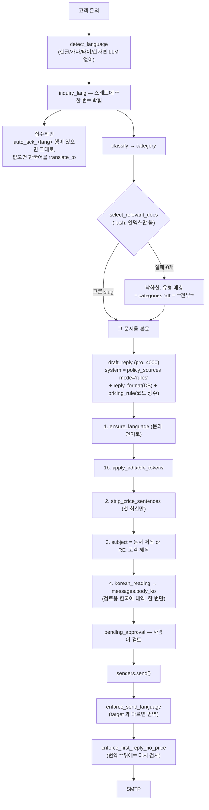

# AI: 무엇을 모델이 정하고 무엇을 코드가 강제하는가

> 인바운드 한 건은 Gemini 를 최대 열 번 넘게 부릅니다 — 언어 감지, 문의 분류, 점수 보정,
> 기업 종류, 도메인 조사 두 번, **어떤 정책 문서를 볼지 고르기**, 초안 쓰기, 스레드 요약,
> 문의 한국어 번역(본문·제목), 접수확인 번역. 모두 `LLMClient.complete()` 한 문을 지나고,
> 그 문이 프롬프트 파일(배포해야 바뀜) + 콘솔의 규칙 행(즉시 바뀜) + 고른 문서 본문을
> 합쳐 보냅니다. 모델이 정하는 것은 **내용**이고, 코드가 강제하는 것은 **형식**입니다 —
> 초안 언어(항상 한국어), 제목(`RE:` 하나), 첫 회신의 가격 금지, 링크·이름 치환.
> 이 넷은 초안 시점과 발송 시점에 **두 번** 겁니다.

CLAUDE.md 에 이미 있는 것(서명은 사람이 고른다 · 자동 회신은 대화당 한 번 · 형식 규칙은
콘솔에 한 벌 · 카테고리→문서 매핑을 코드에 두지 않는다 · 노션에서 못 가져오는 이유)은
여기서 반복하지 않습니다. 아래는 **거기 없는 것**입니다.

## 한눈에

## 지켜야 하는 것들

### 콘솔의 `항상 적용` 규칙은 초안뿐 아니라 **모든** 모델 호출의 시스템 지시가 된다

`LLMClient.complete()` 는 프롬프트 이름과 상관없이 `system=get_company_rules()` 를 붙입니다
(`src/llm/client.py:131`). `policy_sources` 의 `mode='rules'` 행 전부가
(`src/llm/prompts.py:37-65`) 언어 감지(`util/detect_language`), 번역
(`util/translate_ko` · `util/translate_to`), 기업 종류, 스레드 요약, 문서 라우터에까지
같이 갑니다. 유일한 예외가 `LLMClient.search()` 입니다 — 그것만 `system=None`
(`src/llm/client.py:187`).

**어기면**: 콘솔에서 `정책 문서 → 항상 적용` 에 "모든 답변은 한국어로" 같은 한 줄을 더하는
순간 `translate_to` 가 영어 대신 한국어를 돌려주고, 그 결과가 비어 있지 않으므로 발송 가드가
그것을 본문으로 삼습니다 — 영어 고객에게 한국어 메일이 나갑니다. `detect_language` 는
`max_tokens=8` 이라(`src/llm/language.py:89`) 규칙이 설명을 요구하면 출력이 잘리고, 코드는
앞 두 글자만 취해 실패하면 조용히 `en` 으로 떨어집니다. **회신 톤·형식 규칙만 여기 넣고,
"어떻게 답하라" 는 문장은 `mode='knowledge'` 문서에 씁니다.**

### 문의 언어는 접수 때 **한 번** 정해지고, 이후 어디에서도 다시 정하지 않는다

`handle()` 이 첫 인바운드에서 `detect_language` 를 부르고 그 값을 `contact_info` ·
`Conversation.inquiry_language` · `Message.target_language` 에 박습니다
(`src/agents/inbound.py:206-209`, `:1039-1040`, `:1211`). `target_language` 를 쓰는 코드는
이 세 군데뿐이고(`grep target_language`), **고칠 수 있는 화면이 없습니다.**

**어기면 / 틀리면**: 오검출은 그 스레드에서 영구적입니다. 다만 현재는 운영자가 `번역하기`를
완료하기 전에는 발송 버튼이 나타나지 않고, 승인 API와 Conversations 직전 가드도 언어 불일치를
거절합니다. 발송 경로가 보이지 않는 자동 번역을 수행하지 않으므로 오검출을 번역 화면에서
발견해 수정해야 합니다.
라틴 문자 문의만 LLM 판정을 거치므로(`src/llm/language.py:47-71`) 위험 구간은 베트남어 ·
스페인어 · 인도네시아어처럼 라틴 표기 언어입니다.

### 초안 후처리 다섯 단계는 이 순서여야 한다

`ensure_language` → `apply_editable_tokens` → `strip_price_sentences` → 제목 결정 →
`korean_reading` (`src/agents/inbound.py` 의 CODE GUARD 1~4).

- **언어 맞추기가 토큰 치환보다 먼저**여야 합니다. 코드에 그렇게 적혀 있습니다("translation would
  happily rewrite a URL", `:885-886`). 뒤집으면 120자짜리 base64 미팅 링크가 번역 단계에서
  "정리" 되어 예약이 안 되는 링크가 나갑니다.
- **토큰 치환이 가격 제거보다 먼저**입니다. 치환된 값도 가격 검사를 받습니다.
- 제목은 모델이 준 `draft.subject` 를 무조건 버리고 다시 만듭니다.
- **한국어 대역이 마지막**입니다. 링크와 금액이 확정된 뒤라야 두 벌이 같은 글이 되고,
  그래야 검토 화면의 대조가 대조가 됩니다.

**어기면**: 링크가 조용히 깨집니다. 화면에는 멀쩡한 URL 로 보입니다 — 한 글자가 다를 뿐.

### 초안의 언어와 제목은 모델의 출력이 아니라 코드가 덮어쓴 값이다

`draft.language = "ko"` (`src/agents/inbound.py:883`), `draft.subject = doc_subject or
reply_subject(...)` (`:915`). `DraftResult` 는 두 필드를 **필수로 요구**하는데
(`src/agents/inbound.py:119-123`) 코드는 둘 다 버립니다.

**어기면 / 그래서**: 모델이 `language` 키를 빼먹으면 pydantic 검증이 실패하고
`complete()` 가 프롬프트에 "이번엔 진짜 JSON 만" 을 붙여 **pro 모델 4,000 토큰 호출을 한 번 더**
합니다(`src/llm/client.py:148-167`) — 쓰지도 않을 필드 하나 때문에. 두 번 다 실패하면
`LLMError` → 카드가 `draft_failed` 로 뒤집힙니다(`:1442-1451`). 스키마에서 필드를 뺄
생각이면 그 전에 프롬프트의 JSON 예시(`draft_reply.md:44-50`)도 같이 고치세요.

### 기업 종류는 닫힌 목록이지만, 그 검사는 **모델 답변에만** 걸린다

`_company_type` 이 `COMPANY_TYPES` (`src/common/sheet_values.py:13-29`) 밖의 값을 전부
`확인 안 됨` 으로 떨어뜨립니다(`src/agents/inbound.py:688-692`). 그런데 호출부가
`(profile.industry if profile else None) or self._company_type(...)`
(`src/agents/inbound.py:396-397`) 라, 그 연락처에 `CustomerProfile` 이 이미 있으면 모델은
아예 안 부르고 `profile.industry` 가 그대로 워크북 열에 들어갑니다. 그 값은 콘솔 폼의
자유 입력(`src/api/routes/customer_ops.py:630`)이라 아무 검증이 없습니다.

**어기면**: 영업팀이 필터하는 열에 목록 밖의 한 줄(도메인 분석이 쓴 "B2B SaaS — 관측성"
같은 것)이 들어가고, 피벗에서 그 행만 사라집니다.

### 첫 회신 가격 금지는 **초안과 발송 두 곳**에 있고, 둘 다 있어야 한다

초안: `src/agents/inbound.py:891-906`. 발송: `enforce_first_reply_no_price`
(`src/integrations/senders/__init__.py:70-118`) — 번역 **뒤에** 도는 것이 요점입니다
(`:198-201`). 둘 다 `strip_price_sentences` 로 **줄 단위** 삭제입니다
(`src/common/pricing_guard.py:43-62`).

**어기면**: 초안 쪽만 남기면 운영자가 검토 중에 타이핑한 금액이 그대로 나갑니다. 발송 쪽만
남기면 화면에 금액이 보이는 초안이 만들어지고 발송 순간 문장이 사라져 운영자가 자기가 쓴
줄이 없어진 것을 모릅니다(초안 쪽은 `처리 경과` 에 `첫 회신 금액 표기 N건 자동 제거됨` 을
남기지만, 발송 쪽은 로그만 남깁니다).

## 함정

### 가격 정규식은 한국어·영어 표기만 안다 — 그런데 검사는 **번역된 뒤**에 한다

`_PATTERNS` (`src/common/pricing_guard.py:23-32`) 는 통화 기호, `USD/KRW/...` 세 글자 코드,
`원·달러·엔·유로…`, `dollars/euros/yen`, `/mo` 계열입니다. 실측:

| 문자열 | 걸리는가 |
|---|---|
| `월 29달러`, `$29/mo`, `29 USD`, `29 euros`, `29 유로` | ✅ |
| `月額 3,000円` (일본어) | ❌ |
| `29ドル` | ❌ |
| `1.000.000 đồng`, `1.000.000 VNĐ` (베트남어) | ❌ |

발송 가드는 번역 **후** 본문만 봅니다. 즉 운영자가 초안에 "월 3만원" 을 적으면 초안 가드가
잡지만, 초안 가드를 통과한 뒤 `번역하기` 나 발송 시 번역이 `3万円` 으로 바꾸면 발송 가드는
못 봅니다. **일본·베트남 고객의 첫 회신에는 금액 금지 규칙이 사실상 없습니다.**

### 두 발송 가드 모두 `target_language` 가 비면 통째로 건너뛴다

`enforce_send_language` 는 target 이 없으면 텍스트 정리만 하고 반환하고
(`src/integrations/senders/__init__.py:34-37`), `enforce_first_reply_no_price` 는 첫 줄에서
바로 반환합니다(`:78-79`). 지금은 outgoing 메시지를 만드는 곳이 인바운드 에이전트뿐이라
항상 채워지지만, **회신을 만드는 경로를 새로 추가하면서 `target_language` 를 안 넣으면 언어
강제와 가격 가드가 동시에, 조용히 사라집니다.** 새 경로를 만들면 `target_language` 를
반드시 채우세요.

### 정책 문서를 지워도 회신은 계속 그 문서를 본다

`POST /policy-docs/{id}/delete` 는 `PolicySource` 행만 지웁니다
(`src/api/routes/policy_docs.py:158-165`). 라우터가 실제로 읽는 것은 사본인
`knowledge_documents` 인데(`src/agents/policy_sync.py:71-109`) **그 행을 지우는 코드가
저장소 어디에도 없습니다**(`grep KnowledgeDocument` → policy_sync 와 models 뿐). 사본은
`status='active'` 로 남아 영원히 후보입니다.

**화면에는**: `정책 문서` 목록에서 사라져 지운 것처럼 보입니다. 회신은 지운 정책대로
계속 나가고, 그 근거가 화면 어디에도 없습니다. 지금 정말 안 쓰이게 하려면 DB 에서
`knowledge_documents` 행을 직접 지우거나 `status` 를 바꾸는 수밖에 없습니다.

같은 이유로 **본문을 비우는 것으로도 안 됩니다**: `policy_docs_update` 는 `body.strip()`
이 있을 때만 저장하고(`:139`), `refresh_knowledge_copy` 도 빈 본문이면 그냥 반환합니다
(`src/agents/policy_sync.py:122-123`). 이메일 템플릿은 "쓰지 않으려면 내용을 비우세요" 가
맞지만(`src/api/routes/email_templates.py:180-182`), 정책 문서는 정반대입니다.

부수적으로 그 delete 라우트만 `admin_required` 가 없습니다(create/update 에는 있음,
`:71`, `:123`).

### `mode` 를 `knowledge` → `rules` 로 바꾸면 문서가 두 번 들어간다

`refresh_knowledge_copy` 는 `mode != 'knowledge'` 면 아무것도 안 하고 반환합니다
(`src/agents/policy_sync.py:120-121`). 예전 사본은 그대로 남습니다. 그 문서는 이제 **시스템
지시(항상 적용)이면서 동시에 문서 라우터의 후보**입니다. 반대 방향(`rules` → `knowledge`)은
사본이 새로 생기니 정상입니다.

### 판본 이력은 한 표에 있고, 둘 다 씁니다 (2026-08-27 에 고쳐짐)

`document_revisions` 하나에 이메일 템플릿과 정책 문서의 이전 판본이 같이 삽니다. 남기는 곳도
읽는 곳도 `src/db/revisions.py` 한 곳이고, 화면은 두 편집기 바닥의 **「판본 기록」** 버튼입니다.
남는 시점은 **고치기 직전**이라, 맨 위 행은 「지금 본문」이 아니라 「직전 본문」입니다.
만들 때는 안 남깁니다 — 갓 만든 행에는 이전이 없습니다.

**그 전에는 이랬습니다**: `email_templates` 만 `email_template_revisions` 에 쌓았는데
**읽는 라우트도 화면도 없었고**(0069 주석은 "이력 화면에 예전 본문이 남는다" 고 적어 두었지만
그 화면은 존재한 적이 없습니다), 정책 문서는 이력이 아예 없었으며, 그 몫이라던
`knowledge_document_revisions` 는 0016 이 만들고 아무도 쓰지 않았습니다. 이관 0095 가 그
표를 지웠고 0096 이 나머지를 한 표로 모았습니다.

보관 기간은 그대로입니다: 지운 문서는 7일 뒤 `soft_delete.purge_expired` 가 본문과 이력을
같이 치웁니다 — 「7일 뒤 사라진다」가 사실이어야 하니까요.

### 문서 라우터가 실패하면 KR/ENG 템플릿이 **동시에** 붙는다

낙하산은 `_matching_docs(category, scope)` 입니다(`src/llm/knowledge.py:224`, `:246`,
`:251`). 그런데 `_upsert_knowledge` 가 모든 문서에 `categories=["all"]` 을 붙이므로
(`src/agents/policy_sync.py:87`) 유형 매칭은 **활성 문서 전부**를 뜻합니다. 라우터
프롬프트가 "같은 문서의 KR/ENG 두 벌 중 하나만 고르라 — 둘 다 넣으면 따라야 할 형식이 두
개가 된다" 고 명시하는데(`inbound/select_docs.md:26-29`), 낙하산은 정확히 그 금지를 어깁니다.

**화면에는**: 아무것도. 로그에 `Doc router failed, falling back to category match.` 또는
`Doc router selected nothing; ...` (`src/llm/knowledge.py:245`, `:250`). 증상은 "요즘 회신
형식이 이상하다" 로만 옵니다.

### `번역하기` 와 `문의 한국어 번역` 은 이름이 비슷할 뿐 정반대다

`to_korean` = 고객 문의를 한국어로(운영자가 읽기 위해, 미리, 화면 밖에서).
`translate_to` = 우리 초안을 고객 언어로(운영자가 누를 때, 그 자리에서).
`needs_korean` 과 `is_mostly_korean` 은 **서로의 부정이 아닙니다** — 글자가 없는 텍스트에는
둘 다 False (`src/llm/translate.py:40-55`). 하나를 다른 하나의 `not` 으로 쓴 것이 실제 사고:
영어 문의에 대한 한국어 초안에서 `번역할 내용이 없습니다` 가 떠서 운영자가 보낼 메일을 못
봤습니다(`tests/test_translate.py:1-7`).

`tests/test_translate.py:166-179` 는 **소스 파일을 grep 해서** `messages.py` · `ui_api.py`
에 `to_korean` 이라는 글자가 없음을 검사합니다. 화면을 여는 길에 번역을 다시 넣으면 이
테스트가 깨집니다 — 티켓 하나 열 때 말풍선마다 모델을 기다리던 시절로 돌아가지 말라는 뜻.

### 번역 출력은 2,000 토큰에서 잘리므로 화면에서 끝까지 확인한다

초안은 `max_tokens=4000` (`src/agents/inbound.py:878`), 번역은 `max_tokens=2000`
(`src/llm/translate.py:76`, `:107`). Gemini 가 한도에서 끊어도 텍스트는 비어 있지 않을 수
있습니다. 이제 발송 직전 자동 번역은 없고 화면에서 번역 결과를 검토한 뒤 보내므로, 끝 문장이
온전한지 확인해야 합니다. 한국어는 토큰이 조밀하고 영어는 늘어나므로 긴 초안일수록 위험합니다.
**긴 회신을 보낼 일이 잦아지면 이 두 숫자를 같이 올리세요.**

### `reset_cache()` 는 지금 아무것도 지우지 않는다

`src/llm/knowledge.py:138-146` 이 `get_company_rules.cache_clear()` 를 부르는데, 그것은
`prompts.py:152` 에서 `lambda: None` 로 대체된 no-op 입니다. 규칙도 문서도 모두 호출마다 DB
에서 읽으므로 지금은 맞는 동작입니다. 그런데 `knowledge.py` **모듈 docstring 7번째 줄은
아직 "Caching: lru_cache keyed on (category, scope)" 라고 말합니다** — 사실이 아닙니다
(`_matching_docs` 에 캐시 없음, `:119-121`). 성능 때문에 캐시를 다시 넣는다면
`reset_cache()` 에 반드시 연결하세요. 지금 그 함수는 부르는 쪽을 안심시키기만 합니다
(`src/agents/policy_sync.py:128-130`).

### 라우터가 보는 것은 본문이 아니라 인덱스 한 줄이다

`_build_index` 가 만드는 것은 `slug · title · categories · tags · summary` 뿐입니다
(`src/llm/knowledge.py:175-189`). `summary` 는 콘솔의 **「언제 쓰는가」** 칸
(`usage_note`), 비면 본문 앞 400자(`_SUMMARY_CHARS`, `src/agents/policy_sync.py:26`).
표로 시작하는 문서는 그 400자가 `| 케이스 | 문구 |` 가 되어 절대 안 골라집니다
(`tests/test_reply_style.py:138-176` 이 그 경우를 고정).

### 접수확인은 `RE:` 를 안 붙이고, 그건 의도다

`auto_ack` 계열에 `subject` 행이 있으면 그 고정 제목을 쓰고, 없을 때만 `RE:` 로 떨어집니다
(`src/agents/inbound.py:1285-1288`). 대가는 코드 주석에 적혀 있습니다 — 고객 메일함에서
원래 문의와 **다른 대화**로 뜹니다. 상세 회신은 여전히 `RE:` 라 그쪽은 원래 스레드에 붙습니다.

## 왜 이렇게 되어 있는가

### thinking budget 이 flash 0 / pro 128 인 이유

`_THINKING_BUDGET_BY_TIER = {"flash": 0, "pro": 128}` (`src/llm/client.py:35`). Gemini 2.5
의 thinking 토큰은 `max_output_tokens` **같은 예산에서** 나갑니다. 안 막으면 긴 추론이
예산을 다 먹고 실제 답이 잘려 JSON 파싱이 실패합니다. 128 은 pro 의 하한이라 그 값입니다.
알 수 없는 tier 는 0 으로 떨어집니다(`:130`). SDK 가 `ThinkingConfig` 를 모르면 조용히
캡 없이 진행합니다(`src/llm/providers/gemini_vertex.py:112-118`) — 그때 증상이 바로 위의
"JSON 두 번 실패" 입니다.

### 서명·링크·이름을 모델이 안 쓰는 이유가 각각 다르다

- 미팅 링크: 120자 base64 라 모델이 "정리" 합니다.
- 담당자 이름: 한국어 템플릿 첫 줄이 이름으로 자기소개를 하는데, 시키면 지어냅니다.
- 이름만 언어별로 두 칸(`sender_name` / `sender_name_en`)인 이유: "배운태" 와 "Untae Bae"
  는 번역이 아니라 **표기가 둘**입니다. 한 칸이면 번역 단계가 매번 다르게 로마자로 바꿉니다
  (`src/llm/prompts.py:109-112`).
- 값이 비면 토큰을 **그대로 남깁니다**(`:115-146`). 빈 문자열로 치환하면 "이스트소프트
  입니다" 가 나가고, 그건 읽는 순간 이미 나간 뒤입니다. `{{MEETING_LINK}}` 는 발송 전에
  눈에 띕니다.
- 언어 판단 기준은 **초안 본문의 언어가 아니라 고객의 언어**입니다(`:128-131`): 초안은 늘
  한국어인데 영어 고객에게 갈 것이면 처음부터 영문 표기가 들어가야 번역이 안 건드립니다.

### 가격 규칙이 문서와 코드 두 벌인 이유

`_PRICING_RULE_FIRST` / `_PRICING_RULE_NORMAL` (`src/agents/inbound.py:85-96`) 은 프롬프트
변수이고, 같은 취지가 `rule_01_common_principles.md` 의 가드레일에도 있습니다. 이건 중복이
아니라 **분업**입니다 — 문서는 "가격 숫자를 쓰지 않는다" 는 원칙, 코드 상수는 "이번이 첫
회신이냐" 라는 **호출 시점에만 아는 사실**. 예전에는 둘이 정반대였고(코드가 "금액을
명시하라"), 이기는 쪽은 코드였습니다. 지금 두 문장이 같은 말을 하는지
`tests/test_reply_style.py:74-75` 가 봅니다.

### 문의 번역이 티켓 열기에서 접수 시점으로 옮겨진 이유

예전에는 티켓을 열 때 번역했고, 그래서 **그 티켓을 처음 여는 사람이 말풍선마다 모델을
기다렸다가** 화면을 봤습니다(영어 세 줄이면 여섯 번). 지금은 접수 직후 그 대화만 +
10분 폴러가 20건씩(`src/agents/inbound.py:1454-1504`,
`src/agents/inbound_poller.py:203-205`). 접수확인이 이미 나간 뒤이고 아래 초안 작성이 어차피
모델을 더 오래 쓰므로 고객 대기 시간은 그대로입니다.

**실패는 NULL 로 둡니다.** `to_korean` 은 실패해도 예외 대신 `""` 를 돌려주므로
(`src/llm/translate.py:74-86`) 그 자리에 원문을 넣으면 영어가 「한국어 번역」이라는 이름표를
달고 굳고, 폴러는 그 행을 다시 안 집습니다 — 되돌릴 길이 없습니다. 이미 한국어이거나 글자가
없는 본문은 값이 채워지므로 무한 재시도가 아닙니다.

### JSON 을 못 뽑을 때 세 가지 방식으로 뽑는 이유

`_strip_code_fences` (`src/llm/client.py:46-90`) 는 실제로 관측된 세 패턴을 다룹니다:
완전한 펜스, 펜스 뒤에 붙은 잡담("Want me to investigate?"), 펜스 없이 산문 사이에 낀
객체. 마지막은 문자열 안의 중괄호를 세지 않도록 이스케이프까지 추적하며 균형을 맞춥니다.
그래도 실패하면 프롬프트에 경고를 붙여 **한 번만** 더 부릅니다.

### 지식 문서 slug 가 아직 `notion-` 으로 시작하는 이유

`_slug_for` = `f"notion-{doc_key[:12]}"` (`src/agents/policy_sync.py:29-39`). 노션은 사라진
지 오래고 이 접두사는 아무것도 뜻하지 않지만, 바꾸면 이미 그 이름으로 저장된 모든 행이
고아가 됩니다. `label` 이 아니라 `doc_key`(제목 sha256 앞 32자,
`src/api/routes/policy_docs.py:44-52`) 에서 뽑는 것도 같은 이유 — 제목을 바꿔도 **같은**
지식 행이 갱신되어야지, 옛 행이 남아 라우터가 한 정책을 두 번 인용하면 안 됩니다.

## 성능

### 모델 호출 하나가 DB 왕복 하나를 덧붙인다

`_dispatch_once` 가 매번 `_log_event()` (`events` INSERT + commit) 를 부릅니다. 자기 세션을
열고 커밋하며, `try/except` 로 감싸 있어 DB 가 느리면 실패가 아니라 **지연**으로 나타납니다.

**둘이었습니다.** `log_usage()` 가 `llm_usage` 에 한 줄 더 썼는데, 읽는 곳은
`report.get_usage_since` 하나였고 그건 `POST /run/report` 로만 불렸습니다 — 콘솔에 버튼도
스케줄도 없어서 아무도 부르지 않았습니다. 이관 0095 가 기록과 표를 같이 없앴습니다
(2026-08-27 운영자 지시). 같은 숫자는 Vertex 콘솔에 있습니다.

### 발송 경로는 번역하지 않는다

`senders.send()`의 `enforce_send_language`는 현재 언어와 목표 언어가 다르거나 외국어 본문이
여전히 한국어 중심이면 즉시 거부한다. Gemini 번역은 검토 화면의 명시적 `번역하기` 경로에서만
수행된다. 따라서 발송 버튼을 누른 뒤 운영자가 보지 않은 번역문이 생성되는 일은 없다.

### 문서 라우터는 초안마다 flash 호출 하나 + 전체 문서 인덱스를 더한다

문서가 늘수록 인덱스가 길어집니다. `summary` 를 400자로 자르는 이유가 이것입니다
(`src/agents/policy_sync.py:26`). 반대로 라우터가 **실패**하면 활성 문서 **본문 전부**가
pro 프롬프트에 들어갑니다.

## 손대려면 같이 봐야 하는 것

| 고치는 것 | 같이 고쳐야 하는 것 | 왜 |
|---|---|---|
| `src/llm/prompts/inbound/draft_reply.md` 의 형식·톤 문장 | `src/db/seeds/policy/rule_01_common_principles.md` | 같은 규칙이 두 군데면 콘솔에서 고친 쪽이 이깁니다. `tests/test_reply_style.py:34` 가 "한 줄에는 한 문장 / 불릿 / 이모지 / CTA" 가 프롬프트에 **없음**을 검사합니다 |
| `DraftResult` 필드 (`src/agents/inbound.py:119`) | `draft_reply.md:44-50` 의 JSON 예시 | 스키마와 예시가 어긋나면 매 초안이 pro 호출 두 번이 됩니다 |
| `_EDITABLE_TOKENS` (`src/llm/prompts.py:103`) | `draft_reply.md:39`, `src/db/migrations/0042_reply_format_template.py`, `tests/test_reply_style.py:241` | 스켈레톤에 있는데 코드가 모르는 토큰은 고객에게 raw 로 나갑니다(테스트가 한 방향으로만 검사) |
| `_PATTERNS` (`src/common/pricing_guard.py:23`) | `_PRICING_RULE_FIRST/_NORMAL` (`src/agents/inbound.py:85`), `rule_01_common_principles.md` §2 | 문서·프롬프트·정규식 셋이 같은 말을 해야 합니다 |
| `_LANG_NAMES` (`src/llm/language.py:22`) | `_GENERIC` (`src/common/subjects.py:29`) | 언어를 하나 추가하면 제목 없는 문의의 대체 제목도 그 언어로 있어야 합니다. 없으면 영어 |
| 언어 추가 | `auto_ack_<lang>` 이메일 템플릿 행 | 그 언어로 쓰인 행이 있으면 번역을 건너뜁니다(`src/agents/inbound.py:1264`). 없으면 매 접수확인이 Gemini 호출 하나이고 문장이 매번 조금씩 다릅니다 |
| `select_relevant_docs` 반환 형태 | `tests/test_inbound_auto_ack.py` · `tests/test_reply_language.py` 의 `@patch(..., return_value=("", None))` | `with_subject=True` 라 튜플입니다. 문자열로 바꾸면 전 파일이 조용히 통과하고 초안 제목이 깨집니다 |
| `KnowledgeDocument.categories` 기본값 (`src/agents/policy_sync.py:87`) | `_category_matches` (`src/llm/knowledge.py:53`) | `"all"` 이 아니면 라우터 실패 시 후보 0개 → **문서 없이** 답을 씁니다. `tests/test_reply_style.py:180` 이 고정 |
| `policy_sources` 행 삭제/모드 변경 | `knowledge_documents` 사본 (지우는 코드 없음) | 위 함정 참고 |
| `EmailTemplate.key` 접두사 규칙 | `src/db/email_templates.py:19`, `src/api/routes/email_templates.py:24-43`, 검토 화면 고르개 | `signature_` 하나가 목록·고르개·삭제 가능 여부를 동시에 가릅니다 |
| `llm.translate` 를 읽기 경로에 추가 | `tests/test_translate.py:166-179` (소스 grep) | 화면 여는 길에 `to_korean` 이 들어오면 테스트가 깨집니다 |
> 2026-08-24 변경: 즉시 자동 접수확인은 제거되었습니다. 아래 `auto_ack` 언어·템플릿 설명은 제거 전 설계 기록입니다.
