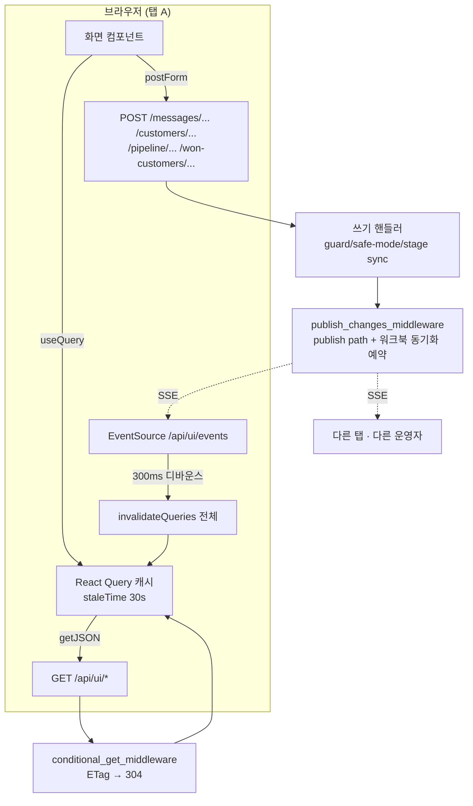

# 콘솔(React): 화면이 데이터를 얻고 갱신하는 규칙

> 콘솔은 `frontend/` 의 React SPA 하나이고, FastAPI 가 `/app` 아래 모든 경로에 **같은 문서**를 돌려주면 라우터가 화면을 고릅니다. 화면이 값을 **읽을 때**는 `/api/ui/*` 의 JSON 을 React Query 캐시에 담고, **쓸 때**는 예전 Jinja 폼이 쓰던 라우트에 그대로 form-urlencoded 로 POST 합니다. 쓰기가 끝나면 서버 미들웨어가 SSE 로 "뭔가 바뀌었다" 한 줄을 뿌리고, 열려 있는 모든 콘솔이 자기 캐시를 통째로 무효화합니다. 그래서 이 서브시스템의 사고는 대부분 세 곳에서 납니다 — 캐시를 언제 버리는가, 쓰기가 어느 라우트로 가는가, 그리고 앱(Oregon)과 DB(도쿄) 사이 왕복 200~370ms 를 몇 번 하는가.

읽기 전에: CLAUDE.md 「Front end」 항목이 큰 그림(빌드 후 패키징, `/api/ui` 는 같은 context builder, 쓰기는 기존 라우트, SSE, `console.css`)을 이미 말합니다. 이 문서는 **거기 없는 것**만 적습니다.

## 한눈에

## 지켜야 하는 것들

### `/api/ui/*` 핸들러는 `def` 다. `async def` 로 바꾸지 마라

`src/api/routes/ui_api.py:3-7` 이 이유를 적어 놓았습니다. 이 핸들러들은 블로킹 SQLAlchemy 만 하는데, FastAPI 는 동기 엔드포인트를 스레드풀에서, `async def` 를 **이벤트 루프 위에서** 돌립니다. 전부 `async def` 였던 시절, 티켓 하나를 여는 데 드는 순차 왕복 ~11 번 동안 SSE 스트림과 큐 폴링이 그 뒤에 줄을 섰습니다.

예외가 하나 있고 그것도 같은 이유입니다: `ui_message_detail` 은 `async def` 지만 본문을 `asyncio.to_thread(_message_detail_context, ...)` 로 밀어냅니다(`ui_api.py:170-191`). 빨라지지 않습니다 — 남을 안 느리게 할 뿐입니다.

**어기면**: 한 사람이 티켓을 여는 2~3초 동안 다른 운영자의 화면이 멈추고, SSE 도 그동안 조용합니다. 화면에는 "살짝 늦게 뜬다" 로만 보입니다.

### 쓰기는 새 JSON API 를 만들지 말고 기존 라우트에 form 으로 보낸다

`frontend/src/lib/api.ts:23-32` 의 `postForm` 이 전부입니다. `application/x-www-form-urlencoded` 인 이유는 상대가 Jinja 폼이 쓰던 그 핸들러이기 때문이고, 그래야 발송 가드·stage sync·safe-mode 차단이 한 벌로 남습니다(CLAUDE.md 참고).

여기서 **암묵지는 응답 모양**입니다. 그 핸들러들은 JSON 이 아니라 303/302 리다이렉트를 돌려줍니다. 그래서 결과를 읽는 방법이 특이합니다 — `frontend/src/ui/SyncBanner.tsx:45-48` 이 `response.url` 의 쿼리스트링(`?sync=ok|partial|local`)에서 결과를 캐냅니다. `fetch` 가 리다이렉트를 따라간 **최종 URL** 이라 가능한 일입니다.

**어기면**: 새 쓰기 경로를 `/api/ui` 아래 JSON 으로 만들면 그 순간 가드가 두 벌이 되고, 배너는 아무 말도 못 합니다("저장됨" 과 "HubSpot 까지 갔음" 이 구분되지 않습니다).

### 브라우저가 부르는 새 경로 접두사는 세 곳에 동시에 등록한다

1. `src/api/security.py:21-32` `WEB_UI_PREFIXES` — 없으면 세션 쿠키를 들고 온 로그인 운영자가 `invalid or missing token` 을 받습니다. `/won-customers` 와 `/app`·`/api/ui` 가 여기 들어간 사연이 그 주석입니다.
2. `frontend/vite.config.ts` 의 `server.proxy` 목록 — 없으면 **개발 서버에서만** 그 경로가 SPA 문서(또는 404)로 떨어집니다. 프로덕션에서는 멀쩡하므로 눈치채기 어렵습니다.
3. 라우트가 화면이면 `frontend/src/main.tsx` 의 `<Route>`, 그리고 옛 URL 이 있으면 `src/api/routes/legacy_redirects.py:29-44`.

**어기면**: (1) 은 로그인했는데 토큰이 없다는 화면, (2) 는 `npm run dev` 에서만 나는 404, (3) 은 `/app/…` 에서 **빈 본문**(아래 참고).

### `/app` 아래에는 catch-all 라우트가 없다 — 없는 경로는 200 인 빈 화면이다

`src/api/main.py:184-188` 이 `/app/{path:path}` 전부에 같은 문서를 돌려주고, `frontend/src/main.tsx:60-95` 의 `<Routes>` 에는 `path="*"` 가 없습니다. 그래서 오타 난 주소는 404 가 아니라 **사이드바만 있고 본문이 빈 화면**입니다.

**어기면**: 라우트 이름을 바꾸고 링크 한 곳을 안 고치면, 그 링크는 눌러도 아무 일도 안 일어난 것처럼 보입니다. 에러도 로그도 없습니다(`error_capture_middleware` 는 4xx/5xx 만 봅니다, `main.py:202-220`).

### SSE 이벤트에는 "누가 썼는지" 가 없다. 그래서 전체 무효화이고, 그래서 디바운스가 있다

`frontend/src/lib/api.ts:40-64`. 토픽은 경로 문자열뿐이고 클라이언트는 `invalidateQueries()` 를 **키 없이** 부릅니다 — 한 화면의 쓰기가 다른 화면의 값을 바꾸는 일이 흔하기 때문입니다(`main.py:339-352`).

같은 파일 47-53 줄에 **되돌린 시도**가 적혀 있습니다. "내가 방금 쓴 것의 메아리" 를 시간으로 걸러 보려 했고 두 가지가 틀렸습니다: ① 이벤트에 작성자가 없어서 남의 저장까지 같이 버려지는데, 포커스 재요청이 꺼져 있고 대부분 폴링도 없어 되받을 길이 없습니다. ② 정작 자기 메아리를 못 막습니다 — 보드의 쓰기는 303→302 를 따라가느라 응답이 세 홉 뒤에 끝나는데 서버는 첫 핸들러가 끝날 때 이미 알립니다.

300ms 디바운스는 그 대신입니다: 한 번의 저장이 재요청 두 번(쓴 탭의 자체 invalidate + 자기 SSE 메아리)이 되던 것을 하나로 묶습니다.

**어기면**: 디바운스를 없애면 연속 저장 한 번에 화면 전체를 여러 번 다시 받습니다 — 왕복 하나가 200ms 인 환경에서 그게 그대로 지연입니다.

### 쓰기 알림은 `publish_changes_middleware` 한 곳에서만 낸다

`src/api/main.py:339-376`. **성공한 non-GET 이 곧 이벤트**입니다. 예전에는 서른 개 쓰기 엔드포인트 중 셋만 손으로 알렸고, 회신 발송·접근 승인·템플릿 수정·계약 추가는 다른 탭에 닿지 않았습니다. `tests/test_ui_api.py:126` 이 이것을 고정합니다.

예외는 **두 개뿐**이고 둘 다 아무것도 안 바꾸는 POST 입니다(`main.py:357`): `/messages/preview` 와 `…/translate`. 미리보기 창 한 번 여는 것이 열려 있는 모든 콘솔의 캐시를 날리면 안 됩니다.

같은 미들웨어가 `/won-customers` · `/customers/` 쓰기 뒤에 영업 워크북 동기화도 예약합니다(`main.py:369-375`). 두 가지가 한 자리에 있는 이유는 같습니다 — 라우트가 열한 개라 각각에 한 줄씩 넣으면 다음에 생기는 라우트가 조용히 빠집니다.

**어기면**: 핸들러 안에서 따로 `publish()` 하면 이벤트가 두 번 나가고(디바운스가 흡수하지만 왕복은 늘어남), 미들웨어를 우회하는 쓰기(백그라운드 작업 등)는 **아무 탭도 모릅니다**.

### 훅은 early return 위에 부른다

`frontend/src/screens/MessageDetail.tsx:81-83`, `frontend/src/screens/SettingsUsers.tsx:28-31`, `frontend/src/screens/won/WonCustomerDetail.tsx:69-71` 에 같은 주석이 붙어 있습니다. 로딩 렌더에서 `return <LoadingBlock/>` 이 먼저 걸리면 훅 하나를 건너뛰고, 데이터가 온 렌더에서는 부르게 되어 React 가 훅 수가 달라졌다고 터집니다(#310).

**어기면**: 화면이 **통째로** 안 뜹니다. 로딩 중에는 멀쩡하고 데이터가 온 순간 하얗게 됩니다.

### 편집기의 초기값은 effect 가 아니라 렌더 중에 채운다

`MessageDetail.tsx:95-107`, `EmailTemplates.tsx:71-77`, `WonContractForm.tsx:75-101` 이 전부 같은 모양입니다: `if (data && loadedId !== data.id) { setLoadedId(...); set…(...) }`.

두 가지를 동시에 지킵니다. ① `loadedId` 가드가 없으면 큐가 뒤에서 재검증할 때마다 운영자가 치던 글이 서버 값으로 되돌아갑니다. ② effect 로 하면 브라우저가 이미 칠한 **뒤에** 돌아서, 첫 프레임에 빈 제목·빈 본문이 보였다가 글자가 나타납니다 — 다 뜬 화면이 다시 바뀌는 것처럼 보입니다.

**어기면**: 저장 버튼을 누르기 직전에 본문이 원래대로 돌아가 있고, 아무 로그도 안 남습니다.

### 캐시 헤더는 세 갈래이고, 그 갈래가 배포 사고를 막는다

- `/static/app/assets/*` → `public, max-age=31536000, immutable` (`main.py:386-387`). Vite 가 파일 이름에 내용 해시를 박으므로 안전합니다.
- 그 외 `/static/*` → `no-cache` (`main.py:392-393`). `console.css` · `won.css` · `tokens.css` 는 **이름이 고정**이라 제자리에서 고칩니다. 이게 없으면 Chrome 이 휴리스틱으로 캐시해서, CSS 를 고쳐도 아무 일도 안 일어난 것처럼 보입니다.
- SPA 문서(`/app`, `/auth/*`) → `no-cache`, **`spa_document()` 안에서**(`main.py:160-181`). 이 문서가 하는 일은 "지금 번들 파일 이름" 을 알려 주는 것뿐인데 그 이름이 빌드마다 바뀝니다. 브라우저가 옛 문서를 들고 있으면 이미 지워진 asset 을 달라고 해서 404 를 받고 **콘솔이 빈 화면**이 됩니다. 라우트가 아니라 함수 안에 붙은 이유는 `auth.py` 도 같은 문서를 내보내기 때문입니다.

**어기면**: 배포할 때마다 강제 새로고침을 시켜야 하는 콘솔이 됩니다. 실제로 그랬습니다.

### ETag 를 살리려면 payload 의 시계를 분 단위로 잘라야 한다

`main.py:293-336` 이 `/api/ui/*` GET 의 본문을 해시해 ETag 로 주고, 같은 것을 받으면 304 로 답합니다. 그런데 목록 payload 에는 `now` 가 실립니다(모든 행을 한 순간 기준으로 재기 위해). 마이크로초까지 있으면 본문이 매 요청 달라져 **폴링하는 화면에서 304 가 영원히 안 납니다**. `src/api/routes/messages.py` 의 `list_now()` 가 초·마이크로초를 0 으로 만들고, `tests/test_conditional_get.py:29-43` 이 그걸 고정합니다.

SSE 는 이 미들웨어에서 빠집니다(`main.py:313`) — 끝나지 않는 스트림을 해시하려면 끝까지 읽어야 하고, 그러면 요청이 영원히 안 끝납니다.

GZip 은 `add_middleware` 로 **가장 나중에** 더해집니다(`main.py:410`). 나중에 더한 미들웨어가 바깥이므로, ETag 를 계산한 뒤에 압축되고 압축을 받는 브라우저와 아닌 브라우저가 같은 ETag 를 씁니다.

**어기면**: `now` 에 초를 되살리면 조용히 대역폭만 늘어납니다 — 화면은 멀쩡합니다. 미들웨어 순서를 바꾸면 브라우저마다 ETag 가 갈려 304 가 안 납니다.

### `.won` 화면의 CSS 는 전부 `.won` 아래에 있어야 한다

`src/api/static/won.css:1-25`. 운영자 HTML 목업을 픽셀 단위로 옮긴 화면이라 목업의 `:root` 변수까지 `.won` 에 겁니다 — `:root` 에 두면 콘솔 전체 색이 바뀝니다. (CLAUDE.md 「화면은 운영자가 준 HTML 목업 그대로」 항목 참고.)

여기 안 적힌 것은 **특이도 사고 두 건**입니다(`won.css:26-33`):

- `.won button`(0,1,1) · `.won .btn`(0,2,0) 이 `console.css` 의 `.btn--danger`(0,1,0) 를 이겨서, `.won` 안에서 연 확인 창의 `삭제` 가 `취소` 와 배경·글자색·테두리·굵기까지 똑같은 흰 버튼이 됐습니다. 되돌릴 수 없는 동작에서 빨간색이 사라진 것입니다. 그래서 목업의 일반 규칙에는 전부 `:not([class*="btn--"])` 가 붙어 있습니다 — 목업 버튼은 `btn-primary`(줄표 하나), 콘솔 버튼은 `btn--primary`(줄표 둘)라 이 조건으로 갈립니다.
- 목업의 `.won .modal` 규칙이 공용 `Modal` 을 숨겼습니다.

계약 폼 모달은 `.won` **밖**(껍데기)에 머리·바닥이 있어서 `.modal--wide:has(> .won)` 선택자로 한 번 더 잡습니다(`won.css` 끝). `:has()` 로 좁히지 않으면 "정말 삭제할까요?" 확인 창까지 760px 이 됩니다.

**어기면**: `.won` 안에서만, 혹은 `.won` **밖 전체**에서 색과 크기가 조용히 틀어집니다. 브라우저 오류는 없습니다.

### `won.css` 의 `.detail-head` 음수 여백은 `console.css` 의 `.main` padding 과 묶여 있다

`won.css` 의 `.detail-head { margin: -28px -34px 0; padding: 22px 70px 0 }` 는 `console.css` 의 `.main { padding: 28px 34px 80px }` 를 상쇄하려는 값입니다. 상세 머리글이 `sticky(top:0)` 인데 위에 28px 여백이 있어서, 스크롤하는 순간 그만큼 튀어 올랐습니다. 1240px 미디어쿼리 아래의 `54px`(= 34+20)도 같은 계산입니다.

**어기면**: `console.css` 의 `.main` padding 을 바꾸면 수주 고객 상세의 머리글이 스크롤할 때 **튑니다**. 다른 화면은 멀쩡합니다.

## 함정

### 파이썬 테스트가 TSX 소스를 문자열로 읽는다

`tests/test_nav_and_tools.py:21-22` 가 `frontend/src/app/Shell.tsx` 와 `frontend/src/main.tsx` 를 통째로 읽어서, 사이드바 섹션 제목·순서·은퇴한 문구·라우트 경로를 문자열 포함으로 검사합니다. `tests/test_nav_and_tools.py:325` 는 `EmailTemplates.tsx` 안의 `useQuery({` 개수와 특정 표현식(`ONE_LINE_FIELDS[data.key]`, `const value = oneLine ? body.trim() : body;`)까지 봅니다. `tests/test_nav_and_tools.py:361` 은 `Shell.tsx` 의 `location.pathname.startsWith(path + "/")` 한 줄을 그대로 요구합니다.

**함정은 실패하는 쪽이 `npm test` 가 아니라 `pytest` 라는 것**입니다. 사이드바 문구를 고치거나 파일을 옮기면 프런트엔드는 빌드도 되고 화면도 멀쩡한데 파이썬 테스트가 깨집니다. (`test_nav_and_tools.py` 의 docstring 은 아직 `frontend/src/Shell.tsx` 라고 적고 있습니다 — 실제 경로는 `frontend/src/app/Shell.tsx` 입니다.)

### 견적 계산기·견적서·계약서는 지웠습니다 (2026-08-13)

운영자 지시("앞으로 안 씀")로 세 화면과 `src/lib/quote.ts` · `src/common/quote_tiers.py`, 그리고 그 계산을 지키던 1,512행짜리 golden 코퍼스(`frontend/test/quote.golden.json`)까지 전부 지웠습니다. 그래서 `npm --prefix frontend test` 는 이제 열 몇 개만 돕니다.

**되살릴 일이 생기면 git 이력에서 그 파일들을 그대로 꺼내십시오.** golden 은 React 포팅 **전** 계산기 스크립트가 스텁 DOM 위에서 실제로 그려낸 값을 캡처한 것이라, 지금 코드로 다시 만들면 "지금 코드가 지금 코드와 같다" 는 말밖에 안 됩니다 — 그 파일의 쓸모가 통째로 사라집니다.

### `react-router` 를 다운그레이드하지 마라 — 그걸 막는 테스트가 있다

`frontend/test/router-advisory.test.ts`. 7.18.2 에는 GHSA-qwww-vcr4-c8h2(RSC 모드 CSRF)가 남아 있지만 이 콘솔은 데이터 라우터도 RSC 도 안 씁니다. npm 이 권하는 7.11.0 은 **다른 범위**(6.0.0–7.17.0)라 open redirect · XSS 계열 14건을 들고 오고, 그중 넷은 `<Link>`/`useNavigate` 만으로도 닿습니다.

그래서 테스트가 `createBrowserRouter` · `RouterProvider` · `useFetcher` · `useSubmit` · `<Form` 이 소스에 **없음**을 검사합니다. 데이터 라우터나 RSC 를 도입하는 날 이 테스트가 깨지고, 그때가 다시 판단할 시점입니다.

이 테스트는 `frontend/src` 전체를 재귀로 읽습니다(`router-advisory.test.ts:32-35`) — 라우트에 안 걸린 파일도 검사 대상입니다.

### `frontend/src/screens/Contracts.tsx` 는 어디서도 import 되지 않는다

`main.tsx` 의 라우트에 없고, 다른 화면도 부르지 않습니다. 그런데 `tsconfig.json` 의 `include: ["src","test"]` 때문에 `tsc -b` 가 컴파일하고, 위 router 테스트가 스캔합니다.

**함정**: 여기를 고쳐도 화면은 하나도 안 바뀝니다. 반대로 여기에 타입 오류를 남기면 **빌드가 실패**하고, 빌드 실패는 곧 `/app` 이 503 입니다. (`ContractDoc.tsx:43` 이 같은 `["contracts", "", ""]` 키를 쓰는 것과 혼동하지 마세요 — 그쪽은 라우트가 있습니다.)

### 보드의 「더 보기」 카드는 React Query 캐시 밖에 있다

`frontend/src/ui/Board.tsx:52` 의 `extra` 는 `useState` 이고, `/api/ui/pipeline/{stage}/cards` 로 offset 페이징해 받은 카드가 여기 쌓입니다(`Board.tsx:88-91`). 첫 페이지 60장(`src/api/routes/customer_ops.py:78` `BOARD_CARDS_PER_STAGE = 60`)은 `["dashboard"]` 쿼리가 들고 있고, 화면은 둘을 이어 붙입니다(`Board.tsx:102`).

`extra` 를 비우는 곳은 **카드를 옮길 때 한 군데뿐**입니다(`Board.tsx:69`). SSE 무효화나 60초 폴링으로 첫 페이지가 새로 와도 `extra` 는 그대로 남습니다.

**함정**: 「더 보기」를 눌러 둔 상태에서 다른 사람이 카드를 옮기면, 첫 페이지는 갱신되는데 그 아래 페이지는 옛 offset 기준이라 카드가 중복되거나 빠져 보일 수 있습니다. 이 상태를 무한 스크롤이나 `useInfiniteQuery` 로 바꾸려면 그 지점부터 보세요.

### 수주 고객 상세는 목록 쿼리에 얹혀 산다

`WonCustomerDetail.tsx:58-63` 과 `WonContractForm.tsx:52-55` 가 `["won-customers"]` 를 **한 번 더** 부릅니다. 상세 payload 에는 산업·플랜·부서 같은 **선택지(`options`)가 없기 때문**입니다. 같은 쿼리 키라 보통은 캐시에서 나오고 왕복이 늘지 않습니다.

**함정**: `/api/ui/won-customers` 의 `options` 블록(`ui_api.py:893-906`)에서 항목을 빼면, 목록 화면이 아니라 **상세와 계약 폼의 드롭다운**이 조용히 비어 버립니다. 반대로 상세 URL 로 바로 들어오면 목록 payload 를 처음부터 받아야 하므로 그 한 번은 진짜 왕복입니다.

### `/api/ui/won-customers` 의 `selectinload` 두 줄을 지우지 마라

`ui_api.py:811-821` 에 실측이 적혀 있습니다. 계약만 미리 읽고 그 **아래**(크레딧 회차·결제 회차)를 안 읽었더니, 고객 40 · 계약 80 짜리 장부 하나를 그리는 데 쿼리가 **163 번** 나갔습니다. 왕복 200ms 면 30초입니다. 그 줄을 더해 163 → 6 이 됐고 결과는 한 글자도 다르지 않습니다.

**함정**: 활성 계약 하나가 회차 두 종류를 전부 만집니다. 여기에 파생값을 하나 더 붙이면 그 자리에서 N+1 이 되살아납니다 — 화면에는 "수주 고객 목록이 느리다" 로만 보입니다.

### `kst()` 는 오프셋 없는 문자열에 `Z` 를 붙인다

`frontend/src/lib/format.ts:13`. API 가 naive datetime(UTC)을 보내므로, 안 붙이면 브라우저가 로컬 시각으로 읽어 모든 타임스탬프가 오프셋만큼 밀립니다. 이미 오프셋이 있으면 정규식이 걸러 이중 보정은 안 납니다.

**함정**: 서버가 어느 필드를 tz-aware 로 바꾸면 이쪽은 안전하지만, 반대로 **날짜만 있는 문자열**(수주 고객의 `starts_on` 등)은 `kst` 가 아니라 `won/shared.ts:92` 의 `fmt`(`2026-08-06` → `26.08.06`)로 갑니다. 둘을 섞으면 하루가 밀립니다.

### `Icon` 은 모르는 이름에 `null` 을 돌려준다

`frontend/src/ui/Icon.tsx:50-51`. 오타 난 아이콘 이름은 오류가 아니라 **아무것도 안 그려지는 자리**입니다. 버튼이 라벨만 남고, 아이콘 전용 버튼은 빈 사각형이 됩니다.

`PATHS` 는 `partials/icons.html` 에서 한 번 추출한 것이고 `dangerouslySetInnerHTML` 로 들어갑니다 — 상수 테이블이니 안전하지만, 여기에 바깥 값이 들어오는 순간 XSS 입니다.

### `staleTime: "static"` 은 `Infinity` 와 다르다

`QuoteCalculator.tsx:127-130`, `Quotation.tsx:35`. `Infinity` 는 "안 오래된다" 일 뿐이라 다른 화면의 저장 하나가 `invalidateQueries()` 를 걸면 가격표까지 같이 다시 받습니다. `"static"` 은 무효화 대상에서 아예 빠집니다.

**함정**: 전체 무효화가 기본인 이 앱에서 `Infinity` 는 사실상 의미가 없습니다.

### 모달은 "이 창에서 한 번이라도 입력했는가" 로만 dirty 를 판단한다

`frontend/src/ui/Modal.tsx:32-52`. 값 비교(`value !== defaultValue`)를 먼저 썼고 안 됐습니다: React 는 제어 입력의 `value` **속성**까지 갱신해서 `defaultValue` 가 늘 따라오고, `select` 는 반대로 `selected` 속성을 안 달아 갓 연 폼의 드롭다운이 전부 "고쳐졌다" 로 잡혔습니다. `onInput` 이벤트 하나면 제어·비제어 양쪽에서 맞습니다.

같은 파일의 다른 두 방어:
- `onClose` 를 **ref 로** 듭니다(`Modal.tsx:29-30`). 효과가 `[onClose]` 에 걸려 있으면 매 렌더 새 함수를 주는 호출부에서 리스너가 풀렸다 걸리고, 정리 코드가 포커스를 여는 버튼으로 되돌려 **글자를 칠 때마다 포커스가 튑니다**. 효과 deps 가 `[]` 인 것(`Modal.tsx:95`)이 이 방어의 핵심이고, `WonContractForm.tsx:66-72` 의 `useCallback` 은 그 위에 겹친 두 번째 방어입니다.
- 배경 클릭은 `mousedown` 과 `click` 이 **둘 다 배경**일 때만 닫습니다(`Modal.tsx:97-112`). `click` 하나로 보면, 여는 버튼을 누른 손이 모달이 뜬 자리에서 떼질 때 브라우저가 공통 조상에 `click` 을 보내 열리자마자 닫혔습니다("번쩍 했다가 사라져").
- 포커스 트랩 선택자에 `iframe` 이 들어 있습니다(`Modal.tsx:65`). 이메일 미리보기 모달은 내용이 iframe 하나뿐이라, 빼면 Tab 이 `취소` 버튼만 맴돌고 60vh 보다 긴 메일을 키보드로 볼 수 없습니다.

**어기면**: 서른 칸짜리 계약 폼을 다 채우고 Escape 를 스치듯 눌러 전부 날립니다. 소통 기록 폼은 값을 DOM 에만 들고 있어 더합니다.

### `useAction` 은 핸들러를 **동기적으로** 부른다

`frontend/src/ui/ActionButton.tsx:21-28`. 다음 tick 으로 미루면 폼 제출 핸들러의 `event.preventDefault()` 가 브라우저가 이미 폼을 보낸 뒤에 실행됩니다 — 화면이 통째로 새로 뜹니다. 그리고 `busy` 를 `disabled` 로만 막지 않고 함수 첫 줄에서도 막습니다: Enter 제출은 버튼을 거치지 않기 때문입니다.

**어기면**: 승인·발송 버튼이 두 번 눌리고, 두 번째 클릭은 같은 요청을 하나 더 보냅니다.

### 실패를 한 문장으로 뭉치지 마라

`frontend/src/lib/api.ts:6-13` 의 `HttpError` 가 상태 코드를 답니다. 이유가 `ui_api.py:303-347` 에 적혀 있습니다: 접근 승인 화면이 `settings_page.settings_users` 를 import 하고 있었는데 그 함수가 템플릿과 함께 사라져 **500(ImportError)** 이 났고, 화면은 모든 실패를 "관리자만 접근할 수 있습니다" 로 그렸기 때문에 **관리자로 로그인한 사람에게 권한이 없다고 말했습니다**. 지금은 403 만 그 문장을 씁니다(`SettingsUsers.tsx:41-58`).

`Recovery.tsx:35-37` 은 아직 모든 error 를 "관리자만 접근할 수 있습니다" 로 그립니다 — 같은 함정이 남아 있는 자리입니다.

미리보기도 같은 부류입니다(`MessageDetail.tsx:153-158`): 실패 응답을 그대로 iframe 에 넣으면 「이메일 미리보기」 제목 아래 오류 페이지가 메일처럼 그려지고, 운영자는 그걸 고객에게 나갈 본문으로 읽습니다.

## 왜 이렇게 되어 있는가

### 포커스 재요청을 껐고, 폴링을 15초에서 60초로 늘렸다

`api.ts:73-77`, `Messages.tsx:38-45`. 창을 다시 누를 때마다 떠 있는 모든 질의를 다시 받았는데 그건 SSE 가 이미 하는 일입니다.

폴링이 아예 없어지지 않은 이유는 **SSE 가 HTTP 쓰기에만 붙어 있기 때문**입니다 — HubSpot 폴러나 발송 워커 같은 백그라운드 작업은 요청이 아니라서 알려 오지 않습니다. 그런데 사람 손 없이 바뀌는 것 중 가장 빠른 것이 HubSpot 폴러이고 주기가 **600초**(`INBOUND_POLL_INTERVAL_SECONDS`)입니다. 15초로 물어도 10분에 한 번 오는 것을 빨리 만들 수는 없습니다 — 40배를 더 물으면서 그때마다 표가 흐려지고 스피너가 돌았습니다.

지금 살아 있는 주기: 대시보드 60초(`Dashboard.tsx:29`), 회신 및 검토 60초, 로그 60초(`Simple.tsx:17`, **`enabled: tab === "all"`** 로 안 보는 탭에서는 아예 안 부름), 복구 60초. 티켓 상세만 4초인데 **`status === "drafting"` 일 때만**이고 그 외에는 `false` 입니다(`MessageDetail.tsx:64-66`).

### 필터를 바꿔도 표를 안 비운다

필터는 다른 캐시 키라 전환할 때마다 표가 빈칸이 됐습니다. `placeholderData: keepPreviousData` 로 읽던 행을 두고, `Refreshing` 이 흐리게 하며 스피너를 얹습니다(`Messages.tsx:46-49`, `Customers.tsx:38`, `Contracts.tsx:70`, `ui/Loading.tsx:54-76`).

`Loading` 과 `Refreshing` 이 둘인 이유도 같습니다(`ui/Loading.tsx:3-14`): **첫 로드**는 보여 줄 게 없으니 올 것과 같은 모양의 스켈레톤이어야 하고(고정 높이 회색 블록은 화면마다 다른 숫자를 찍었습니다), **재요청**은 보여 줄 게 있으니 버리면 안 됩니다.

### 목록에 본문을 실어 보낸다

`ui_api.py:532-541`, `EmailTemplates.tsx:44-51`. 서울에서 이 서비스까지 왕복이 **200~370ms 측정치**이고 그게 바닥입니다 — Postgres 를 찌르는 `/healthz` 가 정적 파일과 같은 시간이 걸립니다. 거리가 값이지 쿼리가 값이 아닙니다.

증상은 이랬습니다: 「미팅 예약 링크」를 열면 잠깐 「템플릿 이름 + 본문」 편집기가 그려졌다가 한 줄짜리 입력으로 바뀌었습니다. 어느 폼을 그릴지는 행의 **key** 가 정하는데 그 key 가 두 번째 요청으로 왔기 때문입니다. 행이 몇 개고 가장 큰 본문이 1.1KB 라 ~10KB 를 한 번에 보내는 편이 쌉니다. `tests/test_nav_and_tools.py:325` 가 "화면에 `useQuery` 는 한 개" 로 고정합니다.

수주 고객도 같은 판단입니다(`ui_api.py:659-667`): 상세의 섹션 일곱이 각각 요청이면 열 때 왕복이 일곱 번입니다. 파생값(다음 지급일·수금율·월간 매출·고객 종류)은 **저장하지 않고 응답에서 계산**합니다 — 저장하면 원본이 바뀌었는데 파생값은 안 바뀐 행이 생기고, 그건 화면에 안 보입니다.

### 옛 URL 은 302 로 보낸다

`src/api/routes/legacy_redirects.py:15-16`. 301 은 브라우저가 영원히 캐시하고, 307/308 은 메서드를 보존하는데 이건 GET 전용 이사입니다. 302 라야 되돌릴 수 있습니다. **쓰기(POST/PUT/DELETE)는 하나도 안 옮겼습니다** — React 화면이 바로 그 라우트로 쏘기 때문입니다.

### 라이브러리를 안 쓴 자리들

- **PDF 없음**: 견적서·계약서는 `window.print()` 입니다(`ui/PrintSheet.tsx:4-10`). 브라우저의 인쇄가 번들 렌더러보다 나은 PDF 를 쓰고, 이미 깔린 한글 폰트를 씁니다. 인쇄 스타일시트가 사이드바·버튼·폼을 걷어냅니다.
- **차트 없음**: 사각형 일곱 개에 차트 라이브러리를 쓰지 않습니다(`Operations.tsx:88-90`).
- **날짜 라이브러리 없음**: `Intl.DateTimeFormat` (`lib/format.ts:1-2`).
- **접근성 헬퍼 없음**: 포커스 트랩·Escape·배경 스크롤 잠금은 `ui/Modal.tsx` 한 벌입니다. 예전 `static/a11y.js` 를 React 화면들이 안 불러서 오버레이 셋이 각자 흉내 내고 있었습니다.
- **CSV 내보내기**: `<a href="/won-customers/export.csv">` 입니다(`WonCustomers.tsx:157`). fetch 로 돌리면 Save As 를 다시 짜게 됩니다.

### 화면이 아는 목록은 서버가 준다

「소통 기록을 남길 수 있는 단계」가 대표입니다. 보드의 `+` 버튼(`Board.tsx:103`)과 티켓 상세의 `추가하기`(`MessageDetail.tsx:115`)가 같은 `manual_log_stages` 를 씁니다 — 서버의 `MANUAL_LOG_STAGES` 한 곳에서 오고(`ui_api.py:188-190`), 화면마다 "New 는 빼고" 를 따로 적으면 언젠가 어긋납니다.

전체 대시보드(`Overview.tsx`)가 같은 원칙의 다른 얼굴이었습니다 — 자기 데이터가 없고 모든 숫자를 안쪽 화면의 builder 에서 가져왔습니다. 2026-08-13 에 화면째 지웠습니다(안 보는 자리였습니다). 원칙은 남습니다: 요약이 요약 대상과 어긋나면 없느니만 못합니다.

### 사이드바 활성 판정이 규칙 한 줄인 이유

`Shell.tsx:62-64`. 정확 일치만 보면 `/won-customers/2102` 상세에서 사이드바가 아무 데도 강조하지 않아 내가 어느 화면인지 사라지고, 접두사만 보면 `/` 가 모든 경로의 앞부분이라 문의 대시보드가 항상 켜집니다. 규칙은 "정확히 같거나 `path + '/'` 로 시작" 하나 — 루트는 `"//"` 가 되어 어디에도 안 걸리고, `/won-customers` 는 `/customers/` 로 시작하지 않아 형제도 안전합니다. 쿼리는 보지 않습니다 — `location.search` 를 같이 보던 시절이 있었는데, 경로가 같고 쿼리만 다른 항목(`협상중 고객`)이 사이드바에 하나 더 있었기 때문입니다. 그 항목이 지워진 뒤로는 쿼리를 든 항목이 하나도 없고, 남겨 두면 오히려 Stage 드롭다운으로 Negotiating 을 고를 때 리드 히스토리가 강조를 잃었습니다.

### 사이드바 접힘은 첫 페인트 전에 적용된다

`frontend/index.html` 의 인라인 스크립트가 `localStorage["perso.nav"]` 를 읽어 `<html>` 에 `nav-collapsed` 를 답니다. React 안에서 하면 접힌 사이드바가 매번 펼쳐진 채로 번쩍입니다.

### 로그인 화면은 라우터 밖이다

`main.tsx:31-40`, `screens/SignIn.tsx:4-9`. `/auth/*` 는 인증 미들웨어가 통과시키는 유일한 접두사이고, 세션이 생기기 전에 그려져야 합니다. 그래서 pathname 으로 골라 `SignIn` 만 렌더하고 QueryClient 도 SSE 도 안 엽니다 — 문서는 같은 번들입니다.

### `/healthz` 가 번들 존재까지 본다

`main.py:441-448`. 번들이 이 답에서 빠져 있던 시절, `/healthz` 는 ok 인데 **로그인 포함 모든 화면이 503** 인 릴리스가 나갔고 배포는 정상으로 보고됐습니다. 열 수 없는 콘솔은 건강한 릴리스가 아닙니다.

## 손대려면 같이 봐야 하는 것

| 고치는 곳 | 같이 고쳐야 하는 곳 | 왜 |
|---|---|---|
| `frontend/src/app/Shell.tsx` (사이드바 문구·순서·경로) | `tests/test_nav_and_tools.py` | 파이썬 테스트가 이 파일을 문자열로 읽습니다 |
| `frontend/src/main.tsx` (라우트 추가/이름 변경) | `tests/test_nav_and_tools.py:187`, `src/api/routes/legacy_redirects.py` | 라우트 목록 검사 + 옛 URL 이 갈 곳 |
| 새 브라우저 경로 접두사 | `src/api/security.py:21` `WEB_UI_PREFIXES`, `frontend/vite.config.ts` proxy | 토큰 요구 / dev 프록시 |
| `src/api/static/console.css` 의 `.main` padding | `src/api/static/won.css` 의 `.detail-head` 음수 여백 | 상세 머리글이 스크롤 때 튑니다 |
| `console.css` 의 `.btn--*` | `won.css:26-33` 의 `:not([class*="btn--"])` | `.won` 안에서 위험 버튼 색이 사라집니다 |
| `/api/ui/won-customers` 의 `options` (`ui_api.py:893`) | `WonCustomerDetail.tsx`, `WonContractForm.tsx`, `WonNew.tsx` | 상세·계약 폼의 드롭다운이 여기서 옵니다 |
| 목록 payload 의 `now` 정밀도 (`messages.list_now`) | `main.py:293` conditional_get, `tests/test_conditional_get.py:29` | 초가 살아나면 304 가 영원히 안 납니다 |
| 새 쓰기 라우트 | `main.py:339` publish 미들웨어(자동), `tests/test_ui_api.py:126` | 자동이지만 예외 목록(`main.py:357`)은 손으로 |
| `/won-customers` · `/customers/` 쓰기 라우트 | `src/agents/won_sheets.schedule_sync` (미들웨어가 호출) | 워크북 동기화가 여기서 예약됩니다 |
| `frontend/package.json` 의 react-router 버전 | `frontend/test/router-advisory.test.ts` | 다운그레이드 금지 사유가 그 테스트에 있습니다 |
| `vite.config.ts` 의 `outDir` / `base` | `src/api/main.py:146-157`, `pyproject.toml:67-71`, `Dockerfile` node 스테이지 | 마운트 경로·패키징·이미지 빌드가 이 경로에 묶여 있습니다 |
| `frontend/index.html` 의 `<link>` | `src/api/static/*.css`, `tests/test_web_ui.py:124` | 두 스택이 같은 스타일시트를 씁니다 |
| `ui/InteractionForm.tsx` 의 필드 | `POST /customers/{id}/interactions` 핸들러 | 세 화면이 같은 폼을 쓰고, 필드가 어긋나면 기록이 한 히스토리로 안 읽힙니다 |
