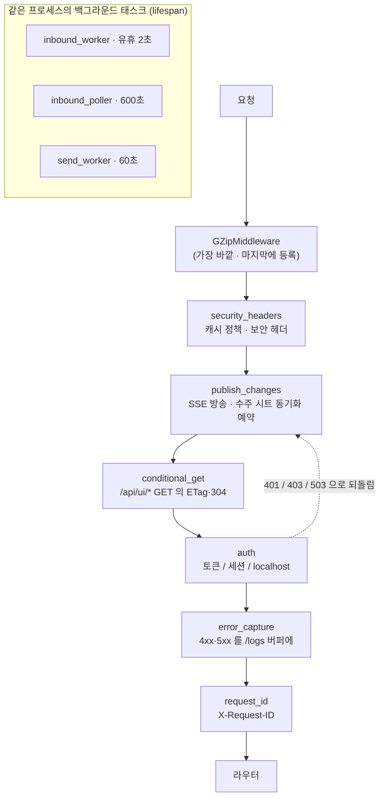

# 플랫폼: 미들웨어·인증·DB·이관·배포·백그라운드

> 요청 하나가 라우트에 닿기까지 일곱 겹의 미들웨어를 지납니다. 그 겹들이 압축·보안헤더·
> 변경 방송·304·인증·오류 수집·요청 ID 를 각각 맡고, **등록한 순서의 반대로** 쌓여 있습니다.
> 인증은 두 가지 모드(로컬/Basic, Google OAuth)가 한 함수 안에 있고 권한의 원본은 `users`
> 테이블 한 곳입니다. 데이터베이스는 SQLAlchemy 엔진 하나에 자체 제작한 마이그레이션 러너
> (`_migrations` 테이블 + Postgres advisory lock)가 붙어 있고, 앱과 DB 가 다른 대륙에 있어
> **왕복 하나가 200ms** 입니다. 백그라운드는 같은 프로세스 안에서 도는 asyncio 태스크 셋
> (인바운드 워커·10분 폴러·발송 워커)이고, 그래서 웹 프로세스는 반드시 하나여야 합니다.

## 한눈에

미들웨어 등록 순서는 `src/api/main.py:194-410`, 실제 중첩 순서는 `app.user_middleware`
로 확인한 것입니다(위 그림이 실측 결과).

## 지켜야 하는 것들

### 미들웨어는 **나중에 등록한 것이 바깥**이다 — 파일에서 아래에 적힌 것이 먼저 실행된다

Starlette 의 `add_middleware` 는 리스트 앞에 끼워 넣습니다. 그래서 `main.py` 에 적힌 순서
(request_id → error_capture → auth → conditional_get → publish_changes → security_headers →
GZip)와 실제 실행 순서는 **정확히 반대**입니다. 바깥부터: GZip(`main.py:410`) → security_headers
(`main.py:379`) → publish_changes(`main.py:339`) → conditional_get(`main.py:293`) → auth
(`main.py:223`) → error_capture(`main.py:202`) → request_id(`main.py:194`) → 라우터.

**어기면**: GZip 을 `conditional_get` 안쪽으로 옮기면 ETag 를 압축된 바이트에서 계산하게 되어
**압축을 받는 브라우저와 아닌 브라우저가 서로 다른 ETag** 를 갖습니다 — 같은 데이터인데 한쪽만
304 를 못 받고, 프록시가 끼면 캐시가 교차 오염됩니다(`main.py:406-409` 에 이 자리인 이유가
적혀 있습니다). `security_headers` 를 안쪽으로 옮기면 auth 가 되돌린 401/403 에 보안 헤더가
안 붙습니다.

### `/api/ui/` 아래에 스트리밍 응답을 새로 만들면 그 요청은 영원히 끝나지 않는다

`conditional_get_middleware` 는 `/api/ui/` 로 시작하는 GET 응답의 본문을 `async for` 로 **끝까지
모아** SHA-256 을 냅니다(`main.py:320-321`). 끝이 없는 스트림을 모으면 끝나지 않습니다. 그래서
`/api/ui/events` 만 손으로 예외 처리돼 있습니다(`main.py:312-314`).

**어기면**: 새 스트리밍 엔드포인트가 브라우저에서 무한 로딩. 서버 로그에는 아무 오류도 안 납니다 —
요청이 실패한 게 아니라 응답을 만들다 멈춘 것입니다. `tests/test_conditional_get.py::
test_the_event_stream_is_never_buffered_for_an_etag` 가 예외 목록을 고정합니다.

### `/api/ui/*` 응답에 초 단위로 움직이는 값을 넣으면 304 가 영영 안 걸린다

ETag 는 본문 해시입니다. 목록 응답에 실리는 `now` 가 마이크로초까지 있으면 매 요청마다 본문이
달라져 **폴링하는 화면에서만** 캐시가 완전히 무력해집니다. 그래서 `messages.list_now()` 는 초와
마이크로초를 0 으로 자릅니다(`tests/test_conditional_get.py::test_the_clock_in_the_payload_
does_not_defeat_the_cache` 가 `list_now().second == 0` 을 직접 단언).

**어기면**: 화면은 멀쩡히 동작하고 아무 오류도 없습니다. 15초·30초마다 같은 JSON 이 태평양을
다시 건너올 뿐입니다 — 느려진 이유를 화면 어디에서도 알 수 없습니다.

### 쓰기 라우트는 아무 데나 만들어도 되지만, **GET 이 아니고 4xx 미만**이어야 알림이 나간다

`publish_changes_middleware`(`main.py:339-376`)가 성공한 non-GET 을 곧 이벤트로 봅니다. 라우트
서른 개에 한 줄씩 넣던 것을 여기 한 곳으로 모은 것이고, 수주 워크북 동기화 예약
(`won_sheets.schedule_sync`)도 같은 자리에서 걸립니다 — 단 경로가 `/won-customers` 또는
`/customers/` 로 시작할 때만(`main.py:369`).

**어기면**: 새 저장 화면이 다른 탭·다른 사람 화면에서 안 바뀝니다. 반대로 **아무것도 안 바꾸는
POST** 를 만들면 그것을 누를 때마다 열려 있는 모든 콘솔이 캐시를 통째로 버립니다. 예외는 두
개뿐이고 경로 문자열로 하드코딩돼 있습니다: `/messages/preview` 와 `…/translate`
(`main.py:357`). 미리보기 라우트 경로를 바꾸면 이 예외가 조용히 풀립니다.

### 새 브라우저 경로는 `WEB_UI_PREFIXES` 에 넣어야 한다

`is_web_ui_path`(`security.py:43-47`)가 "세션 쿠키로 인증하는 브라우저 경로"와 "X-Internal-Token
으로 인증하는 JSON API"를 가릅니다. 목록은 `security.py:21-32`.

**어기면**: 로그인한 운영자가 화면에서 `{"detail":"invalid or missing token"}` 401 을 받습니다.
실제로 났던 일이라 `/won-customers` 항목에 그 사고가 주석으로 남아 있습니다(`security.py:26-28`).
헤더도 없고 `/logs` 에도 안 남기 때문에(아래 함정 참고) 화면만 보면 원인을 알 수 없습니다.

### 마이그레이션은 두 번 돌아도 결과가 같아야 한다

`run_migrations`(`migrate.py:66-96`)는 `mod.up(engine)` 과 `_migrations` 행 INSERT 를 **서로 다른
트랜잭션**으로 처리합니다. 그 사이에 프로세스가 죽으면 다음 기동 때 같은 `up()` 이 한 번 더
돕니다. CI 도 일부러 `init_db.py` 를 두 번 돌립니다(`docs/release-engineering.md` CI 게이트 3).

지키는 방법은 정해져 있습니다: 테이블이 없으면 조용히 `return`(`0066:42-46`), 컬럼이 이미 있으면
`return`(`0067:34`), `CREATE INDEX IF NOT EXISTS`(`0065:139-152`).

**어기면**: 재실행이 데이터를 두 번 변환합니다. 0040 처럼 값을 다시 매핑하는 이관이면 두 번째
실행이 이미 옮긴 값을 또 옮기고, 그때는 원래 값을 복원할 방법이 없습니다.

### 마이그레이션은 앱 코드를 import 하지 않는다 — 그때의 스키마를 글자로 박는다

0066 은 `stage_sync` 의 상수와 같은 집합을 쓰면서도 import 하지 않고 SQL 에 직접 적어 두고, 왜
그런지까지 적어 뒀습니다: "이관은 그때의 스키마에 고정돼야 하므로 import 하지 않고 적습니다 —
나중에 단계 이름이 바뀌어도 이 이관이 한 일은 그대로입니다"(`0066_retire_drafts_past_new.py:25-26`).

**어기면**: 몇 달 뒤 상수 하나를 지우면 **과거의** 이관이 ImportError 로 죽습니다. 그 순간
빈 데이터베이스에 처음부터 마이그레이션을 돌릴 수 없게 되고, 신규 배포와 CI 가 동시에 멈춥니다.

### `models.py` 와 마이그레이션은 반드시 한 쌍으로 고친다

운영 스키마는 마이그레이션이 만들고(`scripts/init_db.py`), **테스트 스키마는
`Base.metadata.create_all`** 이 만듭니다(`tests/conftest.py:114-115`). 두 경로가 완전히 다릅니다.

**어기면**: 모델에만 컬럼을 더하면 `pytest` 는 전부 초록인데 배포하면 `column … does not exist`
로 그 화면만 500. 마이그레이션에만 더하면 반대로 운영은 멀쩡하고 테스트가 `no such column` 으로
엉뚱한 곳에서 무너집니다. conftest 에 그 사고의 흔적이 있습니다 — PID 를 재사용해 옛 테스트 DB 를
물려받았더니 "관련 없는 테스트 13개가 초록 커밋에서 실패했고, PID 가 겹친 그 기계에서만
재현"됐습니다(`tests/conftest.py:19-25`).

### 웹 프로세스가 둘 이상이면 워커를 켜서는 안 된다 — 기동이 거부된다

`validate_startup_settings`(`main.py:47-94`)가 `WEB_CONCURRENCY > 1` 과 세 워커 스위치 중 하나라도
켜져 있으면 `RuntimeError` 로 앱을 못 뜨게 합니다. uvicorn 도 **같은 환경변수**를 워커 수로
읽으므로 값 하나가 두 곳에서 동시에 작동합니다.

**어기면**: 값이 2 가 되는 순간 서비스가 아예 안 뜹니다(Render 로그에 `Unsafe startup
configuration: WEB_CONCURRENCY must be 1 while in-process workers are enabled`). 이건 의도된
동작입니다 — 그 가드가 없으면 폴러 두 개가 같은 HubSpot 티켓을 동시에 집습니다.

### `/healthz` 는 DB 와 **콘솔 번들** 둘 다 봐야 한다

`healthz`(`main.py:419-448`)는 `SELECT 1` 과 `static/app/index.html` 존재를 모두 확인합니다. 번들이
이 판정에서 빠져 있던 시절에 실제로 이런 일이 있었습니다: "`/healthz` 는 ok 라는데 로그인 화면을
포함한 모든 화면이 503 이었고, 배포는 성공으로 보고됐으며 아무도 로그인할 수 없었다"
(`main.py:424-428`).

**어기면**: 플랫폼이 깨진 릴리스를 건강하다고 판단하고 이전 릴리스를 내립니다.

## 함정

### 존재하지 않는 URL 은 404 가 아니라 **401** 이다

브라우저 경로도 아니고 스킵 목록에도 없으면 마지막 분기(`main.py:282-289`)로 떨어져 토큰을
요구합니다. 실측: `GET /nope` → `401 {"detail":"invalid or missing token"}`.

오타 난 라우트를 디버깅할 때 "라우트가 없다" 와 "인증이 막았다" 가 구분되지 않습니다.

### auth 미들웨어가 되돌린 응답은 `/logs` 에도 없고 `X-Request-ID` 도 없다

`error_capture` 와 `request_id` 는 auth 보다 **안쪽**입니다. auth 가 `call_next` 를 부르지 않고
바로 JSONResponse 를 돌려주면 그 둘은 아예 실행되지 않습니다. 실측: 교차 출처 403 도, 토큰 없는
401 도 로그 버퍼 카운트가 0 이고 `X-Request-ID` 헤더가 없습니다.

즉 **운영자가 겪는 인증 실패는 운영 로그 화면에 한 줄도 남지 않습니다**. `error_capture` 의
docstring 이 "401 은 정상적인 로그인 관문이라 건너뛴다"고 말하지만(`main.py:206-207`), 실제로는
건너뛸 기회조차 없습니다.

### `/logs` 버퍼는 프로세스 메모리다 — 재시작하면 사라지고, 500개가 전부다

`_MAX = 500` 링 버퍼(`log_buffer.py:17,45`). 재배포 직후 "로그가 깨끗하다"는 것은 아무 뜻도
없습니다. 원인을 찾으려면 Render 의 stdout 로그를 봐야 합니다.

### `INTERNAL_API_TOKEN` 이 비면 웹 UI 이외의 **모든** 요청이 503 이다

`main.py:282-286`. 기본값이 빈 문자열이라(`config.py:228`) 로컬에서 `.env` 없이 띄우면 웹훅과
`/approve/*` 가 전부 503 입니다 — 401 이 아니라 503 이라, HubSpot 쪽에서는 "서버가 죽었다" 로
보입니다.

### `pool_pre_ping` 은 일부러 꺼져 있다 — 대신 커넥션은 180초면 버린다

`session.py:26-52`. 실측이 주석에 그대로 있습니다(2026-08-05, 서울에서 배포본, TTFB): 정적 파일
230~270ms, `SELECT 1` 하나뿐인 `/healthz` 630~880ms. 차이가 왕복 두 번이고 **왕복 하나가 약
200ms** 입니다. `pool_pre_ping=True` 로 되돌리면 모든 요청이 200ms 씩 느려집니다.

대신 감수한 것: 180초 안에 서버가 끊은 커넥션은 첫 쿼리에서 터집니다. 진짜 해법은 앱과 DB 를
같은 리전에 두는 것인데 **둘 다 생성 후 리전 변경이 불가**해서 서비스/프로젝트를 새로 만들어야
하는 운영 결정입니다.

같은 이유로 **요청 수가 곧 비용**입니다. 화면 하나를 두 번 부르게 만드는 리팩터링은 그 자체로
성능 회귀입니다(`ui_api.py:535-539` 가 템플릿 본문을 목록에 같이 실어 보내는 이유).

### 워커 하트비트 임계값 120초 vs 인바운드 작업 하나가 몇 분

`_check_worker_heartbeats`(`healthcheck.py:165-169`)는 폴러만 `INBOUND_POLL_INTERVAL_SECONDS + 120`
을 쓰고 인바운드·발송 워커는 **120초** 고정입니다. 그런데 인바운드 워커는 루프 맨 위에서 한 번
찍고(`inbound_worker.py:268-271`) 그 다음 잡 하나를 **끝까지** 처리합니다. 잡의 리스는 30분,
갱신 주기는 10분이니(`inbound_worker.py:20-21`) 잡이 몇 분 걸리는 것은 정상입니다.

**결과**: Gemini pro 로 초안을 쓰는 동안 `/internal/healthcheck` 의 `worker_heartbeats` 가
`inbound=…s` 로 WARN 을 냅니다. 워커는 멀쩡히 일하는 중입니다. 이 WARN 만 보고 워커를 재시작하면
처리 중이던 잡의 리스가 끊깁니다.

하트비트 쓰기 자체는 30초 스로틀(`worker_heartbeat.py:20-23`)이고 폴러만 `min_interval_seconds=0`
으로 매 틱 씁니다(`inbound_poller.py:196-198`).

### `events` 테이블은 영원히 자라고, 그 중 일부는 아무도 안 읽는다

- 폴 마커 두 종류가 10분마다 한 행씩 추가됩니다(`inbound_poller.py:46-49, 180-182`) — 하루 288행.
  읽을 때는 `kind` 로 걸러 `created_at desc` 정렬 후 첫 행만 씁니다.
- `inbound_ticket_processed` 는 계속 쌓이는데(`inbound.py:322-324`) 그것을 읽는
  `_is_ticket_already_processed`/`_processed_ticket_ids`(`inbound_poller.py:52-60`)를 부르는 곳은
  **테스트뿐**입니다. 그리고 그 함수는 해당 kind 의 **전 행을 메모리로** 올립니다. 되살릴 생각이면
  먼저 행 수를 세어 보세요.
- 하트비트만 예외로 kind 당 한 행을 제자리 갱신합니다(`worker_heartbeat.py:27-36`).

인덱스는 `kind` 하나뿐입니다(`models.py:234`).

### `_ADMIN_MUTATION_PREFIXES` 는 정책처럼 생겼지만 아무도 읽지 않는다

`security.py:35-40` 에 선언돼 있고 `web_role_allows` 는 쓰지 않습니다. 실제 규칙은 두 줄뿐입니다:
viewer 는 안전 메서드만, 그리고 `/integrations` 는 읽기조차 금지(`security.py:97-110`).

이 튜플을 보고 "관리자 전용 경로가 이미 정의돼 있다"고 판단하면 안 됩니다 — 지금 viewer 가 아닌
모든 역할은 어디든 쓸 수 있습니다.

### 세션 쿠키의 role 은 장식이다 — 매 요청 DB 를 다시 읽는다

`current_user`(`auth.py:120-142`)가 쿠키 서명을 검증한 뒤 `users` 행을 조회해 `approved` 와 `role`
을 다시 읽습니다. 그래서 접근 승인 화면에서 권한을 바꾸면 재로그인 없이 즉시 반영되고, 계정을
막으면 즉시 막힙니다.

대가: **인증된 요청마다 DB 왕복 하나**(=200ms). 그리고 조회가 실패하면 예외를 삼키고 `None` 을
돌려주므로(`auth.py:140-142`) DB 가 흔들리면 로그인 화면으로 튕깁니다.

### basic 모드에서 `admin_required` 는 항상 참이다

`auth.py:167-187`. 세션이 없으면 `AUTH_MODE != "google_oauth"` 를 그대로 돌려줍니다. 이유가
docstring 에 있습니다 — 게이트가 둘이던 시절 "접근 승인 화면은 DB 상 admin 인 운영자에게도 영구히
'관리자만 접근할 수 있습니다' 였는데 바로 옆 운영 로그는 열렸고, 어느 쪽이 되는지는 그 라우트가
둘 중 무엇을 import 했느냐에 달려 있었습니다".

`is_admin` 은 게이트가 아닙니다(`auth.py:156-164`) — 무엇을 **보여줄지** 정하는 용도입니다.

### 쿠키의 `secure` 는 `PUBLIC_BASE_URL` 이 정한다 — 프록시 헤더는 안 본다

`_cookie_secure`(`auth.py:190-192`)는 `request.url.scheme` 또는 `PUBLIC_BASE_URL.startswith("https://")`
만 봅니다. 일부러 그렇게 돼 있습니다("PUBLIC_BASE_URL 은 운영자가 정하지만 임의의 forwarded 헤더는
아니다"). TLS 종단 프록시 뒤에서 `PUBLIC_BASE_URL` 을 비워 두면 세션 쿠키가 `Secure` 없이 나갑니다.

같은 값이 CSRF 기준 출처이기도 합니다(`security.py:93`). conftest 가 이 값을 **강제로 비우는**
이유가 그것입니다 — 개발자의 진짜 Render URL 이 새어 들어오면 `Origin: http://testserver` 인 POST
테스트가 전부 403 이 됩니다(`tests/conftest.py:65-68`).

### 첫 로그인이 관리자가 된다 — 데이터베이스를 비우면 다시 그렇게 된다

`_login_or_pending`(`auth.py:214-249`): `users` 가 0행이면 그때 로그인한 계정이 승인된 admin 으로
생성됩니다. 도메인 게이트가 이미 통과한 뒤라 사내 계정만 가능하지만, **DB 를 초기화한 직후에는
사내 누구든 먼저 로그인한 사람이 관리자**입니다. 복구 경로는 `scripts/bootstrap_admin.py`.

### `/internal/healthcheck` 은 브라우저에서 열 수 없고, 부르면 돈과 로그인 시도가 발생한다

POST 이고 웹 UI 경로가 아니므로 `X-Internal-Token` 이 필요합니다(`main.py:461`). `docs/설정.md` 는
"상태는 `/internal/healthcheck` 의 `google_sheets` 항목에서 확인" 이라고 하지만 화면에서 그것을
부르는 곳은 없습니다 — 실제 수단은 `python -m src.cli healthcheck` 입니다(`src/cli.py:50-62`).

내용도 가볍지 않습니다: 진짜 Gemini 호출 1회, HubSpot token/Conversations actor/channel 조회,
진짜 Sheets 토큰 갱신 + 헤더 읽기가 발생합니다.
`_check_disk_space` 는 상대경로 `"data"` 를 보므로(`healthcheck.py:334`) 다른 디렉터리에서 실행하면
그 항목만 WARN 입니다.

### 로그 리댁션 필터가 `record.args` 를 비운다

`RedactionFilter`(`logging.py:11-19`)는 메시지를 미리 포매팅해 마스킹한 뒤 `record.args = ()` 로
지웁니다. 로그 레코드를 그대로 받아 인자를 다시 쓰려는 핸들러/포매터를 나중에 붙이면 인자가 이미
없습니다. 마스킹 대상은 이메일·전화번호·`authorization|api_key|token|password|client_secret`
패턴입니다(`log_buffer.py:18-23`).

### `APP_HOST` 는 운영에서 바인드 주소가 아니다

Render 의 `startCommand` 는 `--host 0.0.0.0` 을 직접 넘깁니다(`render.yaml:42`). 코드에서
`APP_HOST` 를 읽는 곳은 기동 가드(`main.py:64`), Slack 링크 폴백(`integrations/slack.py:20`),
웹훅 호스트 판정(`webhook.py:166-168`) 뿐입니다.

**함정**: Render 대시보드에서 `APP_HOST` 를 `127.0.0.1` 로 바꾸면 서비스는 여전히 공개된 채로
기동 가드만 조용해집니다 — `WEB_UI_PASSWORD` 없이 basic 모드로 공개 배포하는 것을 막던 검사가
그 한 줄로 무력화됩니다(`main.py:63-66`).

### 배포는 두 갈래이고, 마이그레이션 시점이 서로 다르다

| | Render (`render.yaml`) | Docker 이미지 |
| --- | --- | --- |
| 마이그레이션 시점 | **빌드 단계** (`buildCommand` 의 `python scripts/init_db.py`, `render.yaml:41`) | **기동 직전** (`docker-entrypoint.sh`) |
| `MIGRATE_ON_START` | 아무 효과 없음 | 유효(`false` 면 건너뜀) |
| 콘솔 빌드 | `npm ci && npm run build` + `test -f`(`render.yaml:36-38`) | node 스테이지 + `test -f`(`Dockerfile:9-32`) |

**Render 에서는 스키마가 새 코드보다 먼저 움직입니다.** 마이그레이션이 성공하고 배포가 실패해
이전 릴리스로 되돌아가면, 스키마만 앞서 간 상태로 옛 코드가 돕니다.

`set -e` 가 load-bearing 인 이유도 여기 적혀 있습니다: "여러 줄 buildCommand 는 셸 스크립트이고
스크립트의 종료 코드는 마지막 명령의 것이다. 이게 없어서 npm 이 실패하고 `test -f` 가 실패해도
맨 아래 `init_db.py` 가 0 을 돌려주는 바람에 빌드가 성공했고, **콘솔이 없는 릴리스가 운영에
올라갔다**"(`render.yaml:28-32`).

### advisory lock 은 타임아웃이 없다

`_migration_lock`(`migrate.py:24-44`)은 `pg_advisory_lock` 을 무한 대기로 잡습니다. 앞선 배포가
이관 중에 멈춰 있으면 다음 배포는 **오류 없이 그냥 멈춥니다**. 화면에 보이는 것은 진행 중인 빌드
로그의 마지막 줄(`Acquired Postgres migration advisory lock.` 이 안 찍힌 상태)뿐입니다. 락 키는
`0x504552534F4D4947` = 아스키 `PERSOMIG`(`migrate.py:21`) — 다른 서비스와 겹치지 않게 하려는 값이지
버전이 아닙니다.

### SSE 방송·수주 시트 동기화·발송 카운터는 전부 **프로세스 안의 전역 상태**다

- `_subscribers`(`ui_api.py:44`) — 다른 워커가 처리한 쓰기는 안 들립니다.
- `won_sheets._running/_again`(`won_sheets.py:421-452`) — 동기화 합치기가 프로세스 단위입니다.
- `send_worker._sent_timestamps/_daily_count`(`send_worker.py:28-31`) — 다만 이쪽은 DB 집계와
  `max()` 를 취해 재시작·다중 프로세스에서도 한도가 안 풀립니다(`send_worker.py:74-89`).

웹 프로세스가 하나여야 하는 이유가 워커 중복만은 아닙니다.

## 왜 이렇게 되어 있는가

- **`use_os_trust_store()` 가 import 보다 위, 심지어 `setup_logging()` 보다 위에 있다**
  (`main.py:42`). 첫 HTTPS 호출보다 먼저여야 하고 첫 import 보다 먼저일 필요는 없습니다 — httpx 와
  googleapiclient 는 클라이언트/요청마다 SSL 컨텍스트를 만들기 때문입니다. 사내망의 TLS 검사
  장비가 HTTPS 를 재서명하는데 Windows 는 그 루트를 믿고 Python 은 자기 certifi 만 믿어서, 이게
  없으면 Sheets·HubSpot·Vertex 가 전부 `CERTIFICATE_VERIFY_FAILED` 입니다(`common/tls.py:1-17`).
  `truststore` 가 없어도 앱은 뜹니다 — 정상 네트워크에서는 certifi 로 충분하기 때문입니다.
  **검증을 끄는 코드가 아닙니다. `verify=False` 를 여기에 들이지 마세요.**
- **SPA 문서만 `no-cache` 를 라우트가 아니라 함수에서 붙인다**(`main.py:160-181`). `auth.py` 도 같은
  문서를 내보내기 때문입니다(`auth.py:278-289`). 라우트마다 붙이면 언젠가 한 곳이 빠집니다 —
  실제로 `security_headers_middleware` 가 `/static` 에는 붙이면서 문서는 빠뜨렸고(`/app` 이라 조건에
  안 걸림), 배포할 때마다 강력 새로고침을 해야 했습니다. 옛 문서가 이미 지워진 해시 파일명을
  요청해 **빈 화면**이 됐습니다.
- **`/static/app/assets/` 만 1년 영구 캐시**(`main.py:386-387`). Vite 가 파일명에 내용 해시를 넣기
  때문입니다. 이름이 고정된 `console.css`/`won.css`/`tokens.css` 는 `no-cache` 쪽에 남습니다 —
  제자리에서 고치는 파일이라 영구 캐시하면 UI 수정이 아무 일도 안 한 것처럼 보입니다.
- **웹훅 두 경로는 auth 미들웨어를 통과시킨다**(`main.py:236-237`). 서명 검증이 라우트 안에 있어서
  미들웨어가 막으면 검증기가 돌 기회가 없기 때문입니다. fail-closed 는 `_verify_hubspot_signature`
  쪽이 책임집니다.
- **`/healthz` 와 `/favicon.ico` 는 인증이 아예 없다**(`security.py:18`). 그리고 `/healthz` 는 GET
  뿐 아니라 HEAD 도 받습니다 — UptimeRobot 류가 기본 HEAD 로 찌르는데 GET 전용이면 405 가 나서
  **멀쩡한 서비스를 Down 으로 보고**합니다. 무료 플랜 keepalive 가 이것에 달려 있습니다
  (`main.py:416-419`).
- **`AUTO_SEND_THRESHOLD` 설정은 되살릴 수 없게 지웠다**(`config.py:175-177`). 점수 기반 자동
  승인을 다시 켤 수 있는 설정 자체를 없앤 것입니다.
- **`_migrations` 는 이름만 기록하고 순서는 파일명이 정한다**(`migrate.py:74`, `sorted(...)`).
  번호가 겹치면 문자열 비교로 순서가 갈립니다. 되돌리기(down)는 아예 없습니다 — 앞으로만 굴리고,
  `_migrations` 행을 손으로 고치는 것은 금지입니다(`docs/release-engineering.md`).
- **`legacy_redirects` 를 라우터 목록 맨 마지막에 include 한다**(`routes/__init__.py:30-45`). 302 인
  이유도 적혀 있습니다: 301 은 브라우저가 영원히 캐시하고, 307/308 은 메서드를 보존해서 GET 전용
  이동에는 틀립니다. 302 라야 되돌릴 수 있습니다.
- **`inbound_worker` 의 잡 리스는 스레드가 갱신한다**(`inbound_worker.py:158-165, 216-223`).
  10분마다 `locked_at` 을 밀어 30분 리스를 유지하고, 워커가 죽으면 갱신이 멈춰 30분 뒤 다른
  워커가 가져갑니다. 마지막 시도에서 죽은 잡이 영구 리스로 남지 않도록 claim 직전에 `dead` 로
  내리는 UPDATE 가 먼저 돕니다(`inbound_worker.py:94-108`).
- **폴러가 워터마크를 함부로 전진시키지 않는다**(`inbound_poller.py:106-121`). enqueue 가 실패하면
  마커를 그대로 두고 반환해 다음 폴에서 같은 창을 다시 훑고, 페이지가 가득 찼는데 시각이 안
  움직이면 전진 대신 `logger.error` 를 남기고 멈춥니다 — 전진했다면 티켓을 잃습니다. 창은 마지막
  폴에서 15분을 되감아 시작합니다(`POLL_OVERLAP`).
- **폴러 한 틱이 하는 일은 여섯 가지다**(`inbound_poller.py:192-217`): 하트비트 → 신규 티켓 폴 →
  단계 재조정(모든 단계) → 한국어 문의 번역 채우기 → HubSpot 백필 → 시트 동기화 3종. 전부
  `asyncio.to_thread` 로 **순차** 실행이고 하나가 던지면 그 틱의 나머지가 통째로 건너뜁니다
  (`except` 가 루프 바깥에 하나뿐). 번역 캐시 채우기가 여기 있는 이유는 "기다리는 사람이 없는
  자리라서"라고 적혀 있습니다.
- **발송 워커는 60초를 1초씩 쪼개 잔다**(`send_worker.py:519-522`). 종료 신호에 즉시 반응하기
  위해서입니다. lifespan 이 종료할 때 `request_shutdown()` 을 먼저 부르고 그 다음 태스크를
  취소하며, 각 태스크를 10초까지 기다립니다(`main.py:128-142`).
- **테스트는 `LIVE_EXTERNAL_WRITES=true` 로 돈다**(`tests/conftest.py:47-57`). "라이브" 가 아니라
  "진짜 코드 경로를 모킹된 전송으로 지나간다" 는 뜻이고, 그래서 자격증명 쪽을 비웁니다. 여기에
  실제 사고가 적혀 있습니다 — Sheets 는 그동안 **DB 에 grant 행이 없어서** 우연히 안전했는데,
  `load_grant()` 가 환경변수에서 refresh token 을 읽게 되자 그 우연이 사라지고 `pytest` 가 픽스처
  행("Spammer", "buyer@acme.com")을 실제 영업 워크북에 append 했습니다. 그래서 그 값들은
  `setdefault` 가 아니라 **대입**으로 비웁니다(`tests/conftest.py:70-80`).

## 손대려면 같이 봐야 하는 것

| 고치는 것 | 같이 고쳐야 하는 것 | 안 하면 |
| --- | --- | --- |
| `src/db/models.py` 컬럼 | `src/db/migrations/00NN_*.py` (그리고 그 반대) | 테스트만 초록 / 운영만 정상 |
| 새 브라우저 화면 경로 | `src/api/security.py:21-32` `WEB_UI_PREFIXES` | 로그인한 운영자가 401 |
| `src/api/main.py` 미들웨어 추가 | 등록 위치(= 중첩 순서). ETag·압축·인증 셋의 상대 순서 | ETag 분열, 인증 우회, 로그 누락 |
| `/api/ui/*` 응답에 시각 추가 | `src/api/routes/messages.py:list_now`, `tests/test_conditional_get.py` | 304 가 영영 안 걸림 |
| `/api/ui/` 아래 스트리밍 라우트 | `src/api/main.py:312-314` 예외 목록 | 요청이 안 끝남 |
| `/messages/preview` · `…/translate` 경로 이름 | `src/api/main.py:357` | 미리보기 한 번에 전 콘솔이 재조회 |
| 수주 저장 라우트 추가 | `src/api/main.py:369` 접두사 목록 (`/won-customers`, `/customers/`) | 워크북이 조용히 안 따라옴 |
| `auth.normalize_role` | `src/api/security.py:web_role_allows` (주석이 "keep the two in step") | 역할 이름이 한쪽에서만 통함 |
| `AUTH_MODE`·OAuth 설정 | `main.py:validate_startup_settings`, `render.yaml` 의 `sync: false` 항목 | 기동 거부 또는 로그인 불가 |
| 워커 스위치(`*_ENABLED`) | `WEB_CONCURRENCY`, `healthcheck._check_worker_heartbeats` | 중복 처리 또는 유령 WARN |
| `INBOUND_POLL_INTERVAL_SECONDS` | `healthcheck.py:165-169` 의 임계값 계산 | 정상 폴러가 stale 로 보임 |
| `frontend/` 빌드 산출물 경로 | `Dockerfile:29-32`, `render.yaml:36-38`, `main.py:_SPA_INDEX`, `healthz` | 배포는 성공, 모든 화면 503 |
| 마이그레이션 러너 | `scripts/docker-entrypoint.sh`, `render.yaml` buildCommand, CI 게이트(두 번 실행) | 재실행이 데이터를 두 번 바꿈 |
| 새 외부 쓰기 경로 | `src/common/safe_mode.py`, `tests/test_safe_mode.py` (CLAUDE.md 의 대전제 항목 참고) | 안전 모드가 그 경로만 못 막음 |
