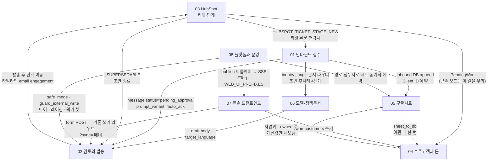

# 암묵지 위키 — 코드에만 있던 사실들

CLAUDE.md 는 **지금 지켜야 할 규칙**이고, 이 폴더는 **그 규칙이 왜 생겼는지와, 규칙으로
적히지도 못한 채 코드에만 있던 사실들**입니다. 새로 온 사람이 저장소를 다 읽기 전에는 알 수
없고, 모르면 반드시 사고를 내는 것들 — 순서 제약(이것 먼저, 저것 나중), 파일을 가로지르는
결합(A 를 고치면 B 도), 되돌린 결정, 마법 값, 그리고 **조용히 실패하는 것들**. 이 저장소에서
가장 비싼 사고는 예외가 나는 사고가 아니라 화면에 아무 표시도 없는 사고였습니다: 고객에게
같은 답이 두 번 가고, 시트 열 하나가 `#REF!` 가 되고, 승인된 회신이 어느 목록에도 없이 멈춰
있는 것. 여덟 문서 전부가 그 함정 지도입니다. 모든 항목에 `파일:줄` 이 붙어 있으니, 의심되면
문서가 아니라 그 줄을 여세요 — 문서가 틀렸으면 코드가 이깁니다.

## 이 위키를 쓰면서 나온 것

문서를 쓰다 **버그 셋을 찾아 그 자리에서 고쳤습니다.** 셋 다 예외가 안 나고 화면에도 표시가
없는 종류였습니다 — 이 폴더가 있는 이유 그 자체입니다.

| 무엇 | 어떻게 가능했나 | 고정한 테스트 |
| --- | --- | --- |
| 비고 한 줄 저장에 옛 원화 계약 금액이 통째로 사라짐 | 부분 폼을 받는 라우트가 폼에 없는 칸을 만짐 | `test_saving_only_the_notes_never_erases_the_money` |
| 신규 회사 문의 한 건이 워크북 담당부서 열 전체를 `#REF!` 로 만듦 | 커밋 순서 — 값을 쓰던 칸이 나중에 수식 열이 됨 | `test_the_registry_append_never_writes_into_a_formula_column` |
| 「서명 없음」 을 고르고 곧장 발송하면 서명이 붙어 나감 | `None` 이 「값 없음」과 「없음이라는 값」을 겸함 | `test_choosing_no_signature_and_sending_straight_away_removes_it` |

## 여덟 문서

| 문서 | 무엇을 고칠 때 여는가 |
| --- | --- |
| [01 인바운드 접수](01-인바운드-접수.md) | 웹훅·10분 폴러·`inbound_jobs` 큐·`InboundAgent.handle()` 의 열 단계. 티켓 하나가 대화 + 고객 메시지 한 줄 + 검토 대기 초안 한 통이 되는 경로와, **그 순서를 뒤집었을 때 나는 일**. |
| [02 검토와 발송](02-검토와-발송.md) | 승인 → 클레임 → SMTP → 발송 후 처리. `Message.status` 하나를 옮기는 세 주체, 메일을 막는 네 겹, 그리고 지금 `test_sent` 때문에 통째로 죽어 있는 재시도 기계. |
| [03 HubSpot](03-HubSpot.md) | 티켓 파이프라인 ↔ 우리 DB 의 다섯 경로(웹훅·폴러·sweep·최신화·백필)와 반대 방향 둘. 무한 루프를 막는 조기 반환, 그물에 뚫린 구멍, 재시도가 안 걸린 호출들. |
| [04 수주고객과 돈](04-수주고객과-돈.md) | 계약·크레딧·분납. **돈에 관한 값은 거의 전부 저장하지 않고 매번 다시 계산한다** 는 원칙과 그 예외(그날 환율), 그리고 금액이 조용히 사라지는 자리. |
| [05 구글시트](05-구글시트.md) | 영업 워크북 일곱 탭. 어느 칸이 콘솔 것이고 어느 칸이 시트의 수식인가, 열 문자를 손으로 적어 둔 곳들, 이미 규칙이 깨져 있는 자리 셋. |
| [06 모델과 정책문서](06-모델과-정책문서.md) | Gemini 호출 열몇 번. 모델이 정하는 것(내용)과 코드가 강제하는 것(형식)의 경계, 프롬프트↔콘솔 규칙↔정규식 삼각 결합, 정책 문서를 지워도 계속 쓰이는 사본. |
| [07 콘솔 프런트엔드](07-콘솔-프런트엔드.md) | React SPA. 캐시를 언제 버리는가, 쓰기가 어느 라우트로 가는가, 왕복 200ms 를 몇 번 하는가. 파이썬 테스트가 TSX 를 문자열로 읽는다는 함정. |
| [08 플랫폼과 운영](08-플랫폼과-운영.md) | 미들웨어 일곱 겹의 중첩 순서, 인증, 자체 마이그레이션 러너, 배포 두 갈래, 같은 프로세스 안의 백그라운드 태스크 셋. |

**어디부터 열지 모를 때**: 고객에게 나가는 것을 건드리면 02 → 06, 화면이 이상하면 07 → 08,
숫자가 이상하면 04 → 05, 티켓이 안 움직이면 03 → 01.

## 가장 위험한 것 톱 10

모르고 건드렸을 때 피해가 큰 순서입니다. 1~4 는 고객이나 되돌릴 수 없는 데이터에 닿습니다.

1. **`HUBSPOT_TICKET_STAGE_NEW` 를 비워 두면 폴러가 모든 파이프라인·모든 단계의 티켓을
   문의로 빨아들인다.** 기본값이 빈 문자열이고, 다섯 지점이 빈 값에 **서로 다르게** 반응합니다
   — 단계 게이트는 꺼지고 검색은 전 단계로 열립니다. 결과는 최근 손댄 모든 티켓(이미 답한 것,
   Won, Lost 포함)에 접수확인이 나가고 초안이 생기는 것이고, 화면에는 "문의 폭증" 으로만
   보입니다. 단계 매핑이 `{}` 라 처리 경과에 단서도 안 남습니다.
   → [03 「티켓 단계 ID 설정이 비면」](03-HubSpot.md)의 표, [01 「문지기 셋이 동시에 열린다」](01-인바운드-접수.md)

2. ~~**수주 고객 상세에서 「갱신 계획 · 비고」 한 줄을 저장하면 옛 원화 계약의 금액이 통째로
   사라진다.**~~ **(고침)** 이 위키를 쓰다 발견해 그 자리에서 고쳤습니다. 남는 교훈은 이것입니다 —
   **부분 폼을 받는 라우트에서 폼에 없는 칸을 만지면 안 됩니다.** 그 패널 자체는 이후 콘솔에서
   빠졌지만(0073) 교훈과 조건은 그대로 남습니다 — 부분 폼은 한 줄이면 다시 생깁니다.
   원래 증상: 부분 폼이 금액 칸을 안 보내는데 `_one_amount_per_currency` 가 마지막에 무조건
   돌면서 `amount_incl_vat = None` 을 실행합니다. 실행으로 확인된 값입니다
   (`1,566,000 / 1,722,600 / 1,450 → None / None / None`). **되돌릴 값이 어디에도 없습니다** —
   시트 동기화가 L·M 열도 함께 비웁니다.
   → [04 「비고 한 줄 저장하면 … 금액이 사라졌다 — 고침」](04-수주고객과-돈.md)

3. **"HubSpot 에 티켓이 없다" 를 "지워졌다" 로 읽으면 `최신화` 한 번에 보드 전체가
   사라진다.** 지금은 배치 실패가 짧은 집합이 아니라 예외이고, 첫 클릭은 세기만 하고, 404/410
   만 삭제 후보입니다. 이 셋 중 하나라도 풀면 토큰이 만료된 아침의 클릭 한 번이 전부입니다.
   → [03 「티켓 없음은 절대 '지워졌다' 로 읽지 않는다」](03-HubSpot.md)

4. **접수확인을 초안 종료(`_retire_superseded_drafts`) 대상에 넣으면 고객이 아무 답도 못
   받는다.** 단계를 한 번 옮기는 것이 아직 큐에 앉아 있는 접수확인을 취소하고, 상세 초안도
   같이 종료됩니다. **화면상 증상이 없습니다** — 그 대화는 「답변 완료」로 보입니다.
   → [03 「접수확인은 초안이 아니다」](03-HubSpot.md)

5. **한 티켓에 초안이 하나인 것을 지키는 자물쇠는 셋이고, 큐의 `event_key` 는 그중 하나가
   아니다.** 웹훅과 폴러가 같은 티켓에 서로 다른 키를 만들어 **새 티켓 하나 = job 두 개**
   입니다. "job 이 하나니까 처리도 한 번" 이라고 믿고 `handle()` 안의 중복 방지를 풀면 고객이
   같은 답을 두 번 받습니다.
   → [01 「자물쇠는 세 개」](01-인바운드-접수.md), [01 「서로 다른 큐 키」](01-인바운드-접수.md)

6. **ARRAYFORMULA 열에 값을 한 칸 쓰면 그 행이 아니라 열 전체가 `#REF!` 가 된다.** ~~그리고 이미
   한 곳이 그렇게 쓰고 있다~~ **(고침)** — 이 위키를 쓰다 발견해 고쳤습니다. 어긋난 경위가
   교훈입니다: 커밋 순서. 원래 증상은 — `google_sheets.py:374` 가 「고객 기본 정보」 G(담당부서)에 값을
   싣습니다. 커밋 순서 때문에 생긴 어긋남이고, 다음 신규 회사 문의가 들어오는 순간 터집니다.
   Inbound DB 쪽 조회는 살아 있어서 **워크북을 직접 열기 전에는 안 보입니다.**
   → [05 「이 규칙은 한 곳에서 깨져 있었다 — 고침」](05-구글시트.md)

7. **`models.py` 와 마이그레이션은 반드시 한 쌍이다.** 테스트 스키마는 `create_all`, 운영
   스키마는 마이그레이션 — 완전히 다른 두 경로입니다. 모델에만 컬럼을 더하면 `pytest` 는 전부
   초록인데 배포하면 그 화면만 500 입니다.
   → [08 「models.py 와 마이그레이션은 반드시 한 쌍으로」](08-플랫폼과-운영.md)

8. **문의 언어 오검출은 그 스레드에서 영구적이고, 고칠 화면이 없다.** 운영자가 검토 화면에서
   고객 언어로 직접 고쳐 써도 `enforce_send_language` 가 그것을 잘못 잡힌 언어로 **번역해서**
   보냅니다. 경고는 없고 로그 한 줄이 전부입니다. 위험 구간은 라틴 표기 언어(베트남어·
   스페인어·인도네시아어)입니다.
   → [06 「문의 언어는 접수 때 한 번 정해진다」](06-모델과-정책문서.md)

9. **「서명 없음」을 고르고 곧장 `발송` 을 누르면 서명이 그대로 붙어 나간다.** `""` 가 `None`
   이 되고, `approve()` 는 `None` 을 "건드리지 마라" 로 읽습니다. `저장`·`번역하기` 를 거치면
   지워지고 곧장 누르면 안 지워집니다. 미리보기는 폼 값을 렌더하므로 서명이 안 보입니다 —
   **미리보기와 실제 메일이 갈리는 유일한 자리**입니다.
   → [02 「「서명 없음」 을 고르고 발송을 누르면」](02-검토와-발송.md)

10. **워크북에서 손으로 적은 행이 말없이 사라진다.** 1000행 밖의 행은 콘솔에게 존재하지
    않아 같은 Client ID 로 유령 중복 행이 생기고, 자연키가 겹치는 두 번째 행은 `owned` 열이
    비워지며, `--replace` 는 A 열에 Client ID 가 없는 행을 백업 없이 날립니다.
    → [05 「1000행을 넘는 행」·「자연키가 겹치는 행」·「--replace」](05-구글시트.md)

**그 다음 다섯**: 발송 후 동기화 재시도 기계가 `test_sent` 때문에 통째로 죽어 있음(02) ·
콘솔 보드에서 Won 으로 끌면 「수주 전환 대기」에 안 뜸(03) · 프런트 빌드 실패 = `/app` 이
503, 그리고 라우트에 없는 `Contracts.tsx` 도 컴파일 대상(07) · 마이그레이션 advisory lock 이
타임아웃 없이 무한 대기(08) · `sending:<pid>:<rand>` 문자열 포맷이 세 곳의 계약(02).

## 서브시스템 사이의 결합

화살표에 적힌 것이 **두 서브시스템이 공유하는 실제 물건**입니다. 그것을 고치면 양쪽을 같이
봐야 합니다.

가장 자주 다치는 세 지점:

- **`Message.status` 값 하나** — 목록 바구니·복구 화면·`_SUPERSEDABLE`·동기화 재시도·리포트
  다섯 곳이 각자 상태 목록을 들고 있습니다(02).
- **단계 이름 집합** — `stage_sync.LOCAL_STAGE_TO_SETTING` · `customer_ops.PIPELINE_STAGES` ·
  `config.HUBSPOT_TICKET_STAGE_*` · `google_sheets._STAGE_VALUES` · `sheet_sync._local_stage`
  다섯 벌이 일치해야 합니다(03, 05).
- **시트의 열 문자** — `build_won_sheets.headers` ↔ `won_sheets.owned` ↔ `sheet_to_db.cell(r,"AB")`
  가 각자 적혀 있고, 한쪽만 고치면 서른 개 필드가 한 칸씩 밀린 채 **예외 없이** 들어갑니다(05).

---

# 아직 안 적힌 것

여덟 문서를 읽고 저장소를 훑어 확인한 빈칸입니다. 전부 위험한 것은 아닙니다 — 위험하지 않은
것은 그렇다고 적었습니다.

## 위험한 빈칸

### 「계약」이라는 말이 두 개의 다른 테이블을 가리킨다 — 어느 문서에도 없다

`ContractRecord`(`src/db/models.py:519`)와 `ClientContract`(`:647`)는 다른 테이블입니다. 04 는
`ClientContract`(수주 고객 화면) 쪽만, 05 는 `ContractRecord` 가 나가던 `수주 DB` 탭이 죽었다는
것만 다룹니다. 그런데 `ContractRecord` 를 쓰는 경로는 아직 살아 있습니다 —
`POST /customers/{id}/contracts`(`customer_ops.py:878`, `:985`)가 만들고, 고객 상세
(`customer_ops.py:538`)와 협상중 고객 목록(`:297`)이 읽고, 폴러가 10분마다 시트에 밀려고
합니다(`sheet_sync.py:603-608`). 그 화면이던 `frontend/src/screens/Contracts.tsx` 는 07 이
적었듯 **라우트에서 빠졌지만 파일은 남아 컴파일됩니다.**

**왜 위험한가**: 같은 말을 쓰는 두 장부가 있고, 어느 쪽이 진짜인지 아무 데도 안 적혀
있습니다. 다음 사람은 반드시 틀린 쪽을 고칩니다. 「이 둘 중 무엇이 은퇴 중이고 무엇이 원본인가」
는 코드만으로 판정할 수 없어 **운영자에게 물어야 할 질문**입니다.

### 견적 계산기·견적서·계약서는 이제 없습니다

2026-08-13 에 운영자 지시로 세 화면과 `src/common/quote_tiers.py` · `frontend/src/lib/quote.ts` · golden 코퍼스까지 지웠습니다. 되살릴 일이 생기면 git 이력에서 꺼내십시오 — 07 의 해당 절에 이유가 적혀 있습니다.

### Slack 승인 알림의 중복 방지와 재시도

`src/agents/_notify.py`(168줄) · `src/integrations/slack.py`(153줄) · 마이그레이션 0027
(`slack_notification_once`). CLAUDE.md 는 "상세 초안이 준비된 뒤에만" 한 줄이고, 여덟 문서 중
어느 것도 이 파일을 열지 않았습니다. 코드에 있는 것: `_claim_slack_notification` 이 원자적
UPDATE 로 시도 하나를 예약하고, `SLACK_NOTIFICATION_MAX_ATTEMPTS = 5` ·
`SLACK_NOTIFICATION_RETRY_SECONDS = 60`(`_notify.py:18-19`).

**왜 위험한가**: 이 알림이 조용히 실패하면 운영자는 **검토 대기가 생긴 것을 모릅니다.** 화면을
직접 열면 보이지만, 알림이 있어서 안 여는 것이 지금의 운용입니다. 위 다섯 곳(02 의 상태 목록)
처럼 "실패해도 아무 데도 안 뜨는" 부류인지 확인이 필요합니다.

### 소통 기록(`CustomerInteraction`)이 어느 대화에 붙는가

`customer_ops.py:693`(`_linked_conversation`) · `:720`(`_log_interaction_to_hubspot`) ·
`:766`(`interaction_add`). 03 은 HubSpot 쪽(`create_interaction_note` 는 note 한 종류만 쓴다)
을, 07 은 `ui/InteractionForm.tsx` 를 세 화면이 공유한다는 것을 적었지만, **DB 쪽에서 그
기록이 어느 대화·어느 계약 차수에 매달리는지**는 어느 문서에도 없습니다. CLAUDE.md 는
"소통 히스토리만 예외로 고객 단위라 `contract_seq` 만 붙였다"(0065)까지만 말합니다. 가장 최근
커밋(`528de3f` 「소통 기록이 HubSpot 타임라인과 양쪽으로 오간다」)이 이 영역을 바꿨는데 그
양방향 규칙이 문서에 안 들어갔습니다.

**왜 위험한가**: 양방향 동기화는 03 이 적은 무한 루프 위험의 전형입니다. 03 의 「HubSpot →
우리 방향의 코드는 HubSpot 에 아무것도 쓰지 않는다」가 여기에도 적용되는지 확인해야 합니다.

### `scripts/render_env_sync.py` — 운영 환경변수를 통째로 지운다

`render_env_sync.py:1-8`: Render 의 `PUT /v1/services/{id}/env-vars` 는 **전체 교체**라
보낸 목록이 그 서비스의 환경변수 전부가 됩니다. 로컬 `.env` 에 없는 운영 값은 지워집니다.
08 의 「배포는 두 갈래」 표에도, `docs/배포.md`·`docs/설정.md` 에도 이 스크립트가 없습니다.

**왜 위험한가**: 08 이 적은 것들(`INTERNAL_API_TOKEN` 이 비면 웹 UI 밖 모든 요청이 503,
`HUBSPOT_TICKET_STAGE_NEW` 가 비면 톱 10 의 1번)이 이 스크립트 한 번으로 동시에 일어날 수
있습니다.

### `src/integrations/web_fetch.py` 의 SSRF 방어

229줄. 도메인 보강이 **고객이 준 도메인의 홈페이지를 실제로 가져오는** 유일한 자리이고,
사설 IP 차단·`_MAX_RESPONSE_BYTES = 1_000_000`·`_MAX_REDIRECTS = 3` 이 전부 이 파일에
있습니다. 01 은 도메인 보강의 **순서** 문제(`_company_type` 이 프로필을 못 본다)만 다뤘고,
`domain_enrichment.py`(165줄)의 만료 규칙 한 줄 외에는 이 영역이 비어 있습니다.

**왜 위험한가**: 빈도는 낮고 피해는 큽니다. 여기 방어를 하나 빼면 아무 화면에도 안 보입니다.

### 시트 위임 OAuth (`src/integrations/google_oauth.py`, 252줄)

08 은 사람 로그인(basic / Google OAuth)만 다룹니다. 워크북에 쓰는 자격증명은 별개 흐름입니다 —
`integration_credentials` 테이블(0029), 리프레시 토큰 암호화 저장, `customer_ops.py:1244-1344`
의 connect/callback/disconnect, 그리고 08 의 conftest 사고("`load_grant()` 가 환경변수에서
refresh token 을 읽게 되자 `pytest` 가 픽스처 행을 실제 워크북에 append 했다")가 정확히 이
모듈의 이야기입니다.

**왜 위험한가**: 토큰이 끊기면 05 의 모든 시트 쓰기가 멈추는데, 05 가 이미 적었듯
**「시트 읽기·동기화」 결과를 보여 주는 화면이 없습니다.**

## 적혀 있지 않지만 위험하지 않은 것

- **`scripts/` 14개 중 11개가 어느 문서에도 없다 — 대부분 괜찮다.** 한 번 돌고 끝난 이관
  (`import_orders_db` · `import_payment_schedule` · `import_knowledge_base` ·
  `import_sheet_to_db`)은 자기 docstring 이 이미 좋은 문서입니다(`import_orders_db.py:1-16` 의
  "모르는 것은 지어내지 않는다"). `hubspot_export` · `hubspot_b2b_slice` · `list_ticket_stages`
  는 포털을 읽기만 하는 조사 도구입니다. **`build_guidebooks.py`(1813줄)는 가장 큰 파일이지만
  가장 안전합니다** — `docx` 와 `Pillow` 를 쓰는데 둘 다 `pyproject.toml` 의 의존성이 아니고
  앱이 import 하지 않습니다. 워드 문서를 그리는 별개 도구입니다. 예외는 위에 적은
  `render_env_sync.py` 하나.
- **마이그레이션 68개 중 개별 설명이 있는 것은 여섯 개.** 나머지는 안 적혀도 됩니다. 규칙은
  08 의 두 줄이 전부이고(두 번 돌아도 같아야 한다 · 앱 코드를 import 하지 않는다), 개별 이관의
  "왜" 는 그 파일의 docstring 이 들고 있습니다(0061 · 0066 이 대표).
- **`src/common/textwash.py` · `src/common/inquiry.py` · `src/db/conversation_history.py` ·
  `src/agents/inbound_scoring.py`.** 넷 다 자기 docstring 이 이미 이 위키가 쓸 말을 하고 있고
  파일이 짧습니다(27~70줄). `conversation_history.py:1-6` 의 "처리경과는 APPEND-ONLY 이고 이
  모듈이 유일한 writer, update 도 delete 도 **일부러** 없다" 가 그 예입니다. 옮겨 적으면 두
  벌이 되고, 06 이 적었듯 두 벌이면 언젠가 갈라집니다.
- **`src/api/routes/companies.py` · `dashboard.py` · `logs.py` · `settings_page.py` ·
  `exports.py`.** 읽기 화면이고 파일 머리말이 왜 있는지를 이미 적습니다
  (`exports.py:1-12` 의 "용도는 하나, 실제로 어떤 문의가 오는지 통째로 읽어보는 것" 이 대표).
  07·08 이 이 화면들이 지나는 공통 규칙(캐시·인증·publish)을 이미 덮습니다.
- **운영 지표 화면**(`customer_ops._inbound_analytics:1463` · `_operations_context:1558` ·
  `_contract_summary:1400`). 기간 버킷팅과 집계 기준이 안 적혔지만 읽기 전용이고, 틀려도 메일이
  나가거나 데이터가 지워지지 않습니다. 07 이 "요약 화면은 자기 데이터가 없다 — 요약이 요약
  대상과 어긋나면 없느니만 못하다" 는 원칙을 이미 적었습니다.
- **`frontend/src/ui/DataTable.tsx` · `QueueTable.tsx` · `screens/PolicyDocs.tsx` ·
  `CompanyDetail.tsx` · `won/Confirm.tsx`.** 07 의 공통 규칙(훅 순서, 편집기 초기값, Modal,
  `useAction`)이 이 파일들에도 그대로 적용됩니다. 개별 문서가 필요할 만큼 특이한 것이 없습니다.

## 확인이 필요한 것

- **`src/agents/report.py` 를 부르는 스케줄러가 없다.** 유일한 호출자가
  `POST /run/report`(`src/api/main.py:472-478`)이고, `render.yaml` 에도 cron 이 없습니다.
  02 는 이 파일이 chokepoint 밖에서 `smtplib` 를 직접 연다는 것만 적었습니다. 게다가
  `_gather_stats` 가 `status == "sent"` 로 세는데(`report.py:51`) 지금 모든 발송은 `test_sent`
  이므로 **부르더라도 전부 0** 입니다. 이 기능이 은퇴 중인지, 켜야 하는데 안 켜진 것인지는
  코드로 판정할 수 없습니다 — 물어야 합니다.
- **01 이 남긴 「Client ID 발급이 `agents/client_ids.py` 를 지나지 않는다」.** 04 가 같은
  파일의 키 문자열 불일치(`"Inbound"` vs `"GTM Inbound"`)를 독립적으로 찾았습니다. 두 문서가
  같은 곳을 다른 각도에서 가리키고 있으니, 그 파일을 되살릴지 지울지는 한 번에 결정해야
  합니다.
- **테스트 79개 중 소스를 문자열로 읽는 것이 몇 개인지 아무도 세지 않았다.** 07 이
  `test_nav_and_tools.py`(TSX 를 읽음), 06 이 `test_translate.py:166-179`(소스 grep),
  02 가 `test_safe_mode.py:383-401`(AST 로 출하값 검사)을 각각 잡았고,
  `tests/test_lazy_imports.py:1-11` 은 **함수 안 import 가 실제 이름을 가리키는지** 검사하는
  또 하나의 구조 테스트입니다(0061 이 지운 이름을 `messages.py` 가 계속 부르고 있었고, 이메일
  미리보기와 번역하기가 500 이었던 사고). 이 부류의 전수 목록이 있으면 "코드는 멀쩡한데
  `pytest` 가 깨진다" 를 처음 겪는 사람이 덜 헤맵니다.
